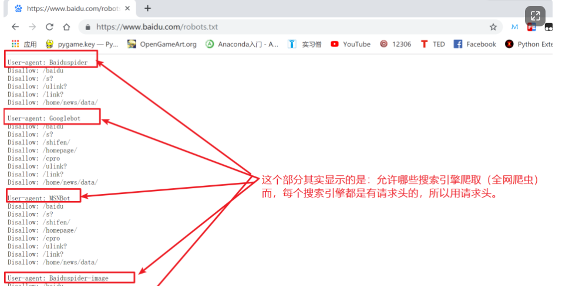
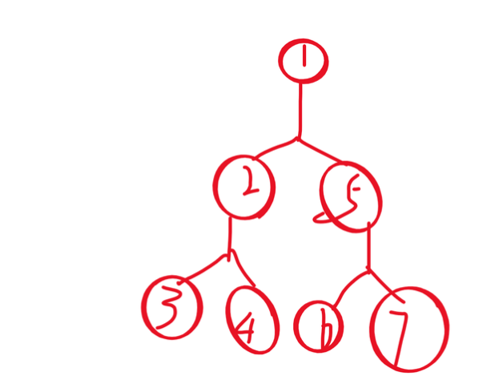
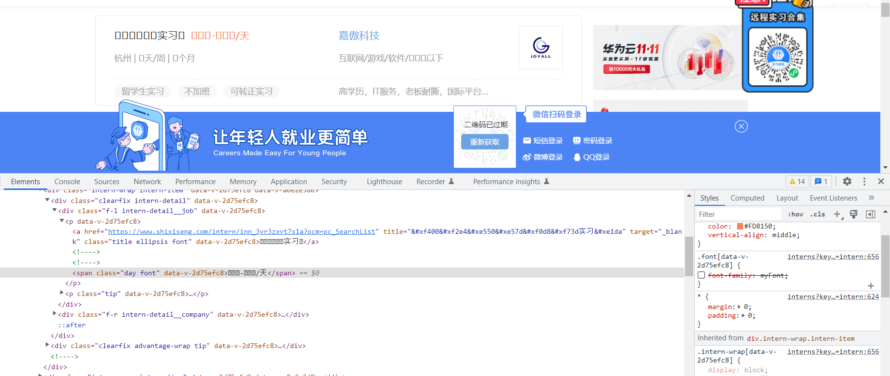
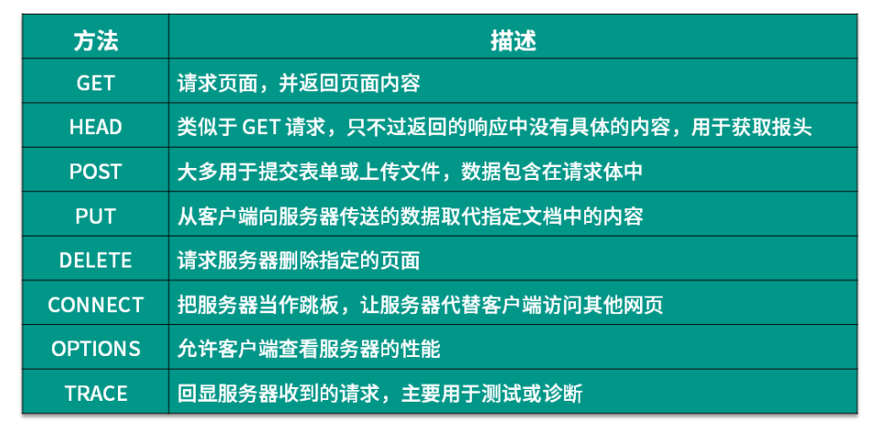
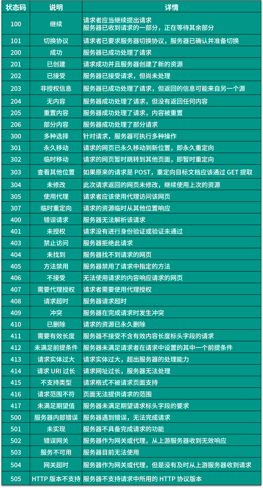

# 网络爬虫

定义：当今最大的网络是互联网，最大的爬虫是各类搜索引擎：谷歌，百度。网路爬虫按照一定的规则爬取所需要的信息的程序，通过URl的请求来实现。在包含广泛信息时，我们就需要一些聚焦于某一方面的信息的爬虫来提供服务，例如某一类型的书。

### 1. 网络爬虫类型




**查看User-Agent方式，右键-检查-NetWork**


全网爬虫：谷歌百度搜索引擎

主题爬虫：某一类型信息的，比如新闻类

增量式爬虫：对已下载的页面采取增量式更新的爬虫，只爬取新产生的或者发生的网页，在一定程度上保证 爬取的页面是最新的，减少了空间的浪费。

为什么要用采用增量式爬虫爬取实时热搜的新闻？优点体现在？

前提环境：第一次抓取微博热搜榜的全部新闻可能需要的工作量是24小时，如重复此工作量去操作达到需求，后果是效率低，且会有重复的数据。

解决策略：增量式爬虫，如何处理新数据？

​					将新旧数据进行比较 ，如python列表知识中的语法点：#value in xx , 类似来进行判断，来保证数据的唯一性（达到了数据不重复的目的）


1.URL 通过value in xx来比较查看

2.内容（哈希）

```python
#哈希解析
test="cava"
print(hash(test))
```

存储介质？

例如将爬取到的url作为MySQl中的主键，定义为Id,查看主键对应的内容，比如第一条值为xiaoyi想去迪士尼，第二条为xiaoyi想去环球影视城，数据已经有更新。

内容的判断？

``` python 
print(hash(text1)==hash(text2))
#返回True则表示存在重复内容
```

### Redis数据库

tips:内存爆满问题，注意要及时备份

**广度优先算法**

每一层都取完再取下一层


**深度优先算法**

从开始取到最后一个节点



### ajax

百度搜索图片

往下滑动的同时，会看到左边数据有增加，但是页面并不会改变

### 字体反爬虫

实习僧网页：



由于对方设置了css文件规则，我们爬取到的数据内容只会显示，xx天xx周

规则？本地电脑：11-a  对方电脑: 11-B

## HTTP

**1.URL和URI**，基本相等

豆瓣有自己的图标，指向唯一访问模式

查看图标方式：网址+favicon.ico

如下图所示


 **2.超文本**

检查-Elements当前渲染后

源代码-没有经过渲染的，一些css内容。。。。

## HTTP&HTTPS

HTTP 的安全基础是 SSL，因此通过它传输的内容都是经过 SSL 加密的，它的主要作用可以分为两种：

1.建立一个信息安全通道，来保证数据传输的安全。

2.确认网站的真实性，凡是使用了 HTTPS 的网站，都可以通过点击浏览器地址栏的锁头标志来查看网站认证之后的真实信息，也可以通过 CA 机构颁发的安全签章来查询。

HTTPS 的安全基础是 SSL，因此通过它传输的内容都是经过 SSL 加密的，它的主要作用可以分为两种：

1.建立一个信息安全通道，来保证数据传输的安全。

2.确认网站的真实性，凡是使用了 HTTPS 的网站，都可以通过点击浏览器地址栏的锁头标志来查看网站认证之后的真实信息，也可以通过 CA 机构颁发的安全签章来查询。 

不通过SSL加密，通过浏览器访问网站时就会出现“该网站不安全”的提示，失去客户访问流量

### HTTP请求过程


第一列 Name：请求的名称，一般会将 URL 的最后一部分内容当作名称。

第二列 Status：响应的状态码，这里显示为 200，代表响应是正常的。通过状态码，我们可以判断发送了请求之后是否得到了正常的响应。

第三列 Type：请求的文档类型。这里为 document，代表我们这次请求的是一个 HTML 文档，内容就是一些 HTML 代码。

第四列 Initiator：请求源。用来标记请求是由哪个对象或进程发起的。

第五列 Size：从服务器下载的文件和请求的资源大小。如果是从缓存中取得的资源，则该列会显示 from cache。

第六列 Time：发起请求到获取响应所用的总时间。

第七列 Waterfall：网络请求的可视化瀑布流。

### post和get区别是什么？

都是获得数据，get是下载，得到内容。用户登陆是使用post,因为get会显示登陆的密码信息，不安全



### 请求头

Accept：请求报头域，用于指定客户端可接受哪些类型的信息。

Accept-Language：指定客户端可接受的语言类型。

Accept-Encoding：指定客户端可接受的内容编码。

Host：用于指定请求资源的主机 IP 和端口号，其内容为请求 URL 的原始服务器或网关的位置。从 HTTP 1.1 版本开始，请求必须包含此内容。

Cookie：也常用复数形式 Cookies，这是网站为了辨别用户进行会话跟踪而存储在用户本地的数据。它的主要功能是维持当前访问会话。例如，我们输入用户名和密码成功登录某个网站后，服务器会用会话保存登录状态信息，后面我们每次刷新或请求该站点的其他页面时，会发现都是登录状态，这就是 Cookies 的功劳。Cookies 里有信息标识了我们所对应的服务器的会话，每次浏览器在请求该站点的页面时，都会在请求头中加上 Cookies 并将其发送给服务器，服务器通过 Cookies 识别出是我们自己，并且查出当前状态是登录状态，所以返回结果就是登录之后才能看到的网页内容。

Referer：此内容用来标识这个请求是从哪个页面发过来的，服务器可以拿到这一信息并做相应的处理，如做来源统计、防盗链处理等。

User-Agent：简称 UA，它是一个特殊的字符串头，可以使服务器识别客户使用的操作系统及版本、浏览器及版本等信息。在做爬虫时加上此信息，可以伪装为浏览器；如果不加，很可能会被识别出为爬虫。

Content-Type：也叫互联网媒体类型（Internet Media Type）或者 MIME 类型，在 HTTP 协议消息头中，它用来表示具体请求中的媒体类型信息。例如，text/html 代表 HTML 格式，image/gif 代表 GIF 图片，application/json 代表 JSON 类型，更多对应关系可以查看此对照表：


### 响应



### session

### Cookie

记住用户信息

### DNS

浏览器缓存


### 页面呈现


### 网页匹配css 内容

 **tips:先用选择器定位要匹配的内容，再从它的上一级开始匹配**

案例1：


案例2：


**点击上下箭头检查匹配的内容**


## 线程

### 全局解释器


一秒钟运行一个线程（一个程序）

如上图所示，thread1和thread2,GIL锁被线程一拿走，且GIL锁只有一个，经过操作系统，在 cpu里执行，时间到了后，释放GIL锁，此时线程2拿到锁，跟线程1 的执行顺序一样。所以即使有2个程序在运行，但线程只有一个。若有其他线程，则会卡在python解释器里。


### 多线程


### 进程

进程定义：一个进程可以做很多事情，并且同时做，互不干扰。

线程：操作系统中最小的调度单位。

**并发**：同一时刻只有一条指令执行，a->b,经过一会儿时间，b->a,同时推进，a和b互相切换，速度很快。

并发在一核处理器的电脑中也能运行。

**并行**：需要多个处理器，电脑只有一核处理器是不可以的；多个cpu中，同一时刻会有一个线程在运行就是并行


### 多线程场景

IO密集型，适合爬虫

CPU密集型不适合多线程

1.单线程

```python
import time
def start():
    for i in range(1000000):
        i+=i
    return
#并不使用任何线程
#time:0.3134646415710449
def main():
    start_time=time.time()
    for i in range(10):
        start()
    print(time.time()-start_time)

if __name__ == '__main__':
    main()
```

2.多线程

```python
import time,threading
def start():
    for i in range(1000000):
        i+=1
    return

def main():
    start_time=time.time()#当前时间
    thread_name_time={} #创建字典的目的，存储每一个线程以及他所对应的时间，key+value
    for i in range(10):
#每个线程顺序执行
        thread=threading.Thread(target=start)#target写你要多线程运行的函数，不用加括号；加了括号调用的是函数运行完成后的值，此时每个线程中不能自己调用start()函数
        thread.start() #开启线程后就要开始运行
        thread_name_time[i]=thread #将数据添加入字典，用i做key值，目的，顺序执行
    for i in range(10):
        thread_name_time[i].join()#join目的：线程执行完才会执行后续部分
    print(time.time()-start_time)

if __name__ == '__main__':
    main()
#time:0.2631237506866455
#和test1速度相差并不大，
```

3.非守护线程

```python
import time,threading

def start(num):
    time.sleep(num)
    print(threading.current_thread().name)#当前线程的名字
    print(threading.current_thread().is_alive())#当前线程是否存活
    print(threading.current_thread().ident)#当前线程的编号

print("start")
#要用多线中的哪个函数，target=函数，name为名字
# 不命名就是ident
thread=threading.Thread(target=start,name="the_first_thread",args=(1,))
#声明结束后要启动
thread.start()#主线程不等待它执行完再执行stop,
thread.join()
print("stop")
#非守护线程
#主线程运行完才会运行子线程内容
#不会随着主线程结束而结束，
#join输出前
#start
#stop
#the_first_thread
#True
#40128
-------------------------------------
#join输出后
# start
# the_first_thread
# True
# 4952
# stop
```

```python
import threading,time

def target(second):
    print(f'Threading {threading.current_thread().name} is run.')
    print(f'Threading {threading.current_thread().name} sleep {second}s')#沉睡了几秒
    time.sleep(second)
    print(f'threading{threading.current_thread().name} ended')
print(f'Threading {threading.current_thread().name} is running')
for i in [1,5]:
    #元组也可
    t=threading.Thread(target=target,args=[i])
    t.start()
    t.join()#等待前面执行完
print(f'Threading {threading.current_thread().name} is ended')
#输出   join前
# #Threading MainThread is running
# Threading Thread-1 (target) is run.
# Threading Thread-1 (target) sleep 1s
# Threading Thread-2 (target) is run.
# Threading Thread-2 (target) sleep 5s
# Threading MainThread is ended
# threadingThread-1 (target) ended
# threadingThread-2 (target) ended
#join
# Threading MainThread is running
# Threading Thread-1 (target) is run.
# Threading Thread-1 (target) sleep 1s
# threadingThread-1 (target) ended
# Threading Thread-2 (target) is run.
# Threading Thread-2 (target) sleep 5s
# threadingThread-2 (target) ended
# Threading MainThread is ended
```

4.守护线程

定义：若该线程被设置为守护线程，在主线程结束后即使该线程还没有运行完它也会被强制结束

守护线程设置方法：在start之前添加 daemon=True

```python
def target(second):
    print(f'Threading {threading.current_thread().name}is run')
    print(f'Threading {threading.current_thread().name} is sleep {second}s')#沉睡的秒数
    time.sleep(second)
    print(f'threading{threading.current_thread().name} ended')
print(f'Threading{threading.current_thread().name} is running')
for i in [1,6]:
    l=threading.Thread(target=target,args=[i])
    l.daemon=True
    l.start()
print(f'Threading {threading.current_thread().name} is ended')
#输出
# ThreadingMainThread is running
# Threading Thread-1 (target)is run
# Threading Thread-1 (target) is sleep 1s
# Threading Thread-2 (target)is run
# Threading Thread-2 (target) is sleep 6s
# Threading MainThread is ended

#原先应该是显示thread-2 ended后，才显示 Threading MainThread is ended
```

5.互斥锁（浅浅了解一下）

```python
import threading
import time

count = 0


class MyThread(threading.Thread):
    def __init__(self):
        threading.Thread.__init__(self)

    def run(self):
        global count
        temp = count + 1
        time.sleep(0.001)
        count = temp


threads = []
for _ in range(1000):
    thread = MyThread()
    thread.start()
    threads.append(thread)

for thread in threads:
    thread.join()
print(f'Final count: {count}')
#输出
#Final count: 69 
```

因为 count 这个值是共享的，每个线程都可以在执行 temp = count 这行代码时拿到当前 count 的值，但是这些线程中的一些线程可能是并发或者并行执行的，这就导致不同的线程拿到的可能是同一个 count 值，最后导致有些线程的 count 的加 1 操作并没有生效，导致最后的结果偏小。

所以，如果多个线程同时对某个数据进行读取或修改，就会出现不可预料的结果。为了避免这种情况，我们需要对多个线程进行同步，要实现同步，我们可以对需要操作的数据进行加锁保护，这里就需要用到 `threading.Lock` 了

5.1加互斥锁

**tips:注意最后释放锁，否则会造成死锁**

```python
import threading
import time

lock = threading.Lock() # 创建一个最简单的 读写锁
number = 0

def addNumber():
    global number
    for i in range(1000000):
        lock.acquire() # 先获取
        number += 1
        # 中间的这个过程让他强制有这个计算和赋值的过程，也就是让他执行完这两个操作，后再切换。
        # 这样就不会完成计算后，还没来的及赋值就跑到下一个去了。
        # 这样也就防止了线程不安全的情况
        lock.release() # 再释放

def downNumber():
    global number
    for i in range(1000000):
        lock.acquire()
        number -= 1
        lock.release()

print("start") # 输出一个开始
thread = threading.Thread(target = addNumber) #开启一个线程（声明）
thread2 = threading.Thread(target = downNumber) # 开启第二个线程（声明）
thread.start() # 开始
thread2.start() # 开始
thread.join()
thread2.join()
# join 阻塞在这里，直到我们得阻塞线程执行完毕才会向下执行
print("外", number)
print("stop")

# 输出
start
外 0
stop

```

6.线程池

可以提前定义大概需要多少线程

 ```python
 import time
 import threadpool
 
 def get_html(url):
     time.sleep(3)
     print(url)
 start_time=time.time()
 #建立线程池
 urls=[i for i in range(100)]
 pool=threadpool.ThreadPool(10)
 #提交任务给线程池
 requests=threadpool.makeRequests(get_html,urls)
 #
 for req in requests:
     pool.putRequest(req)
 pool.wait()
 ```

### 多进程

回顾：一个进程中有多个线程，同一时刻只能有一个线程运行，在python中的多线程并不能完全发挥多核优势。

对于多进程来说，每个进程都有属于自己的GIL,多进程运行不受GIL影响，所以它能更好地发挥多核 的优势。

1.创建进程比较消耗资源

2.多线程和多进程相互结合比较适合大型爬虫项目

3.多进程的好处，多进程中多个线程可以同时运行

**4.多进程是并发执行**


**多进程和多线程的对比**

对于爬虫这种IO密集型任务来说，多线程和多进程影响差别不大。但是对于计算密集型任务，多进程的多核运行效率会有较高的提升。

python内置库中实现多进程的方法：multiprocessing


**process类**


多进程示例：

```python
import  multiprocessing
#多进程
def process(index):
    print(f'Process:{index}')

if __name__ == '__main__':

    for i in range(5):
        p = multiprocessing.Process(target=process,args=(i,))
        p.start()
#输出，几乎是同时输出
# Process:1
# Process:0
# Process:2
# Process:3
# Process:4
```

在cpu核数足够的情况下，不同的进程会分配给不同的cpu核来运行，实现真正的并行执行

在 multiprocessing中有提供方法：cpu_conut来获取当前机器 cpu 的核心数量，通过  active_children 方法来获取当前还在运行的所有进程。

示例：

```python
import multiprocessing,time

def process(index):
    time.sleep(index)
    print(f"Process:{index}")


if __name__ == '__main__':
    for i in range(5):
        p=multiprocessing.Process(target=process,args=(i,))
        p.start()
    print(f"cpu number:{multiprocessing.cpu_count()}")
          #cpu内核个数
    for k in multiprocessing.active_children():
        #子进程，类似多线程中的子线程
        print(f"child process name:{k.name} id : {k.pid}")
    print("process ended")
#输出
# cpu number:12
# child process name:Process-1 id : 76188
# child process name:Process-3 id : 73780
# child process name:Process-2 id : 63316
# child process name:Process-5 id : 74288
# child process name:Process-4 id : 75304
# process ended
# Process:0
# Process:1
# Process:2
# Process:3
# Process:4
```

守护进程

```python
from multiprocessing import Process
import time

class MyProcess(Process):
    def __init__(self,loop):
        Process.__init__(self)
        self.loop=loop
    def run(self):
        for count in range(self.loop):
            time.sleep(1)
            print(f"pid:{self.pid} LoopCount : {count}")
if __name__ == '__main__':
    # print("the main process start")
    process=[]
    for i in range(3,5):
        p=MyProcess(i)
        # process.append(i)
        p.daemon=True
        p.start()
    # for p in process:
    #     p.join(1)
    print("main process ended")
#输出
#main process ended
```

上述程序中，主进程只输出了字符串就结束，同时子进程也结束，可以有效地防止无控制生成子进程，主进程结束后，子进程也会关闭，避免独立的子进程运行。

等待子进程运行完后主进程再结束

```python
from multiprocessing import Process
import time

class MyProcess(Process):
    def __init__(self,loop):
        Process.__init__(self)
        self.loop=loop
    def run(self):
        for count in range(self.loop):
            time.sleep(1)
            print(f"pid:{self.pid} LoopCount : {count}")
if __name__ == '__main__':
    # print("the main process start")
    process=[]
    for i in range(3,5):
        p=MyProcess(i)
        process.append(i)
        p.daemon=True
        p.start()
     for p in process:
         p.join(1)#join方法中加上父进程等待子进程运行的最长时间，预防主进程无限等待子进程
    print("main process ended")
#输出
#the main process start
#pid:79156 LoopCount : 0
#pid:80512 LoopCount : 0
#pid:80512 LoopCount : 1pid:79156 LoopCount : 1

#pid:80512 LoopCount : 2pid:79156 LoopCount : 2

#main process ended
#父进程等待子进程结束后再结束
```

终止进程

```python
import multiprocessing,time

def process():
    print("starting")
    time.sleep(5)
    print("finshed")

if __name__ == '__main__':
    p=multiprocessing.Process(target=process)
    print("before:",p,p.is_alive())

    p.start()
    print("during",p,p.is_alive())

    p.terminate()
    print("terminate:",p,p.is_alive())

    p.join()
    print("joined:",p,p.is_alive())
#输出
# before: <Process name='Process-1' parent=71916 initial> False
# during <Process name='Process-1' pid=68076 parent=71916 started> True
# terminate: <Process name='Process-1' pid=68076 parent=71916 started> True
# joined: <Process name='Process-1' pid=68076 parent=71916 stopped exitcode=-SIGTERM> False
```

进程互斥锁

1.不加锁的示例

```python
from multiprocessing import  Process,Lock
import time

class Myprocess(Process):
    def __init__(self,loop,lock):
        Process.__init__(self)
        self.loop=loop
        self.lock=lock
    def run(self) :
        for count in range(self.loop):
            time.sleep(0.1)
            print(f"pid:{self.pid}  LoopCount:{count}")

if __name__ == '__main__':
    lock=Lock()
    for i in range(10,15):
        p=Myprocess(i,lock)
        p.start()
#输出

# pid:57708  LoopCount:0
# pid:61308  LoopCount:0
# pid:75420  LoopCount:0
# pid:75748  LoopCount:0
# pid:72032  LoopCount:0
# pid:57708  LoopCount:1
# pid:75420  LoopCount:1pid:61308  LoopCount:1
# 
# pid:75748  LoopCount:1
# pid:72032  LoopCount:1

```

从上述程序中可以看出，有不换行的输出

如何换行输出？

示例2：

```python
from multiprocessing import  Process,Lock
import time

class Myprocess(Process):
    def __init__(self,loop,lock):
        Process.__init__(self)
        self.loop=loop
        self.lock=lock
    def run(self) :
        for count in range(self.loop):
            time.sleep(0.1)
            self.lock.acquire()
            print(f"pid:{self.pid}  LoopCount:{count}")
            self.lock.release()
if __name__ == '__main__':
    lock=Lock()
    for i in range(10,15):
        p=Myprocess(i,lock)
        p.start()
#输出
#pid:35836  LoopCount:0
#pid:83824  LoopCount:0
#pid:80204  LoopCount:0
#pid:73364  LoopCount:0
#pid:78224  LoopCount:0
#pid:83824  LoopCount:1
#pid:80204  LoopCount:1
```


