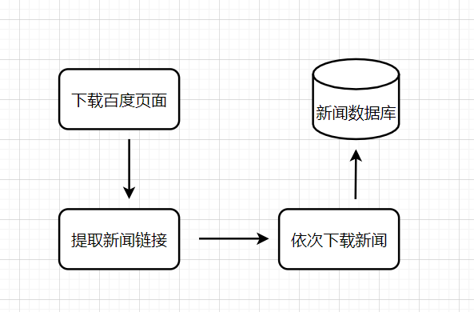
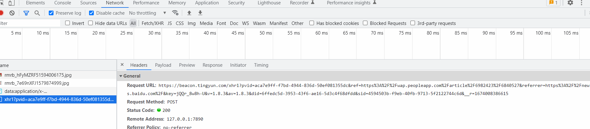

## 百度新闻网站爬取

### 流程图



```python
import re,requests,tldextract,time

def save_data(url,html):
    print("%s :%s" %(url,len(html)))

def crawler():
    #1.下载百度页面
    hub_url='https://news.baidu.com/'
    req=requests.get(hub_url)
    html=req.text
    # print(html)

    #2.获取新闻链接
    # pattern='.*?<link.*?href="(.*?)".*?style="zoom.*?>.*?id="ariaTipText".*?href=""'
    pattern=r'href=[\'"]?(.*?)[\'"\s]'
    news_links=re.findall(pattern,html)
    # print(news_links)

    #3.过滤链接
    links_lst=[]
    for i in news_links:
        if not i.starswith('https'):
            continue
        tld=tldextract.extract(i)
        if tld.domain == 'baidu':
            continue
        links_lst.append(i)
    for k in links_lst:
        html=requests.get(k).text

def main():
    while 1:
        crawler()
        time.sleep()
if __name__ == '__main__':
    crawler()
```

1.requests库 获取百度新闻链接

### 补充：tldextract

Top Level Domain extract

顶级域名提取

```python
url='https://news.baidu.com/'
tld=tldextract.extract(url)

输出-----------------------------------------------------
subdomain='www',domain='baidu',主机名,suffix='com'顶级域名
```



```python
from urllib.parse import urlparse

g_bin_postfix=set([
    'exe','doc','docx','xls','xlsx','ppt','pptx',
    'pdf','jpg','png','bmp','svg','gif','mp4','mkv',
    'zip','avi','wmv','rar','tar','bz2','jpeg','apk',
])

g_news_postfix=[
    '.html?','.htm?','.shtml?',
    '.shtm?',
]

def clean_url(url):
#1.是否url合规
    if not url.startwith('http'):
        return ''
    
#2. 去除参数
    for np in g_news_postfix:
        p = url.find(np)
        if p > -1:
            p=url.find('?')
            url=url[:p]
            return url
        
#3. 不保留二进制内容的链接
    up=urlparse(url)
    print(up)
    path=up.path
    if not path:
        path='/'
    postfix=path.split(".")[-1].lower()
    if postfix in g_bin_postfix:
        return ""
```


