## 正则表达式

### 模式

| 模式       | 描述                                                         |
| ---------- | ------------------------------------------------------------ |
| `\w`       | 匹配字母数字及下划线                                         |
| `\W`       | 匹配非字母数字下划线                                         |
| `\s`       | 匹配任意空白字符，等价于 [\t\n\r\f].                         |
| `\S`       | 匹配任意非空字符                                             |
| `\d`       | 匹配任意数字，等价于 [0-9]                                   |
| `\D`       | 匹配任意非数字                                               |
| `\A`       | 匹配字符串开始                                               |
| `\Z`       | 匹配字符串结束，如果是存在换行，只匹配到换行前的结束字符串   |
| `\z`       | 匹配字符串结束                                               |
| `\G`       | 匹配最后匹配完成的位置                                       |
| `\n`       | 匹配一个换行符                                               |
| `\t`       | 匹配一个制表符                                               |
| `^`        | 匹配字符串的开头                                             |
| `$`        | 匹配字符串的末尾。                                           |
| `.`        | 匹配任意字符，除了换行符，当re.DOTALL标记被指定时，则可以匹配包括换行符的任意字符。 |
| `[...]`    | 用来表示一组字符,单独列出：[amk] 匹配 'a'，'m'或'k'          |
| ``[^...]`` | 不在[]中的字符：[^abc] 匹配除了a,b,c之外的字符。             |
| `*`        | 匹配0个或多个的表达式。                                      |
| `+`        | 匹配1个或多个的表达式。                                      |
| `?`        | 匹配0个或1个由前面的正则表达式定义的片段，非贪婪方式         |
| `{n}`      | 精确匹配n个前面表达式。                                      |
| `{n, m}`   | 匹配 n 到 m 次由前面的正则表达式定义的片段，贪婪方式         |
| `a|b`      | 匹配a或b                                                     |
| `()`       | 匹配括号内的表达式，也表示一个组                             |

### 常规匹配

### atttention:

re.match(pattern,string,flag=0)

从字符的起始位置匹配一个模式，如果不是起始位置匹配成功,match()返回none

\w只能匹配到一个数字/字母

```python
import re
content="Hello 123 4567 Word_This is a Regex Demo"
pattern="^Hello\s\d\d\d\s\d{4}\s\w+\s.*Demo$"
result=re.match(pattern,content)
print(result)
print(result.group())#获取到匹配的对象
#输出
<re.Match object; span=(0, 40), match='Hello 123 4567 Word_This is a Regex Demo'>
Hello 123 4567 Word_This is a Regex Demo
-------------------------------------------------------
content = "Ethanol, Ethyl Alcohol Absolute 200 1L"
pattern="^Ethanol\S\s\w+\s.*1L$"
result=re.match(pattern,content)
print(result)
print(result.group())
```

### 泛匹配

```py
content="Hello 123 4567 Word_This is a Regex Demo"
pattern="^H.*o$"#"^H.+o$"
result=re.match(pattern,content)
print(result)
print(result.group())

```

### 匹配特定目标

```py
content="Hello 123 4567 Word_This is a Regex Demo"
pattern="^H.*\s(\d{3})\s.*Demo$"#
result=re.match(pattern,content)
print(result)
print(result.group())
print(result.group(1))#1,2获取两个内容
---------------------------------------
a = "Beakers, Plastic, Polypropylene, 2000mL"
pattern="^Beakers\S\s(\w+)\S\s\w+\S\s(\w+)$"
result=re.match(pattern,a)
print(result)
print(result.group())
print(result.group(1,2))
-------------------------------------------
content="Filter, Vacuum System, PES Membrane, 0.2"
pattern="^Filter\S\s(\w{5})\w+\s\w+\S\s(\w+)\s\w+\S\s(\d\S\d)$"
result=re.match(pattern,content)
print(result)
print(result.group())
print(result.group(1,2,3))


```

### 贪婪匹配

```python
content="Hello 123 4567 Word_This is a Regex Demo"
pattern="^H.*(\d{3})\s.*Demo$"  #输出567
#\d+会输出7,至少保留一个；\d* 没有输出
#*控制输出数字，

result=re.match(pattern,content)
print(result)
print(result.group())
print(result.group(1))
```

### 换行输出

```python
content='''Hello 1234567 Word_This
is a Regex Demo
'''
pattern="^h.*\s(\d+)\s.*Demo$"#
result=re.match(pattern,content,re.S|re.I)#re.S可以匹配到换行,若开始字母是小写，且没有加re.I,就不会有输出，re.S是忽略大小写（不论开始字母是大写或小写都可以输出）
print(result)
print(result.group())
print(result.group(1))
```

### groups()返回所有

```python
#groups()返回元组
content="Hello 123 4567 Word_This is a Regex Demo"
pattern="^H.*\s(\d+)\s.*Demo$"#
result=re.match(pattern,content)
print(result)
print(result.groups())
```

### 转义 - 原样输出特殊符号

``` python
#转义
import  re
content="hello$6.66"
result=re.match("hello\$6.66",content)#$默认结束，加上\转义后原样输出,.原样输出也需要转义
print(result)
```

### search方法

```python
#search方法,不会因原字符开头和结尾不符合匹配而影响到结果
content='''Hello 1234567 Word_This
is a Regex Demo
'''
pattern="^h.*\s(\d+)\s.*Demo$"#
result=re.search(pattern,content,re.S|re.I)#re.S可以匹配到换行,若开始字母是小写，且没有加re.I,就不会有输出，re.S是忽略大小写（不论开始字母是大写或小写都可以输出）
print(result)
#最好不要加^ $开始和结束符号
```

```python
content="Extra strings Hello 1234567 Word_This is a 666 Regex Demo Extra strings"
pattern="\d+"
result=re.search(pattern,content)
# result=re.search(pattern,content)输出1234567
# result=re.match(pattern,content)#None
print(result)
```

### sub方法

```python
#sub，替换所有符合条件的 。2.将匹配的条件用括号引用，r'1\加上添加的内容',
content="Hello 1234567 Word_This is a Regex Demo"
content=re.sub("(\d+)",r"\1 666",content)
print(content)

```

### 正则表达式小测试

提取中文

```python
import re
s='''<!DOCTYPE html> 
<html>   
<head>         
<title>徐清风</title>   
<head>   
<body>         
   <h2>               
     <a>微信公众号:           
     <em>转行学数据分析</em>           
     </a>         
   </h2>   
</body> 
</html>'''
pattern="<html>.*?<title>(.*?)</title>.*?(?:\s+)?(?:<a>)(.*?):(?:\s+)(?:<em>)(.*?)</em>"
n=re.findall(pattern,s,re.S)
print(n)
#输出[('徐清风', '微信公众号', '转行学数据分析')]
```

提取URL

```python
s1='<link rel="search" href="https://www.baidu.com"/> '
pattern1='<link.*?href="(.*?)"/>'
k=re.findall(pattern1,s1)
print(k)
#输出 ['https://www.baidu.com']
```

提取标签名

```python
s2="<groupId>QDReader.QDAarCenter</groupId>"
pattern2="(<.*?>)\S+(</.*?>)"
k1=re.findall(pattern2,s2)
print(k1)
#输出 [('<groupId>', '</groupId>')]
```

###  excel数据清洗小案例

规范正则表达式

```python
import re

# Detergent, Triton X-100, Emprove, 1 L
# Ethanol, Ethyl Alcohol Absolute 200 1L
# 4L Ethyl Alcohol Pure 200 Proof USP
# CIP 100, 1 gallon
# Bag, 50mL Labtainer BioProcess w/ Luer L


n1="Detergent, Triton X-100, Emprove, 1 L"
regex1=n1.replace(" ","&").upper()
pattern1=".*?(\d+(?:&)?(GALLON|L|KG|ML|UL))"#gallon放在最前面，否则匹配到g就不会检测到gallon
result1=re.search(pattern1,regex1)
print(result1.group(1))

n2="Ethanol, Ethyl Alcohol Absolute 200 1L"
regex2=n2.replace(" ","&").upper()
pattern2=".*?(\d+(GALLON|L|KG|ML|UL))"#|代表或，总结可能包含的单位
result2=re.search(pattern2,regex2)
print(result2.group(1))

n3="4L Ethyl Alcohol Pure 200 Proof USP"
regex3=n3.replace(" ","&").upper()
pattern3=".*?(\d+(GALLON|L|KG|ML|UL))"
result3=re.search(pattern3,regex3)
print(result3.group(1))

n4="CIP 100, 1 gallon"
regex4=n4.replace(" ","&").upper()
pattern4=".*?(\d+(?:&)?(GALLON|L|KG|ML|UL))"
result4=re.search(pattern4,regex4)
print(result4.group(1))

n5="Bag, 50mL Labtainer BioProcess w/ Luer L"
regex5=n5.replace(" ","&").upper()
pattern5=".*?(\d+(GALLON|L|KG|ML|UL))"
result5=re.search(pattern5,regex5)
print(result5.group(1))

regex_list=[".*?(\d+(?:&)?(GALLON|L|KG|ML|UL))",
            ".*?(\d+(GALLON|L|KG|ML|UL))",
            ".*?(\d+(GALLON|L|KG|ML|UL))",
            ".*?(\d+(?:&)?(GALLON|L|KG|ML|UL))",
            ".*?(\d+(GALLON|L|KG|ML|UL))"
            ]
new_regex=set(regex_list)
print(new_regex)
```

```python
import xlrd,xlwt,re

wb=xlrd.open_workbook("MARA.xls")
sheet =wb.sheet_by_name("marm")
regex_list = [
    '.*?(?:,)?(\d+?(\.\d+)?(%)?(GALLON|L|KG|ML|G))',
    '.*?(\d+?(\.\d+)?(%)?(GALLON|L|KG|ML|G))',
    '(\d+?(\.\d+)?(%)?(GALLON|L|KG|ML|G)).*?',
    '.*?(\d+?(\.\d+)?(%)?(GALLON|L|KG|ML|G))',
    '.*?(\d+?(\.\d+)?(GALLON|L|KG|ML|G))',
]

M_data=sheet.col_values(0)[1:]#序号
D_data=sheet.col_values(2)[1:]#混乱的description
data_dict={} #将序号和description变成一一对应的字典
for i in range(len(M_data)):
    data_dict[M_data[i]]=D_data[i]
# print(data_dict)
the_metrial=[]
the_descripition=[]
for key,value in data_dict.items():
    for i in regex_list:
        test=value.upper().replace(" ","%")
        result=re.search(i,test)
        if result:
            the_metrial.append(key)
            the_descripition.append(result.group(1))
            break
#打印测试查看保存的是否是符合正则表达式的key值
# print(the_descripition)
# print(the_metrial)
clean_description=str(the_descripition).replace("%","")
# print(type(clean_description))
#整理完毕，新建表格存入数据
wb2=xlwt.Workbook()
sheet2=wb2.add_sheet("marm")
head_data=["Material","Description"]
the_pos=0
for i in head_data:
    sheet2.write(0,the_pos,i)
    the_pos+=1
the_index=1
for r in the_metrial:
    sheet2.write(the_index,0,r)
    the_index+=1
the_count=1
for k in  eval(clean_description):
    sheet2.write(the_count,1,k)
    the_count+=1
wb2.save("Result_Mara.xls")
```

输出：


## 效果测试

```html
习近平总书记指出，2023年，要坚持稳字当头、稳中求进，更好统筹国内国际两个大局，更好统筹疫情防控和经济社会发展，更好统筹发展和安全，全面深化改革开放，努力实现经济运行整体好转，推动人民生活持续改善。新年头一个月，多项经济先行指标回暖，生产消费供需两旺，中国经济持续回稳向好。
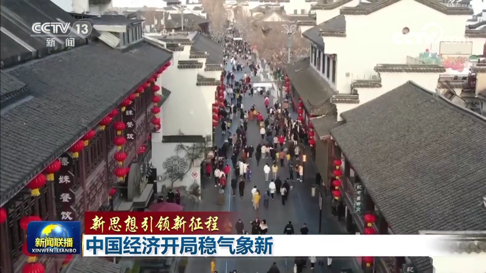
新春年味未消，一系列经济指标已经火热出炉。1月份中国制造业采购经理指数PMI为50.1%，环比上升3.1个百分点，在三个月后重新回到扩张区间。
2022年12月，习近平总书记在中央经济工作会议上发表重要讲话，为中国经济发展指明方向。会议指出，我国经济韧性强、潜力大、活力足，各项政策效果持续显现，2023年经济运行有望总体回升。
国家信息中心的大数据分析发现，全国100个有代表性的科技孵化器周边平均人流量，今年1月比去年12月增长了17.6%，比2022年同期增长了8.5%，表明众多科创型企业已出现明显回暖势头。

项目中标量数据对普通人来说可能略显陌生，但却直接反映企业投资冷暖。监测显示，1月份全国项目中标数量同比增速达到32.2%，中部地区增速最高，达到45.7%。
新年新作为，新年新气象。

向实，实体经济发展势头更稳，后劲更足。农业春耕备耕播种希望，提升全年粮食稳定供应能力。工业订单充足，人机繁忙。今年1月，制造业21个行业中有18个景气度较上月上升，高技术制造业、装备制造业投资增速迅猛，服务业加速向中高端不断升级。
向新，发展动力加快转向创新驱动，新技术、新业态、新模式蓬勃发展，成为经济新的增长点。1月以来，重点城市传统商圈融合主题活动、体验式消费等新模式，客流量整体增长20%以上，线下消费持续复苏，新落地的重大项目更多聚焦智能制造、新能源、数字经济等新兴产业。

推进高水平对外开放，中国更加吸引全球资本目光。记者近日走访德国商会，看到最新编制完成的《德国企业信心调查报告》中，七成以上的会员企业对于中国经济增长充满信心，电子、汽车、化工等高技术产业成为德资企业扩大投资的热门之选。
中国经济加快恢复也为世界经济注入更强信心。联合国、国际货币基金组织等多家国际机构相继调高中国经济增长预期。

今天的中国，充满生机与活力。新的一年，尽管国际环境风高浪急，但中国经济长期向好的基本面依然不变，只要笃定信心、团结奋斗，就一定能实现稳中有进、高质量发展的既定目标。
```

### 没有span

```html
习近平总书记指出，2023年，要坚持稳字当头、稳中求进，更好统筹国内国际两个大局，更好统筹疫情防控和经济社会发展，更好统筹发展和安全，全面深化改革开放，努力实现经济运行整体好转，推动人民生活持续改善。新年头一个月，多项经济先行指标回暖，生产消费供需两旺，中国经济持续回稳向好。

新春年味未消，一系列经济指标已经火热出炉。1月份中国制造业采购经理指数PMI为50.1%，环比上升3.1个百分点，在三个月后重新回到扩张区间。
2022年12月，习近平总书记在中央经济工作会议上发表重要讲话，为中国经济发展指明方向。会议指出，我国经济韧性强、潜力大、活力足，各项政策效果持续显现，2023年经济运行有望总体回升。
国家信息中心的大数据分析发现，全国100个有代表性的科技孵化器周边平均人流量，今年1月比去年12月增长了17.6%，比2022年同期增长了8.5%，表明众多科创型企业已出现明显回暖势头。
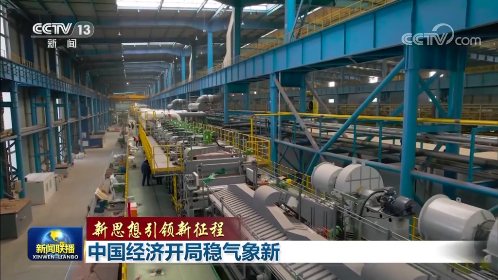
项目中标量数据对普通人来说可能略显陌生，但却直接反映企业投资冷暖。监测显示，1月份全国项目中标数量同比增速达到32.2%，中部地区增速最高，达到45.7%。
新年新作为，新年新气象。

向实，实体经济发展势头更稳，后劲更足。农业春耕备耕播种希望，提升全年粮食稳定供应能力。工业订单充足，人机繁忙。今年1月，制造业21个行业中有18个景气度较上月上升，高技术制造业、装备制造业投资增速迅猛，服务业加速向中高端不断升级。
向新，发展动力加快转向创新驱动，新技术、新业态、新模式蓬勃发展，成为经济新的增长点。1月以来，重点城市传统商圈融合主题活动、体验式消费等新模式，客流量整体增长20%以上，线下消费持续复苏，新落地的重大项目更多聚焦智能制造、新能源、数字经济等新兴产业。

推进高水平对外开放，中国更加吸引全球资本目光。记者近日走访德国商会，看到最新编制完成的《德国企业信心调查报告》中，七成以上的会员企业对于中国经济增长充满信心，电子、汽车、化工等高技术产业成为德资企业扩大投资的热门之选。
中国经济加快恢复也为世界经济注入更强信心。联合国、国际货币基金组织等多家国际机构相继调高中国经济增长预期。

今天的中国，充满生机与活力。新的一年，尽管国际环境风高浪急，但中国经济长期向好的基本面依然不变，只要笃定信心、团结奋斗，就一定能实现稳中有进、高质量发展的既定目标。 
```

## 中国日报测试

```html
 1月31日下午，习近平总书记在中央政治局第二次集体学习时强调，只有加快构建新发展格局，才能夯实我国经济发展的根基、增强发展的安全性稳定性，才能在各种可以预见和难以预见的狂风暴雨、惊涛骇浪中增强我国的生存力、竞争力、发展力、持续力，确保中华民族伟大复兴进程不被迟滞甚至中断，胜利实现全面建成社会主义现代化强国目标。党的十八大以来，以习近平同志为核心的党中央统筹发展、安全和稳定，高度重视发展的安全性与稳定性问题，增强忧患意识，做到居安思危。今天，党建网梳理了习近平总书记的部分相关重要论述，与您一同学习领会。 

 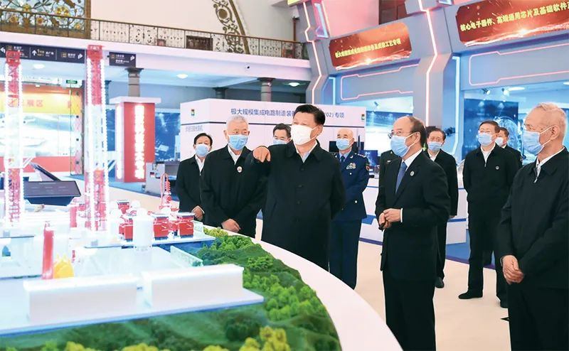 

  <span style="font-size: 16px; background-color: #ffffff;">2021年10月26日，习近平在北京展览馆参观国家“十三五”科技创新成就展。新华社记者 谢环驰 摄</span> 


只有加快构建新发展格局，才能夯实我国经济发展的根基、增强发展的安全性稳定性 
构建以国内大循环为主体、国内国际双循环相互促进的新发展格局，是根据我国发展阶段、环境、条件变化，特别是基于我国比较优势变化，审时度势作出的重大决策。构建新发展格局是事关全局的系统性、深层次变革，是立足当前、着眼长远的战略谋划。我们要从全局和战略的高度准确把握加快构建新发展格局的战略构想。 
——2020年10月29日，习近平在十九届五中全会第二次全体会议上的讲话 
近几年，随着全球政治经济环境变化，逆全球化趋势加剧，有的国家大搞单边主义、保护主义，传统国际循环明显弱化。在这种情况下，必须把发展立足点放在国内，更多依靠国内市场实现经济发展。我国有14亿人口，人均国内生产总值已经突破1万美元，是全球最大和最有潜力的消费市场，具有巨大增长空间。改革开放以来，我们遭遇过很多外部风险冲击，最终都能化险为夷，靠的就是办好自己的事、把发展立足点放在国内。 
——2020年11月，习近平关于《中共中央关于制定国民经济和社会发展第十四个五年规划和二〇三五年远景目标的建议》的说明 
只有加快构建新发展格局，才能夯实我国经济发展的根基、增强发展的安全性稳定性，才能在各种可以预见和难以预见的狂风暴雨、惊涛骇浪中增强我国的生存力、竞争力、发展力、持续力，确保中华民族伟大复兴进程不被迟滞甚至中断，胜利实现全面建成社会主义现代化强国目标。 
——2023年1月31日，习近平在中央政治局第二次集体学习时的讲话 

 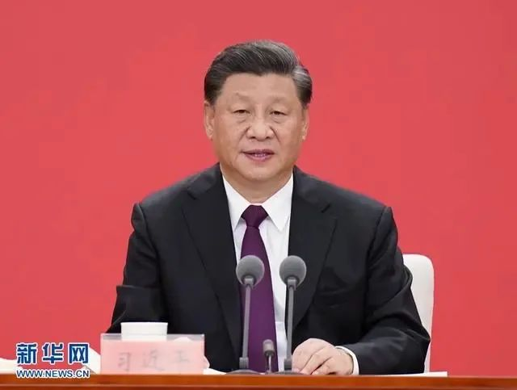 

  <span style="font-size: 16px; background-color: #ffffff;">2020年10月14日，深圳经济特区建立40周年庆祝大会在广东省深圳市隆重举行。习近平在会上发表重要讲话。新华社记者张领 摄</span> 


牢牢守住安全发展这条底线，是构建新发展格局的重要前提和保障 
要优化升级生产、分配、流通、消费体系，深化对内经济联系、增加经济纵深，增强畅通国内大循环和联通国内国际双循环的功能，加快推进规则标准等制度型开放，率先建设更高水平开放型经济新体制。要在内外贸、投融资、财政税务、金融创新、出入境等方面，探索更加灵活的政策体系、更加科学的管理体制，加强同“一带一路”沿线国家和地区开展多层次、多领域的务实合作。越是开放越要重视安全，统筹好发展和安全两件大事，增强自身竞争能力、开放监管能力、风险防控能力。 
——2020年10月14日，习近平在深圳经济特区建立40周年庆祝大会上的讲话 
要牢牢守住安全发展这条底线。这是构建新发展格局的重要前提和保障，也是畅通国内大循环的题中应有之义。 
——2020年10月29日，习近平在十九届五中全会第二次全体会议上的讲话 
我们要坚持以人民安全为宗旨、以政治安全为根本、以经济安全为基础、以军事科技文化社会安全为保障、以促进国际安全为依托，统筹外部安全和内部安全、国土安全和国民安全、传统安全和非传统安全、自身安全和共同安全，统筹维护和塑造国家安全，夯实国家安全和社会稳定基层基础，完善参与全球安全治理机制，建设更高水平的平安中国，以新安全格局保障新发展格局。 
——2022年10月16日，习近平在中国共产党第二十次全国代表大会上的报告 

 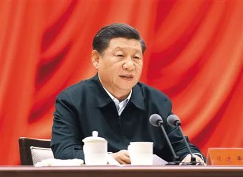 

2021年1月11日，省部级主要领导干部学习贯彻党的十九届五中全会精神专题研讨班在中央党校（国家行政学院）开班。习近平在开班式上发表重要讲话。新华社记者 鞠鹏 摄 
进一步深化改革开放，增强国内外大循环的动力和活力 
我国作为全球第二大经济体和制造业第一大国，国内经济循环同国际经济循环的关系客观上早有调整的要求。这是我们提出构建新发展格局的首要考虑。在当前国际形势充满不稳定性不确定性的背景下，立足国内、依托国内大市场优势，充分挖掘内需潜力，有利于化解外部冲击和外需下降带来的影响，也有利于在极端情况下保证我国经济基本正常运行和社会大局总体稳定。 
——2020年10月29日，习近平在十九届五中全会第二次全体会议上的讲话 
构建新发展格局，实行高水平对外开放，必须具备强大的国内经济循环体系和稳固的基本盘，并以此形成对全球要素资源的强大吸引力、在激烈国际竞争中的强大竞争力、在全球资源配置中的强大推动力。既要持续深化商品、服务、资金、人才等要素流动型开放，又要稳步拓展规则、规制、管理、标准等制度型开放。 
——2021年1月11日，习近平在省部级主要领导干部学习贯彻党的十九届五中全会精神专题研讨班上的讲话 
要进一步深化改革开放，增强国内外大循环的动力和活力。深化要素市场化改革，建设高标准市场体系，加快构建全国统一大市场。完善产权保护、市场准入、公平竞争、社会信用等市场经济基础制度，加强反垄断和反不正当竞争，依法规范和引导资本健康发展，为各类经营主体投资创业营造良好环境，激发各类经营主体活力。推进高水平对外开放，稳步推动规则、规制、管理、标准等制度型开放，增强在国际大循环中的话语权。推动共建“一带一路”高质量发展，积极参与国际经贸规则谈判，推动形成开放、多元、稳定的世界经济秩序，为实现国内国际两个市场两种资源联动循环创造条件。 
——2023年1月31日，习近平在中央政治局第二次集体学习时的讲话
        
        
        

            【责任编辑：吕佳珊】

## 浙江在线原创新闻

浙江在线1月31日讯（记者 陈雷）疫情防控进入新阶段后的首个春节，当出游、返乡人员大幅增加，无论是景区还是高速路，“堵”是大家真切的感受之一。近日，就有网友通过浙江在线微信公众号<a href="https://fapxipmx.act.tmuact.com/signnew/signup?instance_id=6375e95f92168&mp_id=17" target="_self">“线爆”</a>栏目反映，自己凌晨被“堵”在萧山国际机场网约车接客点出口40分钟的遭遇，还因堵车多交了一笔10元的停车费。　　对此，浙江在线记者联系到了网友肖云（化名）。“这样的收费方式非常不合理，如果每个来杭游客都在机场无缘无故堵车40分钟并支付本不应该支付的停车费，大家心里对杭州城市印象一定大打折扣！”肖云表示。<span style="font-family: 楷体, 楷体_GB2312, SimKai;">杭州萧山国际机场网约车上客点&nbsp;浙江在线记者 陈雷 摄</span>　　凌晨被堵在机场出口还要额外交停车费　　市民质疑机场网约车堵车影响城市形象　　肖云告诉浙江在线记者，自己是1月26日（大年初五）凌晨2点左右到达的杭州萧山国际机场，因为地铁等交通已经停运，自己走到了机场交通中心的B2层网约车上客点准备打车回家，此时已是凌晨2点40分。“按照路程来说白天从机场回家只需20分钟，晚上应该更快，但我那天到家已经3点45分了。”肖云表示，多出的40分钟就是堵在了出口处。机场网约车出口的停车收费闸机处因大车流造成拥堵，由于机场停车30分钟以上需要缴纳停车费，缓行进一步造成一系列排队车辆因超时停车而缴费。<span style="font-family: 楷体, 楷体_GB2312, SimKai;">肖云的行程记录 受访者供图</span>　　肖云自己也因堵车交了10元停车费，钱不多但是过程感觉让她觉得很糟心，“今年杭州要办亚运会，肯定还有其他人流高峰，像这样的拥堵，很影响杭州形象。”肖云说，希望相关部门能在亚运会之前重视这一问题。　　肖云的经历并非个例，在社交平台，不少网友反映这几天凌晨被堵在了萧山机场，有网友称自己凌晨0点35分打到车，1点44分还在地库，还有网友表示自己被堵两三个小时。“司机进不来，乘客出不去。”一位网友1月27日（初六）发布的等车视频显示，当天凌晨网约车上客点人满为患，后方乘客甚至看不到前方车辆到达情况。<span style="font-family: 楷体, 楷体_GB2312, SimKai;">在社交平台 多位网友反映凌晨被堵在萧山机场</span>　　为何出现拥堵？浙江在线记者实地走访了萧山机场的交通中心停车库，发现得知B1至B4四层均为停车场，其中位于B2层的网约车集中上客点是机场网约车唯一上客点，而且网约车和私家车出场站时均需经过同一收费处。“包括网约车进场也和私家车混在一起，我那天晚上12点左右从空港大道进入机场网约车上车点通道，在空港大道路口就开始堵车排队，堵得非常严重。”26日（初五）凌晨经历了堵车的网约车司机师傅赵东（化名）告诉浙江在线记者，他本以为几分钟就能到达的上车点那天进去花了1个多小时，接上乘客后又花了1个小时才开到停车场出口的收费处，交费出来时已经是凌晨2点22分。<span style="font-family: 楷体, 楷体_GB2312, SimKai;">机场交通中心停车库平面图 浙江在线记者 陈雷 摄</span>　　春节假期一直在机场附近跑网约车的司机师傅徐立（化名）也在初五凌晨经历了堵车，他分析，“假期本来人流量就多，加上网约车和私家车出去都走同一个道，大家都堵在了一起。”徐立介绍，原本网约车进机场半小时内是不收费的，一般情况下与乘客约好半小时内就可以顺利出机场，但因为晚上地铁停运，网约车需求量大，叠加近期人流多，很多私家车不熟悉出停车场的流程，导致出来的节奏变慢。“乘客觉得很冤，因为这个超时是堵车造成的。”他表示，堵车时间段基本在晚上10点到凌晨2点之间，初七初八凌晨也有拥堵情况，但没有初五那天严重。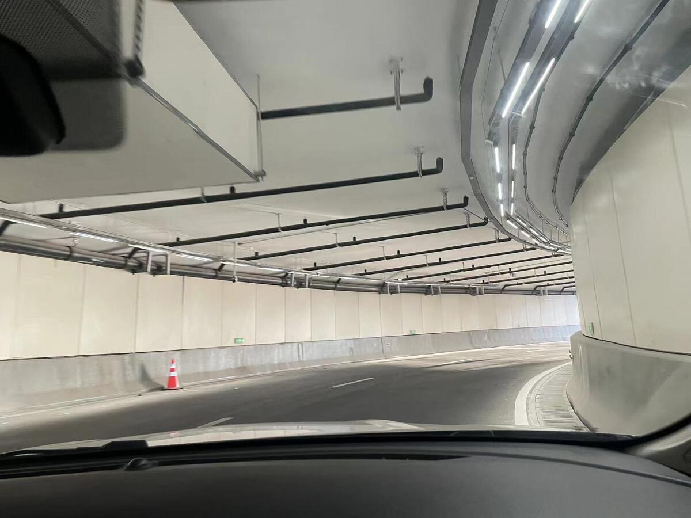<span style="font-family: 楷体, 楷体_GB2312, SimKai;">机场交通中心停车库的网约车和私家车出口通道 浙江在线记者 陈雷 摄</span><span style="font-family: 楷体, 楷体_GB2312, SimKai;">机场交通中心停车库出口收费处&nbsp;浙江在线记者 陈雷 摄&nbsp;</span>　　萧山机场回应已临时增辟应急上客区　　车流量大时网约车可从地面通道出场<br style="text-align: left;"/>　　近期恰逢春节返程，堵车问题如何解决？1月30日，浙江在线记者联系到了杭州萧山国际机场相关工作人员。工作人员称，这几天萧山机场凌晨短时客流骤增，客流比平时激增约2倍以上。25日晚出现拥堵后，机场工作人员曾连续3天对23点半至凌晨3点进出场的网约车进行了统计，网约车数量分别达到了1100辆、1700辆、1900辆，而平时同时段进出网约车仅700辆左右。“突然暴增这么多车，我们虽然做了一些准备，但应对起来还是出现了拥堵。”该工作人员表示，场区在1月26日临时增辟了现上客区的邻近区域作为应急上客区，在网约车入场拥堵时及时开放，同时将网约车入场通道由1个增加为2个。此外设置了网约车出场应急车道，在车流量大情况下，网约车可以直接由地面通道出场，不用再转到地下三层的出口。　　此外，机场也正在采取其他措施进行分流。“因为很多乘客晚上到达时没有地铁才选择网约车，我们也跟地铁协商了加开趟次。”工作人员介绍，1月30日至2月4日，在末班车23点14分结束后，地铁19号线（机场快线）火车西站方向还会定点加开23点29分和23点44分两趟次。同时机场在凌晨0点到2点加开了4趟至火车东站的夜间大巴线路，并通过广播提醒旅客可以选择大巴等方式。　　针对乘客提到的自动扣费问题，工作人员解释，目前机场停车收费主要包括场内扫码、线上和道口自助付三种方式，后续还会在场内增设标识提醒旅客提前交费，此外交通中心停车库已实现支付宝扫车牌（免输车牌号）直接交费的功能。<span style="font-family: 楷体, 楷体_GB2312, SimKai;">交通中心停车库内贴有场内扫码交费的提示 浙江在线记者 陈雷 摄</span>　　“乘客反映的问题，司机们也在反馈，目前我们在考虑制定相应方案，争取在亚运会前落地实施。”工作人员表示，机场正在计划增设交通中心停车库的出口车道，将出口处收费口由原来5个增设为6个。“除了现有的1个上客区外，我们还在考虑将应急上客区设为固定上客区，即设2个上客区，将人流和车流分散开来。”工作人员称，接下来机场还要对人流做一下评估，再计划下一步措施。　　1月31日凌晨，网约车司机师傅徐立向浙江在线记者反馈，当日机场堵车情况已经有了较大改善，因堵车超时的网约车辆近期也没有再收费，车辆进出地库效率显著提高。


-----------------------------------------------------------------------------------------------------

　　浙江在线2月5日讯（记者 林云龙）2月4日，立春节气，标志着冬去春来，万物复苏。杭州西湖边部分柳树已经冒出新芽，传递着早春的气息，市民游客在白堤上感受着萌萌春意。
    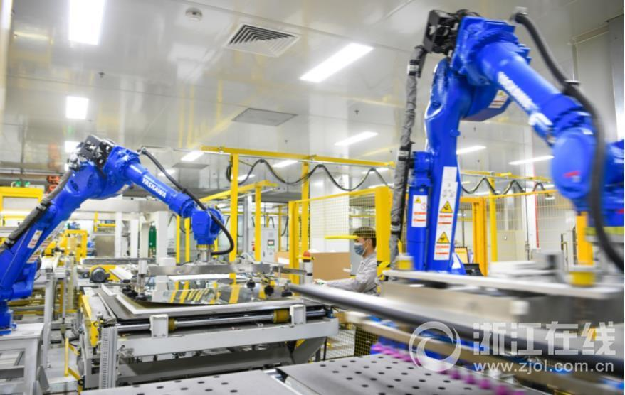　　浙江在线2月3日讯（记者 朱海伟 拍友 胡建强 摄）2月2日，位于杭州临安青山湖科技城的浙江华正新材料有限公司车间内，工人正忙着赶制订单，力争实现“开门红”。该企业主营覆铜板、复合材料和锂电池软包用铝塑膜等产品的设计、研发、生产及销售。产品广泛应用于5G通讯、数据交换、新能源汽车、智慧家电、医疗设备、轨道交通、绿色物流等领域。			 				<span id='pagenav_0' >1</span>2</a>3</a>下一页</a>

------------------------------------------------------------------------------------------------------------------------------------


　　浙江在线2月3日讯（记者 朱海伟 拍友 胡建强 摄）2月2日，位于杭州临安青山湖科技城的浙江华正新材料有限公司车间内，工人正忙着赶制订单，力争实现“开门红”。该企业主营覆铜板、复合材料和锂电池软包用铝塑膜等产品的设计、研发、生产及销售。产品广泛应用于5G通讯、数据交换、新能源汽车、智慧家电、医疗设备、轨道交通、绿色物流等领域。			 				<span id='pagenav_0' >1</span>23下一页			

------------------------

　　浙江在线2月3日讯（记者 朱海伟 拍友 胡建强 摄）2月2日，位于杭州临安青山湖科技城的浙江华正新材料有限公司车间内，工人正忙着赶制订单，力争实现“开门红”。该企业主营覆铜板、复合材料和锂电池软包用铝塑膜等产品的设计、研发、生产及销售。产品广泛应用于5G通讯、数据交换、新能源汽车、智慧家电、医疗设备、轨道交通、绿色物流等领域。


　　浙江在线2月3日讯（记者 朱海伟 拍友 胡建强 摄）2月2日，位于杭州临安青山湖科技城的浙江华正新材料有限公司车间内，工人正忙着赶制订单，力争实现“开门红”。该企业主营覆铜板、复合材料和锂电池软包用铝塑膜等产品的设计、研发、生产及销售。产品广泛应用于5G通讯、数据交换、新能源汽车、智慧家电、医疗设备、轨道交通、绿色物流等领域。		

-----------------

<span style="">　　浙江在线1月17日讯（记者 陈雷 见习记者 田雨阳）</span>春节假期即将来临，火车站也迎来了一波又一波旅客。1月17日的杭州东站和杭州西站里，既有归乡的游子，有送别的亲友，也有趁着假期来游玩的游客，人们带着不同的向往与期待，在车站里相遇。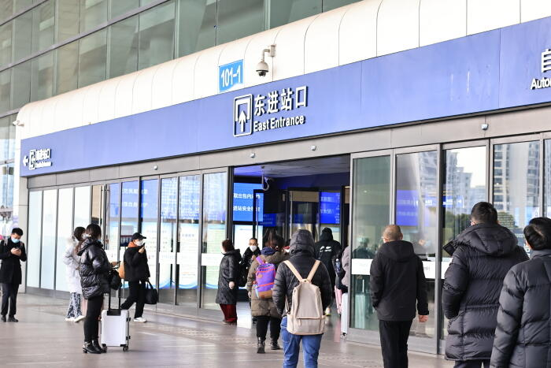<span style="font-family: 楷体, 楷体_GB2312, SimKai;">杭州东站进站口 浙江在线记者 陈雷 摄</span><span style="">　　回家，回家</span>　　团圆，是春节的主题词。临近岁末，不少在杭州打拼的外乡人收拾好行李，踏上返乡的旅程。　　上午10时左右，在杭州东站进站口外，曹女士拉着行李箱脚步匆匆。这几年，她一直在杭州做家政服务，和孩子聚少离多。“跟孩子说了我今天回衢州。”一想到马上就要见到在老家上学的孩子，曹女士笑容满面，她打算回家后带着孩子一起置办年货，让他们也把老一辈的风俗传承下去。说话间，曹女士已经找到了进站指示牌，她拉着行李箱一路小跑，往进站口奔去。　　同样期待回家的，还有来自重庆的九九。一年前，她来到杭州一家直播公司做主播。“这里的直播行业发展得很好，我就来这儿试试。”经过培训和“实战”，九九的业务愈发熟练，一年下来也有了一些积蓄，这让她对未来充满了信心。提起回家最期待的事，“当然是吃好吃的！”九九开心地说。　　在城市的另一端，也有一位重庆人迫不及待地想拥抱家乡美食。“主要是想吃家里做的腊肠，还有火锅、小面。”刘先生说。他提着前些天年会抽奖抽到的电饭煲，在杭州西站等朋友一起回家。“父母年纪大了，想早点回去。”至于回家最期待的，就是和亲友相聚。“兄弟姐妹大家一起吃个饭、聚一聚，就是最幸福的时候，我觉得这就是年味。”　　对大部分人来说，春节是团圆，但也免不了有短暂分离的小插曲。　　中午11时，赵莹莹和男友在杭州西站进站口前的广场告别。今天，赵莹莹要坐高铁回河南老家，男友则订了明天的票回安徽老家。“票不好买，没能同一天返程。”男友有点遗憾。除了行李，赵莹莹特地拎了满满一袋零食，“这是给弟弟带的。”前几天，赵莹莹告诉父母马上要回家过年了，赵莹莹的父母按捺不住激动，立即表示要来接站，想第一时间看到女儿，弟弟也满心期盼，等待着这个不见要想念，见面就斗嘴的姐姐。<span style="font-family: 楷体, 楷体_GB2312, SimKai;">旅客小徐和大娘在火车站拍照 浙江在线记者 陈雷 摄</span>　　来自天南海北的旅客行色匆匆，带着行李、礼物和一颗颗似箭的归心，从杭州出发，期待敲响家门的那一刻。　　重逢，重逢　　火车站内人来人往，当忙碌了一年的游子带着憧憬归家时，负一楼的出站口外，重逢的喜悦及出游的欢欣亦在大厅里蔓延。<span style="">　　在杭州西站负一楼的1号出站口，家住杭州市钱塘区的谭江贵紧紧盯着出站口上方的车次到达表，计算着母亲到达的时间。“还有5分钟就到了，这次老妈来杭州和我们一起过年！”谭江贵拿出手机看了看时间。已经定居杭州的他有三年没回过河南老家了，今年因为一家人刚刚“阳康”，商量后决定让母亲来杭州团聚。“家里冰箱已经塞满了肉菜和水果，小时候过年都是妈妈做的菜，她最拿手的就是饺子，还有蒸馒头、包子和花卷，就是想这一口了。”谭江贵脸上洋溢着无限期待。说话的间隙，从郑州东出发的列车抵达杭州，在出站口看到熟悉的身影后，谭江贵小跑过去，顺手接过母亲手里的行李箱，一起朝着出站方向走去。</span>　　　　有亲人奔赴而来，也有在外的儿女回家。丈夫推着大行李箱，儿子跟在后面推着小箱子，在西站出站口，从杭州嫁到安徽的吴女士带着一家人赶在年前回到家乡，为了和家里的爸爸吃上一顿团圆饭。“往年工作不忙都会回来，家里就爸爸一个人，等着我回家买年货呢！”吴女士说。<span style=""></span><span style="font-family: 楷体, 楷体_GB2312, SimKai;">吴女士一家三口 浙江在线记者 陈雷 摄</span><span style="">　　亲人重逢，同样的温情也在杭州东站上演。在东站负一楼的出站口，拎着温州特色粉干礼盒和大包小包的张友涨将行李放在地上，和妻子、女儿一起等着儿子来接站。“今年儿子在杭州买房了，我们来看看他！”言语之间，张友涨带着点自豪。</span>　　从一个目的地到另一个目的地，列车穿行间带来了重逢的喜悦，亦带来亲人好友出游的愉悦。　　在杭州东站负一楼富有西湖特色的宣传图前，从温州乐清赶来的江女士正为两个孩子拍照留念。刚刚抵达杭州的一家四口准备在这玩两天，去西湖逛一逛。“三年都没出来，孩子在课本上看过西湖的景点，像三潭映月、雷峰塔、苏堤啊，我们就带他们来看看。”江女士解释，两个孩子一个8岁一个7岁，之前因为年龄小也不太出远门，这次趁着年前先带孩子来近一点的杭州，年后计划出省游玩。<span style=""></span><span style="font-family: 楷体, 楷体_GB2312, SimKai;">江女士一家四口 浙江在线记者 陈雷 摄</span>　　趁着年前假期来趟杭州，在杭州东站，与江女士一样的游客不在少数。从义乌赶来的高张莉和朋友听说杭州多个景点免费的消息，计划去法喜寺等景点看看；从德清出发的赵思闻和好友背上小包，准备去灵隐寺逛一逛；还有游客从温州赶来，准备跟着杭州的亲人去良渚文化博物馆走一趟……<span style="">　　进站口，推着行李箱的游子脚步匆匆，带着无限憧憬回家；出站口，等候的亲友踮脚张望，在人群中期待着相逢。从天南海北而来，向大街小巷而去，一列列飞驰的列车载着人们向着不同方向前行，驶向同一个方向——重逢。</span>				 									

------------------

每一篇新闻： <a href="http://www.news.cn/video/20230205/1533633a506c4cd6a48116669892ad8a/c.html"></a>    假期结束，新的开始。你准备好了吗？不负坚韧守望、奋斗致远，不负英雄遍地、烟火人间！新华网携原创歌曲《人间值得》，祝福大家元宵节快乐。愿你历尽千帆，依然觉得人间值得！                           

--------------------------------------------------------------------

每一篇新闻： 桃之夭夭，灼灼其华。这是《诗经》中描写春天桃花盛开怒放、色彩鲜艳、惹人喜爱的诗句。2月4日立春，在塔克拉玛干沙漠边缘的新疆阿拉尔市，果农们种植的水蜜桃开花了，一树树火红的桃花喜迎春天的到来。             走进阿拉尔市梨花镇果农黄梅的果蔬温室大棚里，艳丽的桃花、飞舞的蜜蜂、拍照的游人，让人仿佛置身3、4月份的江南桃园。黄梅介绍，随着近段时间气温升高，今年的水蜜桃花期比往年提前10天左右，在立春当天全部盛开。 大棚水蜜桃开花期间，黄梅采用人工养殖的蜜蜂进行授粉，这样做水蜜桃的坐果率高、品质好。果实成熟后，吸引游客采摘和网络预订的方式销售。这两年，靠着种植2个大棚的水蜜桃和2个大棚的葡萄，黄梅家的年收入超过10万元。 新疆阿拉尔市梨花镇果农黄梅告诉记者：“大家听说桃花开了，这几天好多朋友打电话，都说带着家人孩子一起过来游玩拍照，这几天已经接待了好几拨了，看着红红火火的桃花，今年咱们一定有个好收成。”             游客张玉芹：“朋友推荐我来这里游玩的，我看到这里满树的桃花，飞舞的蜜蜂，我们还拍了很多美美的照片，我的心情一下子就舒畅起来了，我感觉到了春天的气息。”                         （中国日报新疆记者站 毛卫华 图文：杨海洲 杜新民）

## 测试

 每一篇新闻： <article>  在刚刚过去的这个春节假期，很多旅游景点再现疫情前人潮汹涌的场景，数据也证明了这一点。文旅部的数据显示，今年春节假期，全国国内旅游出游3.08亿人次，同比增长23.1%，超过了行业预期，而且很重要的一个指标是达到了2019年同期，也就是疫情之前的春节假期88.6%的人流量，这是一个相当可喜的恢复场景，而且不仅仅是国内游，连境外游也一点一点地打开着窗口。毫无疑问，对于旅游业来说，这是一个开门红。那么，如何持续？如何进一步地增长？信心如何更好地建立？《新闻周刊》本周视点关注：旅游业的新春。  <section></section>  长线游市场春节假期迎来强劲复苏  本周，春节假期已告以尾声，据文旅部的数据显示，今年春节假期全国国内旅游出游3.08亿人次，同比增长23.1%。国内多个热门景区再现了游客“爆满”的景象，长线游市场在今年春节假期迎来了强劲复苏。尽管假期结束，节后的错峰游市场依然火热，随着旅游目的地的机票、住宿等产品的价格大幅下降，仍然吸引了不少游客前往。    兔年春节国内外的景区门票订单皆迎来三年新高。市场属性更强的主题公园和旅游度假区以特色创意为游客带来了久违的欢乐，再加上旅游景区以免费、降价和优惠策略而成为各地“抢游客”的首发阵容和主阵地，带动地方游客快速增长的同时，政策的可持续也备受关注。丽江古城凭借自身特色，以及在免费入园政策的加持后，也创下了近年来的预约热潮。    强劲的复苏态势也对各地旅游管理部门、企业经营者和一线工作人员提出新的要求。经历过此前的不景气，这家景区在冷淡期间也做出了一系列的升级以及预案措施。  数据显示，国内跨省游旅客占比29.3%，中远程市场开始领跑假日旅游经济。加上大量返乡探亲旅游者的本地休闲消费，拉升了旅游收入高于出游人数7个百分点的增幅，有力推动了此次假期旅游潮市场规模和效益向疫情之前常态化的全面回调。  不光是国内，此前多条对外防控政策的放松或取消，也为出国游旅客注入实现“诗与远方”的动力。    现在身在泰国的小龙，是一名旅行爱好者，三年未出国旅行的他在政策的优化升级后，做下了一程游历30个国家的复杂计划，他希望以此来弥补许久未出国游玩的遗憾。他发现，近期外出机票的价格普遍较高，所以选择多次中转降低游玩成本，自己还是迫不及待想出去看看。而再次回到多年前所游玩的场景时，他比以往多了些不同的感触。  此前，中国正式取消入境核酸检测和集中隔离，文旅部发布通知，宣布文旅行业8项疫情防控工作指南废止，再到下周即将正式实行的，试点恢复全国旅行社及在线旅游企业经营中国公民赴有关国家出境团队旅游和“机票＋酒店”业务。这样一来，不光是个体旅客，更有团体效益的注入，多家旅行社已经蓄势待发，准备好新旅行产品等待久违的复苏。  <section></section>  游客回归使得旅游业面临人员缺口  春节假期，重庆市巫山县迎来了久违的客流高峰，游客终于又可以领略峡长谷深、层峦叠嶂的风景。对于这样的场景，导游李洋洋同样是久违了。公司业务的长期停滞，她的收入锐减，只能兼职卖货维持生计。    在李洋洋所在的旅游公司，有多名导游离职转行。而在春节前，公司开始重新招兵买马，应对游客高峰，其中不少曾经的老员工又回来了。    旅游业是疫情期间从业者流失较为严重的行业，根据文旅部的数据，2021年末，纳入统计范围的全国各类文旅从业人员484.41万人，比2019年末减少31.7万人。而如今，重新回归的游客，又使得旅游业面临人员缺口。在一些招聘网站上，旅游相关岗位的热度稳步提升。    陈晓飞，是福建一家国际旅行社的出境游领队，本周，他刚刚回归工作岗位。在过去的三年里，国内旅游还能开展，境外游则全部暂停，这家公司的境外游部门，100人的团队流失了70%。  出境游的领队，类似国内游的导游，不同的是，出境游领队必须与相应的旅行社订立劳动合同，这也是陈晓飞没有直接辞职的原因之一。干了十几年领队的他，一直等待消息重操旧业。  下周一，出境团队旅游业务就将恢复，陈晓飞将带团去往泰国，他只有一周的时间进行准备。在他所在的部门，老同事已经回归了一大半，但订单预订量却并不理想，公司运营压力反而变得更大。    三年疫情之后，导游群体的生存和发展值得更多关注。他们之中，许多人没有签约的旅行社，导游证挂靠在导游协会，因此没有底薪，没有五险一金，充其量是自由职业者，收入全靠带团的劳务费，还得向协会缴纳管理费。专家呼吁，应给予他们更多政策上的关注。当然，旅游行业用工本就比较灵活，相比稳定的劳动关系，从业者更期待的是，稳定的客流和稳定的收入。  <section></section>  沉寂三年的旅游业站在了转折点上  根据文化和旅游部数据中心测算，今年春节假期，全国国内旅游出游3.08亿人次，同比增长23.1%，各地相继出台景区门票减免或打折优惠。从客观数据到业者感受，今年春节假期，得益于疫情防控政策优化调整，旅游市场迎来难得的“开门红”。    此时刚刚复苏行业，还是拿出了较大的诚意让利给游客，据统计，今年40%的景区都采取了免票或降价等优惠措施，山东泰山、贵州黄果树瀑布等耳熟能详的景区都阶段性免除门票，浙江南浔古镇更是在春节前宣布永久免门票。  据了解，南浔古镇从2008年创建5A景区后成人门票价格一直为95元，随着古镇提供的旅游产品增多，门票收入占比也从过去的六成多，逐步下降到近两年的四成左右。    通过观察南浔古镇今年的免票实践发现，关闭售票处仅仅是第一步，之后还要在扩展旅游服务项目上做文章。一方面能让景区稳住收入、良性运作，另一方面能让游客把钱花在满足个性化需求的地方，获得物有所值的旅游体验。  今年春节假期，各地优惠让利现象较为普遍，一定程度推高了旅游人数，3.08亿人次出游的数据，恢复至2019年同期的88.6%，但另一项重要指标旅游收入，只恢复到73.1%，中间有超15个百分点的差距，反映出旅游消费的恢复还没完全赶上出游人数的恢复。    当沉寂了三年的旅游业，站在了转折点上，行业也值得思考未来该从哪些方面提质发展。当游客心理悄然变化之际，关键看从业者能否敏锐抓住机遇、作出改变。  在中国旅游研究院院长戴斌看来，旅游业作为市场化程度较高的产业，与百姓生活水平和质量息息相关。带领人们探索诗和远方的旅游业，只要找对方向，发展前景仍然可期。  <section></section>  透过这次春节假期热门景点的人潮汹涌，真的能够感受到旅游出行不是锦上添花或者非必需品那么简单。在人们美好生活的追求当中，它越来越是太多人的刚需，是人们精神生活的重要内容和追求。除了旅游业多一点政策帮扶，自己多练“内功”之外，还得让人们兜里有更多的钱，工作生活中也时常能有闲，这闲和钱加在一起，才会让与诗和远方有关的旅游业在中国快速发展。 </article>               

-------------------

中国新闻网测试

为何这般“闹”元宵节？小习俗传承千年记忆-中新网
中新网上海2月5日电 题：为何此般“闹”元宵节？小习俗传承千年记忆

　　作者谢梦圆

　　“这个兔子身上为什么有那么多花纹啊？而且还会亮，好漂亮啊！”6岁的小秋指着悬挂的彩色兔子灯好奇地问身边的妈妈。5日，赏花灯、猜灯谜、包汤圆等元宵活动在上海市浦东新区群众文化艺术馆举行，现场上百个造型各异的花灯组成一片流光璀璨的花灯长廊吸引不少带孩子的家长驻足拍照留影。

　　一旁的灯谜架上红纸片随风翻飞，纸上写着灯谜，辅以隐隐透出亮光的大红灯笼图案作为装饰。架子顶端每隔一段距离就伸出一根近一米的杆子，每根杆子上依次挂着两个纯色纸灯笼和一个兔子灯。兔子灯憨态可掬的模样引得孩子们纷纷仰头盯着看。

　　为什么元宵节一定要看花灯？

　　“原始社会利用火带来熟食和光明后，引发了人们对于火的崇拜，后来古人又开始崇拜天上的星星。所以说最古老的元宵节就是对火、星星这样发亮物的原始崇拜。”华东师范大学终身教授、上海市非遗保护工作专家委员会副主任陈勤建介绍，很早楚地民间就有了祭祀“太一天神”的习俗，具体表现为从正月十五日傍晚开始点灯到天明。

　　对火的原始崇拜到了汉代形成了民俗化、社会化趋势。汉代社会受楚文化影响较大，民间也广泛存在祭祀“太一天神”的现象。

　　之后这种全民习俗又演变成了社会性的庆典活动。到了隋唐时期，一些统治者比较提倡看花灯的风俗，尤其是唐宋的统治阶级，甚至会发布放假政策。上行下效，至少到了南宋时期，元宵节已经成为盛大的、全民狂欢的活动了。


--------------------------------------

北京时间2月2日，巴基斯坦举办卡拉奇核电站3号机组落成仪式。至此，中国自主三代核电“华龙一号”出口巴基斯坦2台百万千瓦机组在建成投产后正式交付巴方，“华龙一号”在巴基斯坦首个项目全面建成。巴基斯坦国家电力监管局近日发布数据显示，随着中国新一代核电机组建成并投入运行，核电在巴基斯坦发电量中占比大幅提高，从2000年的0.6%升至2022年的10.6%，成为确保巴基斯坦电力供应稳定的中坚力量。去年4月，“华龙一号”全球第四台、海外第二台机组——卡拉奇核电站3号机组投入商业运行。“这是自2021年5月卡拉奇核电站2号机组投入商运以来，从巴基斯坦传出的又一好消息。”项目安全工程师阿赫迈德激动地说。他在这两个机组项目工作了6年多，负责对新招聘的巴方员工进行安全培训。核电是技术密集型的高新战略产业，是国家综合实力和核心竞争力的重要体现。作为中国自主研发、具有完全自主知识产权的第三代核电技术，“华龙一号”成为中国创新的一张新名片。“对我们来说，参与‘华龙一号’建设是无比宝贵的机会。”阿赫迈德坦言，“华龙一号”在巴基斯坦顺利建成投产，向世界展示了中国核电方案的成熟性和先进性。据了解，卡拉奇核电站2、3号机组全部投产后，每年将为当地提供清洁电力近200亿千瓦时，能够满足当地200万人口的年度生产和生活用电需求。项目建设还助力当地经济社会可持续发展。巴基斯坦卡拉奇核电工程总承包方、中国核工业集团有限公司（以下简称“中核集团”）中国中原卡拉奇项目总经理范海平介绍，在项目全周期建设中，当地新增就业岗位6万余个，通过现场示范、技能传授、技能比武等方式，项目累计培训巴方人员10万余次，培养技能熟练、可独立上岗的巴籍员工8000余名。在巴基斯坦旁遮普平原上，坐落着中国自行设计、建造的第一座出口商用核电站——恰希玛核电站。1995年，26岁的季明力来到中巴合作建设的恰希玛核电站，担任电气安装班的一名班长。在这里，他结识了刚从当地学校毕业的新员工拉蒂夫。作为同龄人，季明力和拉蒂夫有许多共同语言。拉蒂夫聪明好学，时不时拉着季明力请教电工知识。时光荏苒，2017年，季明力再次回到巴基斯坦参与“华龙一号”建设时，惊喜地与老朋友拉蒂夫重逢。这时，拉蒂夫已是项目现场一名经验丰富的电工负责人。在范海平看来，一项项核能合作成绩背后，凝聚着中巴两国人民在共同奋斗中结下的深厚友谊。“这是中巴两国核科技工作者携手取得的重大成就，是我们推动共建‘一带一路’走深走实的坚实行动。”巴基斯坦规划、发展与特别项目部部长伊克巴尔表示，新一代核电技术对巴基斯坦减少能源进口开支、降低碳排放意义重大。随着相关项目的持续推进，巴中两国能源合作将不断迈上新台阶。               

-------------------------

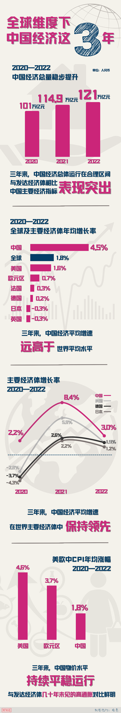    新冠疫情暴发以来，中国在世界主要经济体中保持增速领先。过去三年里，中国经济年均增长4.5%，增速远高于世界经济平均增速1.8%，也高于美国、欧元区和日本的1.6%、0.7%和-0.3%。 国际货币基金组织（IMF）1月30日发布《世界经济展望报告》更新内容，大幅上调今年中国经济增长预期至5.2%，认为中国优化调整防疫政策等因素将改善中国和全球经济增长前景。IMF首席经济学家皮埃尔-奥利维耶·古兰沙认为，中国2023年对全球经济增长的贡献率将远超美国和欧盟。       近期多家国际金融机构也表示看好中国经济前景和对全球经济复苏的贡献。 摩根士丹利近期把2023年中国经济增长预期上调0.3个百分点至5.7%。高盛集团连续第三次上调明晟中国指数的目标点位，认为中国当下市场回升不仅是消费和服务贸易恢复，更是“跨越许多产业、基础更加广泛的增长恢复”。 据世界银行的世界发展指标数据库测算，2013年至疫情发生后的两年，中国对世界经济增长的平均贡献率达到38.6%，超过七国集团国家贡献率的总和。 过去一年多来，全球经济持续面临高通胀和货币政策收紧压力，中国成功将物价维持在相对较低水平，为继续实施积极的财政政策、稳健的货币政策提供了空间。 国际观察人士认为，得益于良好基本面和有效宏观政策应对，中国优化调整防疫政策后经济将实现更快恢复。中国超大市场规模、重要的供应链地位、独特的资源禀赋、科学的经济社会治理、开放的经贸政策等因素，共同改善了中国经济前景，给全球应对通胀、促进贸易、维护供应链稳定等带来更多期待。                        

----------------------

融汇中西的新春音乐会、欢乐喜庆的春节巡游、热闹非凡的新春庙会……2023年春节期间，由中国文化和旅游部主办的“欢乐春节”活动在多国举行。这些“文化年货”形式多样、丰富多彩，慰藉了海外游子的思乡之情，也让世界各地的民众“沉浸式”体验热闹的中国春节。
华侨华人同庆欢乐春节</strong>
春节期间，位于阿根廷布宜诺斯艾利斯市的国家公园广场上龙腾狮舞、锣鼓喧天，这里正在举行2023年“欢乐春节”新春庙会。
“对于华侨华人而言，春节年俗是深刻的文化印记。”庙会承办方负责人之一、阿根廷妇女儿童联合会会长陈静说，今年的春节庙会更重视中华传统文化元素的呈现，还有很多华裔青少年登台献艺，充分展现阿根廷华侨华人蓬勃奋进的面貌，也把欢庆中国春节的喜悦分享给当地民众。
庙会是中国传统民俗文化活动，也是海外华侨华人庆祝春节必不可少的活动。日前，在俄罗斯莫斯科举行的“欢乐春节——中国文化庙会”现场，投壶、套圈儿、猜谜语等各项小游戏吸引了众多嘉宾驻足，中国书法家还在现场挥毫泼墨，书写“福”字和春联。在丰富多彩的文化体验活动中，大家共同欢庆农历兔年春节。
在匈牙利布达佩斯，2023年“欢乐春节”匈牙利唐人街新春庙会于当地时间1月28日举行，现场张灯结彩、喜气洋洋，来宾们学习书法国画，剪窗花、猜灯谜、画脸谱、包饺子、品茗赏茶。
多彩活动展现文化魅力</strong>
“观众朋友们，我现在在里斯本东方博物馆……”当地时间1月25日，葡萄牙《葡新报》的记者来到2023年葡萄牙“欢乐春节”活动现场做直播，带领观众在音乐和展览中感受葡萄牙的春节氛围。
2023年“欢乐春节”活动在葡萄牙里斯本和波尔图两个城市举办，《葡新报》记者直播了两地的活动。“两场直播活动都在线上引发热烈反响。”葡萄牙《葡新报》的报道指出：“随着华人在葡萄牙影响力与日俱增，春节活动已不再是华人社区内部的自娱自乐，发展为多元文化融合的民间盛会，展现了中华传统文化魅力。”
春节期间，各类音乐会架起沟通的桥梁，让海内外共享中华文化之美。当地时间1月7日晚，2023“欢乐春节”《唐诗的回响》音乐会在纽约林肯中心上演；巴黎中国文化中心当地时间1月25日晚举办2023“欢乐春节”系列活动之“弦音雅韵”音乐会；当地时间1月16日晚，2023年“欢乐春节”庆典音乐会在柏林中国文化中心举行，音乐家们带来了一场中西合璧的视听盛宴。
各族裔共享年味大餐</strong>
在加拿大蒙特利尔，第七届欢乐春节庙会当地时间1月28日在唐人街中山公园和文化宫举行，庙会以“振兴华埠迎兔年”为主题。“蒙特利尔欢乐春节庙会始于2017年，已成为中华传统文化展示和交流的一道靓丽的城市文化风景。”蒙特利尔华商会主席张仕根介绍，在当地逾百个华人社团共同支持和参与下，历届庙会已累计吸引300多万人次的游客前来体验中华民俗风情、共享中国春节的喜庆。
当地时间1月14日，2023“欢乐春节”大巡游在阿联酋迪拜举行，60余个方阵、20多辆花车从世博会中国馆出发，喜庆前行。华侨华人商会、在阿中资机构和企业、阿联酋当地企业等组成巡游队伍，奉献舞龙、舞狮、秧歌、伞舞等表演，一辆辆花车五彩缤纷、各具巧思。街边的春节集市上，人们在品尝中华美食、体验非遗手作、挑选中国商品。
阿联酋华星艺术团团长王鸣凤表示，阿联酋华星艺术团组成了腰鼓队方阵，在春节巡游中英姿飒爽，腰鼓队中的成员年龄最小的10岁，年龄最大的72岁。“‘欢乐春节’大巡游不仅是阿联酋华侨华人的一道年味大餐，也是一场当地民众共同参与的文化盛宴，向阿联酋乃至全世界展示了中华传统文化。”
          

            （吴）

-----------------

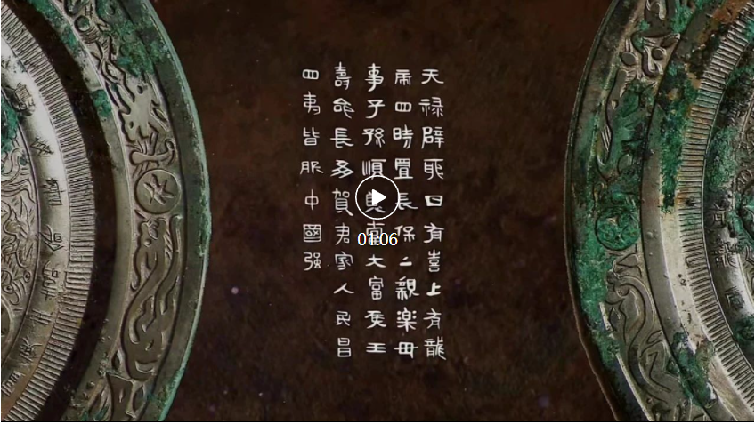 

何为中国？何以中国？无声文物记录着中华文明的恢弘气象，诉说着中华文化的起承转合。“人民昌·中国强”汉代铜镜，是迄今发现的唯一带有“人民昌”“中国强”吉语铭文的铜镜，进一步佐证了汉代“中国”国家观念的形成。
标题: 多地新学期要求“健康监测”成标配 - 中国日报网
经历了“疫情转段”和“超长寒假”，近日，各地中小学陆续开学，多地发布学校开学要求和工作安排。不少地区要求学生返校前一周开展为期一周的健康自测，有的学校还要求填写健康监测表，如确认感染新冠病毒须如实报告并延迟返校，有的地区还要求师生返校后连续7天开展健康监测，尽量减少聚集性活动；多个地区教育局还要求在开学前对师生基础疾病、新冠病毒感染情况进行全面摸排，根据师生日常防护需要做好退烧、止咳、止泻等药品和抗原检测试剂、口罩等防疫物资储备。此外，不少地区还关注经历此次疫情转段和超长寒假后，学生的心理健康情况，要求开学后开展心理健康状况普查和心理主题班会。
国家卫健委发布 学校新冠防控指南
北京青年报记者注意到，近日，多地教育部门转发国家卫健委官网发布的《新型冠状病毒感染疫情防控操作指南》中的《学校新型冠状病毒感染疫情防控操作指南》。该《指南》要求，没有疫情的学校，开展正常的线下教学活动。疫情流行高峰期间，中小学校、幼儿园采取严格的封闭管理，高校可实施分区管理。师生出现发热、干咳、乏力、咽痛等症状时，不带病到校工作或学习。如检测结果确认感染病毒，须如实报告学校，延迟返校。师生入校时测量体温。学校在校舍入口、楼梯入口、电梯入口等位置摆放共用消毒用品，食堂餐桌安装隔板，学生错峰就餐。适当减小班额，加大桌椅间距。细化校内感染者分级诊疗办法，各级各类学校储备新型冠状病毒感染对症治疗药物、抗原检测试剂，以及常用防疫物资。不组织康复期的师生参加剧烈运动。
《指南》明确，高等学校不再开展全员核酸筛查。除跨地区返校入学确有必要外，高校师生出入校门和校园公共区域不要求提供核酸证明。高校校医院设立发热门诊，实行24小时值班值守制度。中小学校和幼儿园师生出入校门不再提供核酸证明，当感染者占比较大时，可以班级或年级为单位停止线下上课、实施线上教学。同时，落实晨午检制度、传染病疫情报告制度、因病缺勤缺课追踪登记制度等。
各地要求学生返校前 开展为期一周的健康自测
对此，从幼儿园到中小学到高校，多地学校在近日陆续发布开学通知，并明确返校要求。湖南省直机关第二幼儿院2月5日发布的开学通知提到，该幼儿园2月6日正式开学，根据《关于做好2023年春季学期开学疫情防控工作的通知》，开学返园前一周，师生居家每日开展测量体温和新型冠状病毒感染相关临床症状观察等健康自测，并填写《2023年春季开学健康监测表》，于报到时交给班级老师。出现发热、干咳、乏力、咽痛等症状的，建议其完成两次抗原或核酸检测（两次检测时间需间隔24小时），如检测结果确认感染病毒，须如实上报，并延迟返园。
绍兴市阳明小学2月4日发布开学通告称，2月6日各年级错时报到、开学，师生返校前要做好体温监测，返校当天须提供《一人一表》。开学前一周，师生开展发热、干咳等新型冠状病毒感染症状监测，出现发热、干咳、乏力、咽痛等疑似症状的，建议及时就医并在家休息。开学当天，将《学生“一人一表”登记表》交班主任。请家长、师生务必配合学校防疫工作，严格落实开学后每天的居家健康监测，因病缺勤及时报告症状、病因，履行复课查验，及时准确上报相关信息及数据。
杭州师范大学东城中学2月4日晚发布开学返校通知称，2月6日，一年级到九年级各年级错峰开学报到、放学，全体师生员工自返校前一周起每日开展测量体温和新型冠状病毒感染相关临床症状观察等健康自测，以及返校注意事项；如出现发热、干咳、乏力、咽痛等症状，应进行抗原或核酸检测，如实填写 《健康异常情况填报表》报告学校，如检测结果为阳性，延迟返校返岗。师生员工入校时仍需测量体温，学生刷脸进入校园。
华南理工大学2月4日发布2023年春季学期学生返校通知称，离校学生错峰分批返校，因参与重大科研项目、毕业求职、重要竞赛备赛等特殊原因申请提前返校的学生，经审批同意后返校；其他学生，省外返校的2月17日返校报到；省内返校的2月18日返校报到。全体学生做好自我健康监测，返校前须至少连续7天在“MyPass系统”的“健康填报”模块如实填报个人健康状况。出现发热、干咳、乏力、咽痛等症状应进行抗原或核酸检测，结果异常的，须如实报告院（系）并延迟返校。连续7天完成“健康填报”后，在“MyPass系统”提交返校申请，学校审批通过后，凭“已同意返校”页面进入校园和入住宿舍。学生返校前须向院（系）如实报备个人新冠疫苗接种、新冠病毒感染等情况。
各学校按照人口总数 动态储备药物
1月18日，韶关市教育局发布《关于做好2023年春季学期学校开学有关工作的通知》。韶关市教育局要求，学校要组织工作力量加强师生日常健康监测，提醒督促师生出现发热、干咳、乏力、咽痛等症状时，不带病到校工作或学习。开学返校前一周，学生居家每日开展测量体温和新型冠状病毒感染相关临床症状观察等健康自测，出现发热、干咳、乏力、咽痛等症状要检测抗原或核酸，如检测结果确认感染病毒，须如实报告学校，延迟返校。师生返校后连续7天开展健康监测，尽量减少聚集性活动。此外，在药品和防疫物资储备上，韶关市教育局要求，各学校按照人口总数的15％—20％动态储备新型冠状病毒感染对症治疗药物，包括退烧、止咳、止泻等药品。
1月30日，贺州市教育局发布《关于做好2023年春季学期中小学、幼儿园开学工作的通知》。在疫情防控方面，贺州市教育局要求做好师生员工开学前7天每日居家健康监测。还要加强药品物资储备，要加强卫生室（保健室）建设，储备感冒、发烧、腹泻等必要的对症治疗药物。
各地通知
金华
开学两周内不组织体育比赛
2月1日，金华市教育局印发《金华市2023年春季开学疫情防控工作方案》，要求做好师生员工开学前7天每日健康监测，确保无异常症状后返校，师生返校后要常态化开展日常健康监测。处于新冠感染期的师生要如实报告学校并延缓返校。外来必要入校人员进校实行预约制，佩戴口罩，在校门口测量体温，确认无发热、咳嗽等身体异常症状后入内。金华市教育局在方案中提到，开学后2周内，原则上不组织各类竞技性较强的体育比赛等活动。
福州
开学后落实学生心理健康普查
2月4日，福州市委教育工委、市教育局召开福州市教育系统新学期工作部署会议，福州市上述会议指出，要准确认识学生心理健康问题的复杂性和“超长寒假”带来的开学适应问题，做好心健教育和各项教学安排。经历了“疫情转段”和“超长寒假”，部分学生或面临着开学焦虑、考试焦虑、作业焦虑，做好返校学生心理疏导工作显得格外关键和紧迫。各地各校要全面贯彻落实2月1日全省学校心理健康教育工作部署会议精神，确保学生平稳过渡。各校在开学后要全面压实“五个一”：一次线上家访、一次关注生的入户家访、一次学生心理健康状况普查、一次心理主题班会、一次疫情转段主题团辅，健全完善“一生一档”，健全心理健康辅导与咨询的值班、预约、转介、重点反馈等制度，确保“求助有门、助人有方、受助及时”。
标题: 人民日报任平文章：满怀信心，开好局起好步 - 中国日报网
（一）
春天来了！
这是疫情防控进入新阶段后的第一个春天，全国整体疫情已进入低流行水平。备足农资，调试农机，犁铧翻开新泥，广袤沃野抓紧春耕备耕；长虹飞架，高峡筑坝，铲车挖机轰鸣，重大工程有力有序有效推进；高铁疾驰，车船如织，全国景区再现旺盛客流，消费回暖迅速。流动的中国充满生机活力，正奋跃而上、飞速奔跑。
全力促发展、奋战开门红！各地“新春第一会”部署全年工作重点任务，呈现“开年就开跑”的新气象，彰显“起步即冲刺”的新作为。中国经济企稳回升的积极因素正在不断汇集，新发展格局加快构建，亿万人民意气风发、鼓足干劲，向着新目标，奋楫再出发。
党的二十大擘画了全面建设社会主义现代化国家、以中国式现代化全面推进中华民族伟大复兴的宏伟蓝图，吹响了奋进新征程的时代号角。新的征程，新的出发。2023年是全面贯彻落实党的二十大精神的开局之年，开局关乎全局，起步决定后程。面对艰巨繁重任务和风险挑战，如何打开事业发展新天地、成就开局起步新气象、谱写全面建设社会主义现代化国家新篇章？
“新征程是充满光荣和梦想的远征，没有捷径，唯有实干”“我们要以斗争精神迎接挑战，以奋进拼搏开辟未来，努力实现全年目标任务，为实现第二个百年奋斗目标奠定良好基础”……习近平总书记掷地有声的动员号召，彰显了新时代中国共产党人坚定的历史自信、强烈的历史主动，鼓舞着全党全国各族人民在党中央坚强领导下坚定信心、抖擞精神，齐心协力加油干，越是艰险越向前。
走过极不寻常、极不平凡的昨天，结论分外清晰：“只要党和人民始终站在一起、想在一起、干在一起，任何风浪都动摇不了我们的钢铁意志，任何困难都阻挡不了我们的铿锵步伐”。
走在日新月异、欣欣向荣的今天，脚步更加有力：“现在，我们正意气风发迈上全面建设社会主义现代化国家新征程，向第二个百年奋斗目标进军，以中国式现代化全面推进中华民族伟大复兴。”
走向光明宏大、气象万千的明天，信念格外坚定：“只要我们坚定信心、顽强拼搏，就一定能够实现新征程的良好开局。”
（二）
这样一份成绩单令世人瞩目。2022年我国国内生产总值超过121万亿元，粮食生产实现“十九连丰”，全国城镇新增就业超额完成预期目标，全年进出口总值首次突破40万亿元大关，居民消费价格指数全年上涨2%，物价总水平保持平稳……“超出预期”成为外媒报道的高频词，彭博社更指出中国经济比分析师预测的更具韧性。
这样火热的场景令世人振奋。重大项目纷纷开工、企业竞相“出海”抢单，餐饮旅游市场逐渐回暖……快速升温的中国经济，让世界为之一振。泰国副总理、菲律宾旅游部长等官员专程在机场欢迎中国游客，马尔代夫以“水门礼”迎接中国航班……嗅觉灵敏的国际市场，更是迅速捕捉到满满的中国机遇。美国消费者新闻与商业频道在报道中指出，随着中国及时优化调整防控措施，一系列积极的数据令经济学家们不断提高对全球经济前景的预期。
事非经过不知难，成如容易却艰辛。
百年变局叠加世纪疫情，全球经济复苏乏力、美欧通胀水平创40多年新高，超预期因素突发，考验是罕见的，困难是空前的，中国经济在持续承压中砥砺前行，成绩殊为不易。面对需求收缩、供给冲击、预期转弱三重压力，我们顶住了！抗疫情、战高温、应对全球粮食能源严重危机，我们稳住了！举办北京冬奥盛会、兑现“确保‘两个奥运’同样精彩”的承诺，我们成功了！
惊涛骇浪从容渡，风雨无阻向前行。实践再次证明，以习近平同志为核心的党中央具有驾驭复杂局面的娴熟能力、引领中国发展的高超智慧，为我国经济社会持续健康发展提供了根本保证。
回望抗疫这三年，中国经济在战胜挑战中发展，在风雨洗礼中成长，在历经考验中壮大。从2020年成为全球唯一实现正增长的主要经济体，到2021年经济规模占世界比重超18%，再到这三年年均增长4.5%，明显高于世界2%左右的平均水平……沿着高质量发展航道破浪向前，今日中国发展基础更牢、发展质量更优、发展动力更为充沛。
看韧性，中国经济底盘坚实、无惧风浪。
“熟悉的烟火气回来了。”这个春节假期，全国铁路、公路、水路、民航共发送旅客约2.26亿人次，比2022年同期增长71.2%；实现国内旅游收入3758.43亿元，同比增长30%；日均出入境41万人次，同比增长120.5%；电影票房67.58亿元，位居我国影史春节档票房第二……强劲的数据，火热的消费，折射出神州大地上的繁荣景象，为中国经济的蓬勃生机和强大韧性写下生动注脚。
纵观当前中国经济，提质增效的势头不减，结构优化的动能正在积蓄。我们以“世界第二大经济体、第一大工业国、第一大货物贸易国”的综合实力托举经济航船行稳致远，以“全球最完备的产业体系、超大规模的消费市场”提升产业链供应链韧性和安全水平，以“2.2亿人的人才资源总量”夯实高质量发展的人才根基，以“以国内大循环为主体、国内国际双循环相互促进的新发展格局”塑造参与国际合作和竞争新优势……如同船行大海，波浪起伏必然带来颠簸，但船底厚实，更能助力航船抵达彼岸。
“中国经济是一片大海，而不是一个小池塘”，“狂风骤雨可以掀翻小池塘，但不能掀翻大海”。我们比历史上任何时期，都拥有更为坚实的物质基础、更为强大的经济韧性，这是我们应对冲击的坚固底盘，也是推动经济企稳回升的深厚底气。
看潜力，中国市场规模巨大、前景广阔。
世界经济低迷不振的背景下，第五届进博会按年计意向成交735.2亿美元，比上届增长3.9%，累计意向成交额再创新高。《世界开放报告2022》这样评价：“连续五年如期举办进博会，让中国大市场成为世界大机遇，释放了中国全面扩大开放、加强国际合作的积极信号，展现了同世界分享市场机遇、推动世界经济复苏的中国担当。”
市场资源是我国的巨大优势。我国有14亿多人口，人均国内生产总值连续两年保持在1.2万美元以上，有4亿多人的中等收入群体，正在迈向高收入国家行列，是世界上最有潜力的超大规模市场。以新能源汽车为例，得益于庞大的国内汽车消费市场和制造业数字化、智能化、绿色化转型升级，2022年我国新能源汽车持续爆发式增长，产销分别完成705.8万辆和688.7万辆，同比分别增长96.9%和93.4%，连续8年产销量保持全球第一。移动物联网终端连接数达18.45亿户、占全球总数的70%，建成全球规模最大、技术领先的网络基础设施，以沙漠、戈壁、荒漠地区为重点的大型风电光伏基地建设加速推进……从拼数量到拼质量，从谋速度到谋效益，更好统筹经济质的有效提升和量的合理增长，充分利用和发挥需求优势，正形成构建新发展格局的雄厚支撑。
“短板”也是“跳板”，解决发展不平衡不充分的问题，同样蕴含着中国经济高质量发展的巨大潜力。消除区域壁垒，畅通城乡循环，居民消费提质扩容，产业补链延链升链……从补短板到锻长板，从破堵点到清盲点，更好统筹供给侧结构性改革和扩大内需，不断巩固和增强供给优势，正转化为推动高质量发展的强大引擎。
看活力，中国发展动能充沛、动力强劲。
航天员乘组“太空会师”，中国空间站全面建成，首架C919大飞机正式交付，白鹤滩水电站全面投产……过去一年，我国重大科技创新成果捷报频传，全球创新指数排名上升至第十一位，全社会研究与试验发展经费投入强度达到2.55%、再创新高。《世界知识产权指标》报告显示，中国发明专利有效量已位居世界第一。科技创新取得的丰硕成果，正是中国经济活力十足、动能澎湃的有力证明。
放眼今日之中国，各自由贸易试验区、海南自由贸易港蓬勃兴起，沿海地区踊跃创新，中西部地区加快发展，东北振兴蓄势待发，边疆地区兴边富民……神州大地生机勃发，处处活跃着创新创造。高标准市场体系加快建设，科技人才评价改革试点蹄疾步稳，全面实行股票发行注册制改革正式启动，行政许可事项清单管理全面实行……全面深化改革向广度和深度进军，持续激活各类经营主体内生动力。《区域全面经济伙伴关系协定》正式实施，鼓励外商投资范围进一步扩大，高质量共建“一带一路”深入推进，持续打造市场化、国际化、法治化的营商环境……中国对外开放的大门越开越大，助力开放型经济迈上新台阶。
“最令人激动的经济增长故事来自中国”，不久前在瑞士达沃斯召开的世界经济论坛2023年年会上，金砖国家新开发银行行长马科斯·特罗约如此感慨。当世界银行判断全球经济增长正急剧放缓到“危险地接近陷入衰退的程度”，当世界经济论坛近2/3受访首席经济学家预测2023年世界经济出现衰退……外部一片悲观的声音中，中国经济被寄予厚望。联合国发布的《2023年世界经济形势与展望》报告预测，“中国经济复苏将支持整个区域的增长”。多家国际投资机构纷纷上调2023年中国经济增速预测，“未来一年将更加光明”。
新时代东风浩荡，拂过万水千山。事实已经并将继续证明：“中国经济韧性强、潜力大、活力足，长期向好的基本面依然不变。”作为“全球最具活力的经济体之一”，随着市场需求逐步回升和政策效应叠加，中国经济社会发展活力将进一步释放，中国作为世界经济复苏“稳定器”和增长“发动机”的作用将更加凸显。
（三）
阳光，总是在历经风雨后更显灿烂，在穿越阴霾后愈加光明。
武汉，快递分拣中心内传送带飞速运转，一件件包裹在此集结转运，工作人员“忙到飞起”；上海，豫园“山海奇豫记”主题灯会游人如织，不远处的外滩灯火璀璨、熙熙攘攘；广州，花城汇的吆喝声此起彼伏，引来八方食客；北京，东三环国贸桥车水马龙，行人穿梭，交通流量恢复如常……一座座历经疫情大考而生生不息的城市，见证了14亿多中国人民团结一心、携手抗疫的英雄壮举，铭刻下统筹疫情防控和经济社会发展取得重大积极成果的人间奇迹。
“经过艰苦卓绝的努力，我们战胜了前所未有的困难和挑战，每个人都不容易。”在2023年新年贺词中，习近平总书记深情回望。三年来，在以习近平同志为核心的党中央坚强领导下，我们始终坚持人民至上、生命至上，因时因势优化防控策略，最大程度守护人民生命安全和身体健康，最大限度减少疫情对经济社会发展影响。三年，1000多个日日夜夜，于人类历史长河中不过一瞬，于亿万中华儿女而言，却何其刻骨铭心、何其荡气回肠。同心抗疫，早已成为深深烙印在我们每个人内心深处的集体记忆。
应对世纪疫情是一场大战大考，关键是如何做到既保生命、保安全，又保经济、保民生。“疫情要防住、经济要稳住、发展要安全”，以习近平同志为核心的党中央团结带领全党全国各族人民，以科学之策应对非常之难，坚持稳字当头、稳中求进，高效统筹疫情防控和经济社会发展工作，统筹发展和安全，不仅创造了人类同疾病斗争史上的防控奇迹，同时保持了经济社会大局稳定，在高质量发展中赢得了历史主动。
——防住疫情，守护人民生命安全和身体健康，我们义无反顾。三年来，病毒频繁变异，防控策略不断优化调整，而始终不变的，是不放弃每一名患者的坚决行动，是人民至上、生命至上的价值追求。从无数白衣战士逆行出征、多地重症救治专业人员尽锐出战，到不断提升分区分级差异化精准防控水平，从严从细筑牢疫情防控屏障；从提出“早发现、早报告、早隔离、早治疗”，到实现“应检尽检、应隔尽隔、应收尽收、应治尽治”；从强化对65岁以上重点人群的健康监测和服务保障，到加快推进发热门诊建设、加大重点药物市场供给……正因为始终把人民放在心中最高位置，我国有效应对了全球五波疫情冲击，有效处置了国内100多起聚集性疫情，避免了致病力相对较强的原始株、德尔塔变异株等大范围流行传播，在病毒最凶猛的阶段有效保护了人民生命安全和身体健康。数据显示，我国人均预期寿命从2019年的77.3岁提高到2021年的78.2岁；在全球人类发展指数连续两年出现下降的情况下，中国人类发展指数排名提升了6位。这样的成绩，是用科学精准的疫情防控政策举措守护得来的，是靠“什么都可以豁得出来”的理念干出来的。
——稳住经济，让经济社会发展少受影响，我们全力以赴。防疫关乎生命，发展关乎生计。如何统筹处理好二者关系，考验智慧与治理水平。三年来，我们始终坚持科学、精准、主动，不断优化调整防控措施，一手抓防疫、一手抓发展，努力用最小代价实现最大防控效果，为经济社会正常运行创造条件。从减税降费、援企稳岗，实施一揽子纾困帮扶政策稳住经营主体，到专人驻企、专班解困，确保重点产业链供应链正常运转；从宏观政策靠前发力、形成合力，推动稳经济一揽子政策和接续措施全面落地见效，到把稳就业、稳物价、保民生作为必须守好的底线，切实保障和改善民生……善开顶风船，勇走上坡路，中国经济经受住了“压力测试”，2020年、2021年、2022年我国经济总量连续突破100万亿元、110万亿元、120万亿元，不断站上新台阶。在应对世纪疫情的同时，我们如期打赢脱贫攻坚战、如期全面建成小康社会、实现“十四五”良好开局，顺利开启全面建设社会主义现代化国家新征程。正如古巴国际政治研究中心中国问题专家爱德华多·雷加拉多所说：“中国统筹疫情防控和经济社会发展卓有成效，将疫情带来的不利影响尽可能降到最低，这展现了非凡的组织动员能力。”
——安全发展，以高水平安全保障高质量发展，我们未雨绸缪。发展和安全如一体之两翼、驱动之双轮。统筹发展和安全，增强忧患意识，做到居安思危，是我们党治国理政的一个重大原则。面对全球粮食危机，牢牢把住粮食安全主动权，稳面积、战旱涝、防病虫，稳产增产举措落地见效，中国人的饭碗端得更牢；面对全球性能源供需天平失衡，保供应、稳价格、调结构，全力夯实能源生产基础，大力发展清洁能源，我国能源价格保持稳定；面对疫情对产业链供应链造成的冲击，建立“白名单”制度、搭建协调平台，确保产业链供应链稳定安全；面对一些国家想实行“脱钩断链”、构筑“小院高墙”，加快关键核心技术攻关，推动解决“卡脖子”问题，努力实现高水平科技自立自强；面对疫情对一些传统业态的冲击，加快推进传统产业数字化转型，推动线上医疗、远程办公、智能制造等新业态快速发展，不断塑造发展新动能新优势……三年来，我们下好先手棋、打好主动仗，有效防范化解各类风险挑战，在危机中育先机、于变局中开新局，中国号巨轮无惧风雨，始终破浪前行。
国有国的气质，大有大的模样。回顾三年抗疫之路，中国采取负责任政策举措，高效统筹疫情防控和经济社会发展，不仅有效保障了本国民众健康安全、最大程度稳住了经济社会发展基本盘，同时也为促进全球团结抗疫、推动世界经济复苏增长作出了重要积极贡献。向153个国家和15个国际组织提供数千亿件抗疫物资，向120多个国家和国际组织供应超过22亿剂新冠疫苗；进博会、服贸会、消博会、广交会等展会年年举办，中国新发展为世界带来新机遇；中欧班列开行数量再创新高，如同“生命通道”，为全球产业链供应链注入稳定性……风雨同舟、共克时艰，历史必将铭记，一个负责任大国践行诺言的务实与担当、面对困难的大爱与大义。
“曙光就在前头，只要我们上下同心、坚忍不拔，就一定能赢得防疫最后胜利”，习近平总书记在2023年春节团拜会上的嘱托和勉励令人充满信心。14亿多中国人民一道拼、一道干、一道奋斗，必将汇聚起无坚不摧的磅礴之力，赢得抗击疫情的全面胜利，创造更加美好的未来。
（四）
春天的脚步，总是格外明快。
“嗡嗡嗡”，浙江嘉善边锋机械股份有限公司的无人作业车间里，智能化机器不停运转发出声响，机械臂上下摆动，一派加班加点赶订单的火热场景。
“公司订单已经排到了3、4月份，今年是我们外贸企业的‘订单年’”“我们准备参加10余场国际展会，并大力邀请海外客商到总部实地考察”“见到了客户，就见到了机会”……展望新的一年，企业负责人信心满满、底气十足。
随着疫情防控政策优化调整、稳经济一揽子政策落地见效，我们已经挺过最困难时刻，发展的有利因素增多。机器转起来，工人忙起来，订单多起来，消费旺起来，物流畅起来……各类经营主体信心激发，中国经济活力迸发。国际金融协会经济学家的报告判断：“推动全球经济增长的最大动力将是正在不断优化疫情防控措施的中国”。
忆往昔，中国经济曾经受洪水、地震、非典疫情等考验，曾面对亚洲金融危机、国际金融危机、中美经贸摩擦等挑战，但总是能履险如夷、化危为机，展现出强大的供给能力、适应能力和修复能力。
看当下，中国经济在前所未有的三重压力下，正稳中求进，恢复向好。爬坡过坎、闯关夺隘，为全面建设社会主义现代化国家开好局起好步，我们满怀信心、充满豪情。
这样的信心，源自中国共产党的坚强领导。
回望抗疫三年，决战脱贫攻坚，决胜全面小康，实现中华民族千年梦想；坚决打赢疫情防控人民战争、总体战、阻击战，有力改变了病毒传播的危险进程……惊涛骇浪中掌舵领航，大战大考前镇定从容，以习近平同志为核心的党中央总揽全局、协调各方，为沉着应对各种重大风险挑战提供根本政治保证，统筹疫情防控和经济社会发展取得重大积极成果。
实践充分证明，中国共产党具有无比坚强的领导力、组织力、执行力，始终是风雨来袭时全体人民最可靠的主心骨。“两个确立”是战胜一切艰难险阻、应对一切不确定性的最大确定性、最大底气、最大保证，对新时代党和国家事业发展、对推进中华民族伟大复兴历史进程具有决定性意义。
回首非凡十年，从把“党政军民学，东西南北中，党是领导一切的”写入党章，到把“中国共产党领导是中国特色社会主义最本质的特征”载入宪法，再到以一系列制度安排把党的领导落实到治国理政全过程各方面……党中央权威和集中统一领导得到有力保证，党的领导制度体系不断完善，党的领导方式更加科学，党把方向、谋大局、定政策、促改革的能力不断提高，总揽全局、协调各方的领导核心作用充分发挥。
新征程上，坚持党的全面领导不动摇，坚决维护党的核心和党中央权威，充分发挥党的领导政治优势，全党全国各族人民就一定能够团结一致向前进，推动中国号巨轮乘风破浪、扬帆远航。
这样的信心，源自我国社会主义制度的显著优势和强大治理效能。
今年1月，中国首个体外膜肺氧合（ECMO）治疗产品获批上市，让人回想起三年前：历时不到17小时，行程近万公里，两架飞机接力飞行，16台ECMO从德国法兰克福经北京运抵武汉；从中央到地方，全国紧急调配近80台ECMO直奔武汉……争分夺秒的紧急驰援、有力有序的跨境协调，只为挽救更多生命。
三年来，从第一时间科学果断作出决策，领导组织党政军民学、东西南北中大会战，到10天建成武汉火神山医院、12天建成雷神山医院的生死竞速；从数以千计企业迅速转产、仅用35天将全国口罩日产量提升约13.5倍，到2023年春节期间累计下沉干部380多万人次参与农村疫情防控、乡镇卫生院和社区卫生服务中心累计对65岁以上的重点人群上门服务和随访989.7万人次……我们发挥集中力量办大事的制度优势，将一个个“不可能”变成“一定能”。
实践充分证明，我国社会主义制度具有非凡的组织动员能力、统筹协调能力、贯彻执行能力，是抵御风险挑战、提高国家治理效能的根本保证。
衡量一个国家的制度是否成功、是否优越，一个重要方面就是看其在重大风险挑战面前，能不能号令四面、组织八方共同应对。回望过去，稳经济、促发展，战贫困、建小康，控疫情、抗大灾，应变局、化危机，无不彰显了“坚持全国一盘棋，调动各方面积极性，集中力量办大事”的显著优势。党的十八大以来，坚持和完善党的领导制度体系，坚持和完善社会主义基本经济制度，坚持和完善繁荣发展社会主义先进文化的制度，坚持和完善共建共治共享的社会治理制度，坚持和完善生态文明制度体系……在以习近平同志为核心的党中央坚强领导下，各领域基础性制度框架基本确立，许多领域实现历史性变革、系统性重塑、整体性重构，中国特色社会主义制度更加成熟更加定型，国家治理体系和治理能力现代化水平明显提高。
新征程上，进一步坚定制度自信，坚持和完善中国特色社会主义制度、推进国家治理体系和治理能力现代化，善于运用制度力量应对风险挑战冲击，我们就一定能把我国制度优势更好转化为国家治理效能，推动“中国之治”迈向更高境界。
这样的信心，源自更为主动的精神力量。
胜负之征，精神先见。疫情暴发之初，“天使白”“橄榄绿”“守护蓝”“志愿红”迅速集结，发出“疫情不退我不退”的誓言；疫情防控一线，面对感染风险，社区干部喊出“我是党员我先上”的强音；北京冬奥会、冬残奥会筹办举办过程中，面对疫情等带来的不利影响，工作人员以“困难再多也嚼嚼咽了，一切付出与奉献都值得”的执着与坚韧做好各项工作；防控措施优化调整后，面对救治压力，医护人员写下“一个人顶不下来，就两人凑一个班”的动人留言……三年来，无数人辛勤付出、无私奉献，共同铸就了生命至上、举国同心、舍生忘死、尊重科学、命运与共的伟大抗疫精神。
实践充分证明，社会主义核心价值观、中华优秀传统文化具有强大精神动力，是凝聚人心、汇聚民力的强大力量。
人无精神则不立，国无精神则不强。唯有精神上站得住、站得稳，一个民族才能在历史洪流中屹立不倒、挺立潮头。党的十八大以来，习近平新时代中国特色社会主义思想深入人心，社会主义核心价值观广泛传播，中华优秀传统文化得到创造性转化、创新性发展，文化事业日益繁荣，网络生态持续向好，意识形态领域形势发生全局性、根本性转变。今天的中国，党心军心民心空前凝聚振奋，中国特色社会主义道路自信、理论自信、制度自信、文化自信成为最激荡人心的主旋律，中国人民更加自信、自立、自强，极大增强了志气、骨气、底气，在历史进程中积累的强大能量充分爆发出来，焕发出前所未有的历史主动精神、历史创造精神，正在信心百倍书写着新时代中国发展的伟大历史。
新征程上，激扬精神的力量，坚定信念信心、增强历史主动、矢志团结奋斗，我们就一定能凝聚起同心共筑中国梦的磅礴伟力。
天地风霜尽，新程壮阔多。走过万水千山、穿越惊涛骇浪、经受大战大考，中国人民应对前进道路上各种风险挑战的底气更足、信心更满、干劲更大。因为我们更加懂得“越是困难时刻，越要坚定信心”，也更加笃定：有以习近平同志为核心的党中央坚强领导，有习近平新时代中国特色社会主义思想科学指引，有社会主义制度的显著优势，有亿万人民同心汇聚的磅礴力量，中国的明天必将更加美好，我们的梦想一定能够实现。
（五）
新春伊始，塞内加尔商人苏拉开始收拾行囊。2月底，他将回到“第二故乡”——浙江义乌。“做梦都想见到中国朋友们。”苏拉在这座“世界超市”工作生活了20多年，“3年没回中国，太期待了，还要带新朋友一起来。”
疫情前，义乌常驻外商约1.5万人，每年到义乌采购的外商超过50万人次。受阻于全球疫情，义乌常驻外商人数最低谷时减少一半左右。为让外商迅速“归队”，推动义乌外贸尽快回暖，从去年12月起，义乌市政府向外商推出免住宿、仓储打折优惠、增加商位融资额度等政策。兔年春节后，义乌常驻外商数量已超1万人。
2月2日，全球最大的小商品集散中心——义乌国际商贸城迎来兔年开市首日。7.5万个商位开门上新，喜迎四海宾客，来自全球的境外客商到场采购。开市首日客流量超过22万人次，210多万种商品迭代上新，在册市场主体数突破90万户……“世界超市”恢复往日的繁荣景象。
义乌的回暖，浓缩流动的中国。穿山越岭，一辆辆物流车满载拖拉机、联合收获机，从江苏徐州奔赴全国粮食主产区助力春耕备耕；陆海联动，一列列集装箱班列装满煤炭、硫黄和铁矿石，从广西北部湾港防城港码头向各自目标堆场平稳驶去……春节刚过，港口码头，厂矿车间，田垄果林，多少马不停蹄，多少蓄势待发！疫情遮不住阳光，春天已经来了，无数奋斗者踏上新的征程，亿万追梦人开启新的篇章。
扬帆起航，这是争分夺秒的活力中国；乘势而上，这是昂扬奋发的行进中国。
在春天进发，万物复苏、万象更新，神州大地充满希望。今年1月份，中国制造业采购经理指数（PMI）升至50.1%，连续3个月收缩后重返扩张区间；春节假期全国国内旅游出游人次同比增长23.1%，仅前4天国内酒店和各类旅行安排的预订量就已超过2019年同期水平。随着疫情防控转入新阶段，生产生活秩序加快恢复，中国经济增长的内生动力将不断积聚增强，深化改革开放的红利将持续释放。在去年年底举行的中央经济工作会议上，习近平总书记作出“明年经济运行有望总体回升”的战略判断。时与势在我们一边，这是我们定力和底气所在，也是我们的决心和信心所在。
从春天启程，登高望远、勇往直前，中国仍需风雨兼程。当前，世界之变、时代之变、历史之变正以前所未有的方式展开，世界百年未有之大变局加速演进，中华民族伟大复兴进入关键时期。看国际，世纪疫情影响深远，逆全球化思潮抬头，单边主义、保护主义明显上升，世界经济复苏乏力，局部冲突和动荡频发，全球性问题加剧，世界进入新的动荡变革期。看国内，当前我国经济恢复的基础尚不牢固，三重压力仍然较大，改革发展稳定面临不少深层次矛盾躲不开、绕不过，来自外部的打压遏制随时可能升级。新征程上，唯有知难而进、砥砺前行，才能开好局起好步。
新的征程、新的出发，让我们锚定既定目标，把握发展机遇。做好今年的经济工作，努力实现全年目标任务，对于实施“十四五”规划、实现第二个百年奋斗目标至关重要。当前，我国发展进入战略机遇和风险挑战并存、不确定难预料因素增多的时期，机遇更具有战略性、可塑性，挑战更具有复杂性、全局性。只有不驰于空想，不骛于虚声，才能把宏伟目标变为美好现实；只有科学有效地应变局、育先机、开新局，才能形成更多新的增长点增长极。前进道路上，准确识变、科学应变、主动求变，抢抓窗口期、机遇期、攻坚期，各项政策精准发力、充足发力、靠前发力、协同发力，我们就一定能让经济的暖流不断涌动，让发展的脉动愈发强劲，实现新征程的良好开局。
新的征程、新的出发，让我们保持战略定力，坚定必胜信心。不畏浮云遮望眼，风物长宜放眼量。一时的数据波动，是短期性的、突发性的；长期的发展大势，是趋势性的、战略性的。以世界第二大经济体之势，以超大规模市场之能，以年均增长高于全球平均水平之速，中国经济长期向好的发展大势不可阻挡。前进道路上，坚持稳中求进工作总基调，完整、准确、全面贯彻新发展理念，加快构建新发展格局，着力推动高质量发展，更好统筹国内国际两个大局，更好统筹疫情防控和经济社会发展，更好统筹发展和安全，充分认识并切实用好我国经济发展的多方面比较优势和有利条件，中国经济完全有条件、有能力、有底气实现更大突破、迈上更高台阶。
新的征程、新的出发，让我们发扬斗争精神，奋力攻坚克难。“志不求易者成，事不避难者进。”在一个更加不稳定不确定的世界中谋求发展，必须把困难估计得更充分一些，把解决问题的措施想得更周到一些，把各项工作做得更扎实一些。越是形势多变、环境复杂，越要迎难而上、奋勇搏击，在困难面前不推诿、不逃避，在风险面前不畏缩、不躲闪。回望过去，中国经济从来都是在经历风雨中发展起来的；面向未来，中国经济也一定能在应对挑战中继续茁壮成长。前进道路上，保持顽强的斗争精神、坚韧的斗争意志、高超的斗争本领，敢于知难而进、知重负重，敢于一马当先、一往无前，更大的奇迹等待我们去实现，更美好的未来等着我们去抵达。
新的征程、新的出发，让我们矢志团结奋斗，实干创造未来。每个人前进的脚步，叠加成国家的进步；每个人创造的价值，汇聚为前行的力量。昂扬奋进的时代画卷里，“每个人都了不起”。美好生活不会从天而降，宏伟蓝图不会自动成真。唯有团结奋斗，才能铸就更辉煌的伟业；唯有实干笃行，才能创造更灿烂的明天。前进道路上，确保全党全国拥有团结奋斗的强大政治凝聚力、发展自信心，以奋发有为的精神状态、真抓实干的过硬作风，脚踏实地，埋头苦干，加快形成共促高质量发展的合力，集聚起万众一心、共克时艰的磅礴力量，我们就一定能把发展进步的命运牢牢掌握在自己手中。
春潮澎湃，激荡万千气象。从起势看走势，从开年看全年，以“拼”的精神、“闯”的劲头、“实”的干劲，众志成城同心干，撸起袖子加油干，久久为功扎实干，把思想和行动统一到党的二十大精神和党中央的决策部署上来，中国号巨轮的航程必将更为壮阔、前景必定更加光明。
（六）
历史的洪流，在时序更替中奔腾；发展的航船，在奋楫争先里前行。
“什么时候没有困难？一个一个过，年年过、年年好，中华民族5000多年来都是这样。爬坡过坎，关键是提振信心。”
“每当辞旧迎新，总会念及中华民族千年传承的浩然之气，倍增前行信心。”
“14亿多中国人心往一处想、劲往一处使，同舟共济、众志成城，就没有干不成的事、迈不过的坎。”
“加快构建新发展格局，是立足实现第二个百年奋斗目标、统筹发展和安全作出的战略决策，是把握未来发展主动权的战略部署。”
…………
这就是中国人民面向未来的豪迈，这就是中华民族走向复兴的决心和信心。
在党的二十大报告中，习近平总书记郑重宣示：“从现在起，中国共产党的中心任务就是团结带领全国各族人民全面建成社会主义现代化强国、实现第二个百年奋斗目标，以中国式现代化全面推进中华民族伟大复兴。”
蓝图恢宏，气吞山河；号角激越，催人奋进。立足开年，展望全年，我们充满对明天的热切渴望，充满对未来的坚定信心。开好局、起好步，接续奋斗启新程、乘势而上开新篇，一步一个脚印把党的二十大作出的重大决策部署付诸行动、见之于成效，我们一定能把宏伟目标变为美好现实，在新的赶考之路上交出新的优异答卷。
山高路远，但见风光无限；跋山涉水，不改一往无前。让我们更加紧密地团结在以习近平同志为核心的党中央周围，全面贯彻习近平新时代中国特色社会主义思想，深刻领悟“两个确立”的决定性意义，增强“四个意识”、坚定“四个自信”、做到“两个维护”，坚定信心、同心同德，埋头苦干、奋勇前进，努力完成经济社会发展目标任务，为全面建设社会主义现代化国家、全面推进中华民族伟大复兴而团结奋斗！
风劲好扬帆，奋进正当时！
          

            （任 平）

------------------------

 

央视网消息：正月十五月儿圆、闹花灯。正如诗词所说“谁家见月能闲坐？何处闻灯不看来？”各地各式的花灯星星点点，流光溢彩，美轮美奂。
          
     
标题: “欢乐春节”为多国奉上中华文化年货 - 中国日报网
融汇中西的新春音乐会、欢乐喜庆的春节巡游、热闹非凡的新春庙会……2023年春节期间，由中国文化和旅游部主办的“欢乐春节”活动在多国举行。这些“文化年货”形式多样、丰富多彩，慰藉了海外游子的思乡之情，也让世界各地的民众“沉浸式”体验热闹的中国春节。
华侨华人同庆欢乐春节
春节期间，位于阿根廷布宜诺斯艾利斯市的国家公园广场上龙腾狮舞、锣鼓喧天，这里正在举行2023年“欢乐春节”新春庙会。
“对于华侨华人而言，春节年俗是深刻的文化印记。”庙会承办方负责人之一、阿根廷妇女儿童联合会会长陈静说，今年的春节庙会更重视中华传统文化元素的呈现，还有很多华裔青少年登台献艺，充分展现阿根廷华侨华人蓬勃奋进的面貌，也把欢庆中国春节的喜悦分享给当地民众。
庙会是中国传统民俗文化活动，也是海外华侨华人庆祝春节必不可少的活动。日前，在俄罗斯莫斯科举行的“欢乐春节——中国文化庙会”现场，投壶、套圈儿、猜谜语等各项小游戏吸引了众多嘉宾驻足，中国书法家还在现场挥毫泼墨，书写“福”字和春联。在丰富多彩的文化体验活动中，大家共同欢庆农历兔年春节。
在匈牙利布达佩斯，2023年“欢乐春节”匈牙利唐人街新春庙会于当地时间1月28日举行，现场张灯结彩、喜气洋洋，来宾们学习书法国画，剪窗花、猜灯谜、画脸谱、包饺子、品茗赏茶。
多彩活动展现文化魅力
“观众朋友们，我现在在里斯本东方博物馆……”当地时间1月25日，葡萄牙《葡新报》的记者来到2023年葡萄牙“欢乐春节”活动现场做直播，带领观众在音乐和展览中感受葡萄牙的春节氛围。
2023年“欢乐春节”活动在葡萄牙里斯本和波尔图两个城市举办，《葡新报》记者直播了两地的活动。“两场直播活动都在线上引发热烈反响。”葡萄牙《葡新报》的报道指出：“随着华人在葡萄牙影响力与日俱增，春节活动已不再是华人社区内部的自娱自乐，发展为多元文化融合的民间盛会，展现了中华传统文化魅力。”
春节期间，各类音乐会架起沟通的桥梁，让海内外共享中华文化之美。当地时间1月7日晚，2023“欢乐春节”《唐诗的回响》音乐会在纽约林肯中心上演；巴黎中国文化中心当地时间1月25日晚举办2023“欢乐春节”系列活动之“弦音雅韵”音乐会；当地时间1月16日晚，2023年“欢乐春节”庆典音乐会在柏林中国文化中心举行，音乐家们带来了一场中西合璧的视听盛宴。
各族裔共享年味大餐
在加拿大蒙特利尔，第七届欢乐春节庙会当地时间1月28日在唐人街中山公园和文化宫举行，庙会以“振兴华埠迎兔年”为主题。“蒙特利尔欢乐春节庙会始于2017年，已成为中华传统文化展示和交流的一道靓丽的城市文化风景。”蒙特利尔华商会主席张仕根介绍，在当地逾百个华人社团共同支持和参与下，历届庙会已累计吸引300多万人次的游客前来体验中华民俗风情、共享中国春节的喜庆。
当地时间1月14日，2023“欢乐春节”大巡游在阿联酋迪拜举行，60余个方阵、20多辆花车从世博会中国馆出发，喜庆前行。华侨华人商会、在阿中资机构和企业、阿联酋当地企业等组成巡游队伍，奉献舞龙、舞狮、秧歌、伞舞等表演，一辆辆花车五彩缤纷、各具巧思。街边的春节集市上，人们在品尝中华美食、体验非遗手作、挑选中国商品。
阿联酋华星艺术团团长王鸣凤表示，阿联酋华星艺术团组成了腰鼓队方阵，在春节巡游中英姿飒爽，腰鼓队中的成员年龄最小的10岁，年龄最大的72岁。“‘欢乐春节’大巡游不仅是阿联酋华侨华人的一道年味大餐，也是一场当地民众共同参与的文化盛宴，向阿联酋乃至全世界展示了中华传统文化。”
          

            （吴）

----------------

人勤春来早，奋力开新局。
立春时节，龙江大地，千里冰封未解，重点项目热潮涌。嫩江市铜山矿采矿工程项目、双鸭山东荣一矿、大庆聚碳酸酯联合项目……目光所至，机器轰鸣，人员紧张有序工作着。春节不停工、提前复工复产、增加投资……“促进全省经济运行整体好转20条”出台提振信心，黑龙江省重点项目正开足马力，全力冲刺首季“开门红”。
在大庆聚碳酸酯联合项目施工建设现场，许多大型作业机械来回穿梭，轰隆隆的机械声不绝于耳。“‘促进全省经济运行整体好转20条’的发布，极大地激励了企业的活力，冬闲变冬忙，春节期间，项目也没有停工，全力以赴抢进度、赶工期。留岗工人干劲很足。”项目负责人介绍。
像这样忙碌的场景还有很多，哈尔滨地铁3号线西北环，春节期间4个盾构工区同时施工，焊花点点；双城飞鹤乳制品智能产业园建设项目现场工作人员在紧张地进行设备调试……
黑龙江省各地创造一切条件尽最大可能确保在建项目冬季不停工，室外不能施工的室内施工、地上不能施工的开展地下工程、土建不能施工的安装设备、工程不能施工的抓备料，形成更多实物工作量。目前，全省冬季不停工在建省级重点项目达21个。
走进穆棱市顺祥煤矿，煤场里正在源源不断地卸煤储煤，架空乘人装置正在运送开采作业人员。“为了抢效率，提高产量，我们正月初六就复工了。”矿长刘衡说。
“我们是露天、地下采矿相结合，为实现全年产铜任务，今年春节期间没停工。”黑龙江铜山矿业有限公司负责人说。
在位于七台河的省重点项目黑龙江联顺生物科技有限公司，一边是春节不停工，千人奋战生产一线争取“开门红”；另一边为续建生产线开工建设紧张地进行前期准备工作。
省发改委重大项目办以问题为导向，强化包联企业工作，切实解决项目推进的痛点和难点，让项目能够顺利、高速地推进。目前，全省在建省级重点项目，62个项目具备2月底前复工条件，150个项目3月底前、超过500个项目4月底前可实现开复工。（记者 吴利红 见习记者 杨惠暄）
          
      
    
          
          

            （吴利红）

---------

实干是我们党的优良传统。 
习近平总书记一贯推崇实干，多次在不同场合发表重要讲话，要求党员干部坚持“实”字当头、“干”字为先，创造出经得起历史和人民检验的实绩。 
央视网《联播+》特梳理总书记相关重要论述，与您一起学习。 
 
 
 
 
 

标题: 走进企业看信心｜“干”出“新机遇” - 中国日报网
 

天津港，通达世界180多个国家和地区的500多个港口，是“一带一路”的海陆交汇点和服务全面对外开放的国际枢纽港。 
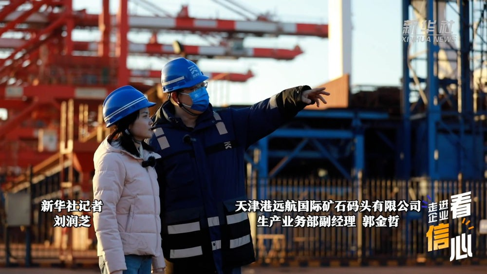 
港口，是经济运行的重要“晴雨表”。开年以来，天津港码头机器轰鸣、货运吞吐创下新高、国际班列接踵而至，折射出充足的经济活力与韧性。 
 
 
今年春节期间，天津港远航国际公司接卸作业码头吞吐量超过140万吨，创下新高，同比去年春节吞吐量翻了一番；天津港海铁联运的发运量994节，同比去年增长了44%。 
 
今年1月，天津港集团发布首个全物联网集装箱码头，按下“港口万物智能互联时代”快进键，码头服务质量和作业效率不断取得新突破。 
 
渤海湾畔新潮涌，伴随着嘹亮的汽笛声，这座中国北方大港阔步前行。 
 
出品人：孙志平、丁锡国 
监制：樊华、王建华、刘元旭 
策划：秦大军、邵香云 
记者：李帅、刘润芝 
摄像：郝杰 
新华社音视频部 
新华社天津分社 
联合出品

------------

中新网上海2月5日电 题：为何此般“闹”元宵节？小习俗传承千年记忆

　　作者谢梦圆

　　“这个兔子身上为什么有那么多花纹啊？而且还会亮，好漂亮啊！”6岁的小秋指着悬挂的彩色兔子灯好奇地问身边的妈妈。5日，赏花灯、猜灯谜、包汤圆等元宵活动在上海市浦东新区群众文化艺术馆举行，现场上百个造型各异的花灯组成一片流光璀璨的花灯长廊吸引不少带孩子的家长驻足拍照留影。

　　一旁的灯谜架上红纸片随风翻飞，纸上写着灯谜，辅以隐隐透出亮光的大红灯笼图案作为装饰。架子顶端每隔一段距离就伸出一根近一米的杆子，每根杆子上依次挂着两个纯色纸灯笼和一个兔子灯。兔子灯憨态可掬的模样引得孩子们纷纷仰头盯着看。

　　为什么元宵节一定要看花灯？

　　“原始社会利用火带来熟食和光明后，引发了人们对于火的崇拜，后来古人又开始崇拜天上的星星。所以说最古老的元宵节就是对火、星星这样发亮物的原始崇拜。”华东师范大学终身教授、上海市非遗保护工作专家委员会副主任陈勤建介绍，很早楚地民间就有了祭祀“太一天神”的习俗，具体表现为从正月十五日傍晚开始点灯到天明。

　　对火的原始崇拜到了汉代形成了民俗化、社会化趋势。汉代社会受楚文化影响较大，民间也广泛存在祭祀“太一天神”的现象。

　　之后这种全民习俗又演变成了社会性的庆典活动。到了隋唐时期，一些统治者比较提倡看花灯的风俗，尤其是唐宋的统治阶级，甚至会发布放假政策。上行下效，至少到了南宋时期，元宵节已经成为盛大的、全民狂欢的活动了。

中新网上海2月5日电 题：为何此般“闹”元宵节？小习俗传承千年记忆

　　作者谢梦圆

　　“这个兔子身上为什么有那么多花纹啊？而且还会亮，好漂亮啊！”6岁的小秋指着悬挂的彩色兔子灯好奇地问身边的妈妈。5日，赏花灯、猜灯谜、包汤圆等元宵活动在上海市浦东新区群众文化艺术馆举行，现场上百个造型各异的花灯组成一片流光璀璨的花灯长廊吸引不少带孩子的家长驻足拍照留影。

　　一旁的灯谜架上红纸片随风翻飞，纸上写着灯谜，辅以隐隐透出亮光的大红灯笼图案作为装饰。架子顶端每隔一段距离就伸出一根近一米的杆子，每根杆子上依次挂着两个纯色纸灯笼和一个兔子灯。兔子灯憨态可掬的模样引得孩子们纷纷仰头盯着看。

　　为什么元宵节一定要看花灯？

　　“原始社会利用火带来熟食和光明后，引发了人们对于火的崇拜，后来古人又开始崇拜天上的星星。所以说最古老的元宵节就是对火、星星这样发亮物的原始崇拜。”华东师范大学终身教授、上海市非遗保护工作专家委员会副主任陈勤建介绍，很早楚地民间就有了祭祀“太一天神”的习俗，具体表现为从正月十五日傍晚开始点灯到天明。

　　对火的原始崇拜到了汉代形成了民俗化、社会化趋势。汉代社会受楚文化影响较大，民间也广泛存在祭祀“太一天神”的现象。

　　之后这种全民习俗又演变成了社会性的庆典活动。到了隋唐时期，一些统治者比较提倡看花灯的风俗，尤其是唐宋的统治阶级，甚至会发布放假政策。上行下效，至少到了南宋时期，元宵节已经成为盛大的、全民狂欢的活动了。

>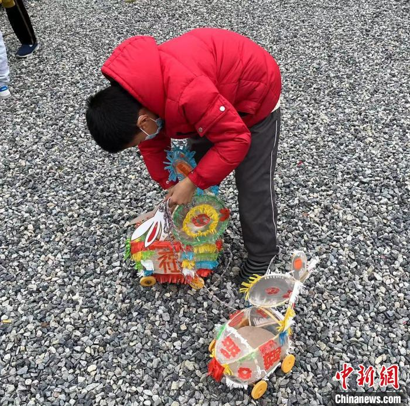

## 中国教育新闻网

2月6日，在山东省青岛市李沧区崇礼小学，学生正在体验剪纸。张鹰 摄" />
                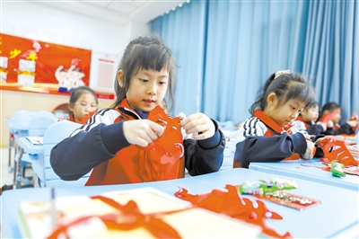
                
            

                    2月6日，在安徽省淮北市第三实验小学，学生们在语文课上朗读课文。万善朝 摄" />
                

           

            本报北京2月6日综合消息（记者黄鹏举孙军）今天，河北、安徽、山东、浙江、湖南、重庆等地中小学和幼儿园迎来2023年春季学期开学。各地用精心筹划的欢迎仪式、多彩的活动开启新学期。山东省青岛市120万名中小学生今天迎来新学期。卡通兔子在学校门前迎接学生，元宵节的灯笼装扮美化校园……青岛市李沧区崇礼小学开展“非遗进校园”活动，学生们通过剪纸、皮影戏、手绘制作风筝等非物质文化遗产项目，感受传统文化魅力。浙江省台州市仙居县第一小学举行拔河、跳绳、老鹰捉小鸡等趣味活动，让学生们在快乐运动中迎接新学期。新学期伊始，河北省邢台市隆尧县教育部门在多所小学、幼儿园组织开展“开学第一课安全进校园”主题活动。消防救援人员、交警走入校园，通过主题班会、现场讲座等方式讲解各类人身安全保护知识，以增强少年儿童自我安全保护意识。《中国教育报》2023年02月07日第1版

--------------

            日前，浙江省教育厅向全省各地教育局发出提示函，严禁提前组织学生返校集中补课、组织任何形式的开学考试，要求重点做好开学前后的家校沟通，做细做好延期考试的学生考前心理疏导和考试组织，合理降低对学有困难学生的作业要求，允许缓交寒假作业，帮助学生平稳度过开学过渡期。可以说，该提示函的发出是非常及时的，体现了健康第一、以生为本的教育理念。有数据统计发现，近期各地因“开学焦虑”问题而进行心理求助的学生正在增加，问题的复杂程度也高于往年同期，需要引起学校和家长的重视。“放假—开学”本是学生最习以为常的校园生活模式，但在经历了上学期长时间居家网课、新冠病毒感染、期末考试调整以及超长寒假等之后，新学期的开学就显得非同寻常。因而，学校该如何安排开学前后的准备工作、家长该如何帮助孩子收心向学、学生又该以怎样的方式开启新生活，成为本阶段看似老生常谈却富有全新挑战的重要话题。总体而言，除了必要的条件保障准备外，学校和家长要重点从情绪引导与心理支持的角度，帮助学生做好迎接新学期的心态调整和心理建设工作。就学校而言，要为开学后将出现长于往年的过渡期而提前做好准备，以“三退”求“三进”。“三退”是指过渡期里，校园常规要求倒退一步，容许学生线下学习规范的再养成；教学进度安排后退一步，支持学生新旧知识衔接的再强化；家校沟通主题后退一步，重启学生家庭基本状况、亲子关系和重大事件的再摸排。根据心理发展规律，新适应的形成至少需要21天，因此可以将开学后的第一个月设置为“重新适应”主题月，从而把在开学前就要求学生做好的身心和学业准备推迟到开学后的三四周内完成。这样的安排及时传达给学生后，能大大缓解焦虑情绪。而精心准备、合理安排下的“三个后退一步”还将为全体学生利用过渡期取得学习习惯、知识掌握和人格成长上的“三个更进一步”创造契机。为此，学校可以在开学前采用线上热身班会、吐槽小会、云聊天、电话家访等自由轻松的形式，引导学生回顾在校和居家学习的切身体验，总结个人得失，为构建高效学习模式做好准备；支持学生巩固加强混合学习的技能技巧，为继续用好线上线下资源开展自主学习打下基础；鼓励学生分享居家学习期间对家庭、国家、社会和生命价值的思考与感悟，为人格上的成长升华积累养分。就家长而言，要密切关注和科学回应孩子的情绪反应与心理变化，有所为有所不为。可以适当向孩子表达自身情绪，但不要宣泄情绪。有些孩子居家学习效果不佳、寒假作业进展缓慢，家长看在眼里急在心里。此时，家长可以适当表达自己的焦虑以唤起孩子对问题的重视，但不可把孩子当成肆意宣泄情绪的出口。情绪宣泄不仅会把不良情绪传递给孩子，而且会放大紧张焦虑的情绪反应，激化孩子对上学的抵触和逃避心理。一旦发现孩子出现情绪不稳定、睡眠不好、忧心忡忡、拖延磨蹭、无来由的身体不适等，要及时提供心理支持与帮助，不能视而不见或横加指责。家长要以同理心站在孩子的角度看待其当前面临的压力，科学表达自己的认同与理解，引导孩子倾诉内心的感受，并与孩子一起分析问题根源、探寻解决途径。当家庭力量无法解决时，要及时向心理教师或专业机构寻求帮助。此外，面对不同年龄阶段和性格特点的孩子，要因人而异，采取适宜的亲情表达方式，避免好心办坏事。比如，对于小学生，家长主动指导寒假作业、憧憬规划新学期生活、一起准备学习用品、帮孩子实现假期愿望等都是行之有效的好做法。但对于正值青春期的中学生，家长的主动介入与干预却可能适得其反。此时更需要家长以积极共情、信任尊重、以身示范、非说教表达等方式给予心理支持。需要强调的是，无论学校还是家长，都要树立学生是自身成长第一责任人的观念，协助和支持学生充分发挥自身主体作用，使其在困难与挑战的磨砺中不断优化心理建设，成为自己身心健康的主人。（作者系中国教育科学研究院副研究员）《中国教育报》2023年02月07日第2版

----------

​            <span type="imagenote" class="imagenotePlace"></span>

-------------

中新网2月8日电 据国家发展改革委微信公众号消息，《横琴粤澳深度合作区发展促进条例》公布。条例自2023年3月1日起施行。

横琴粤澳深度合作区发展促进条例

(2023年1月9日广东省第十三届人民代表大会常务委员会第四十八次会议通过)

　　第一章  总  则


　　第一条  为了推动横琴粤澳深度合作区(以下简称合作区)建设，促进澳门经济适度多元发展，丰富“一国两制”实践，根据《横琴粤澳深度合作区建设总体方案》(以下简称《总体方案》)和有关法律、行政法规，制定本条例。

　　第二条  本条例适用于合作区建设和发展促进等活动。

　　本条例的适用范围为《总体方案》中确定的横琴岛“一线”和“二线”之间的海关监管区域，不包括澳门大学横琴校区和横琴口岸澳门管辖区。横琴与澳门之间为“一线”，横琴与中华人民共和国关境内其他地区(以下简称内地)之间为“二线”。

　　第三条  合作区建设应当坚持解放思想、改革创新、互利合作、开放包容，发展促进澳门经济适度多元的新产业，建设便利澳门居民生活就业的新家园，构建与澳门一体化高水平开放的新体系，健全粤澳共商共建共管共享的新体制，推动澳门长期繁荣稳定和更好融入国家发展大局。

　　第四条  广东省人民政府及其有关部门、珠海市人民政府及其有关部门应当根据合作区开发建设实际，将有关省、市管理权限依法授权或者委托给合作区有关机构行使。

　　广东省人民政府及其有关部门应当结合自身职能制定措施，加大对合作区指导支持力度，把合作区作为深化改革、扩大开放的试验田和先行区。

　　广东省其他地区已经推行的改革举措，合作区具备条件且有实际需要的，广东省人民政府及其有关部门应当支持合作区探索实施。

　　支持合作区以清单式申请授权方式，在经济管理、营商环境、市场监管等重点领域深化改革、扩大开放。

　　第五条  合作区率先在改革开放重要领域和关键环节大胆创新、先行先试、自主探索，推进规则衔接、机制对接，打造具有中国特色、彰显“一国两制”优势的区域开发示范。

　　合作区建立容错免责机制。在合作区进行的改革创新未能实现预期目标，但是符合合作区战略定位和任务要求，决策程序符合法律、法规或者有关规定，未牟取私利或者未恶意串通损害公共利益的，对有关单位和个人免于追究相关责任。

　　第二章  治理体制

　　第六条  合作区管理委员会由广东省、澳门特别行政区双方按照《总体方案》联合组建，实行双主任制。广东省和澳门特别行政区有关单位、珠海市人民政府、中央驻粤相关机构是合作区管理委员会的成员单位。

　　合作区管理委员会是负责合作区开发管理的议事决策机构，统筹决定合作区下列重大事项，其中涉及国家事权的事项应当按照程序报批：

　　(一)重大规划，包括合作区总体发展规划、国土空间规划、重要专项规划、年度工作总结和计划安排，年度预决算建议草案等。

　　(二)重大政策，包括需要省人民政府支持的重大政策，需要争取国家支持的产业、财税、人才、通关、创新创业等方面的重大政策，合作区立法建议等。

　　(三)重大项目，包括合作区的基础设施建设、产业发展和公共服务等领域的重大项目。重大项目的具体标准由合作区管理委员会另行制定。

　　(四)重要人事任免，包括提出管理委员会副主任建议人选，任免管理委员会秘书处秘书长、副秘书长和执行委员会主任、副主任，以及执行委员会职能设置、工作机构和人员额度等事宜。

　　合作区管理委员会可以根据合作区实际需要，按照议事决策程序对前款重大事项的具体内容进行调整。

　　第七条  合作区执行委员会是合作区管理委员会的日常工作机构，承担合作区建设主体执行责任，负责合作区具体开发建设工作，依法履行国际推介、招商引资、产业导入、土地开发、项目建设、教育医疗、文化体育、社会保障等相关行政管理和公共服务职能。

　　合作区执行委员会及其工作机构是承担合作区经济、民生管理等相关行政管理和公共服务职能的法定机构。

　　第八条  原中国(广东)自由贸易试验区珠海横琴新区片区管理委员会、原珠海市横琴新区管理委员会及横琴镇人民政府的经济、民生管理等相关行政管理和公共服务职能，由合作区执行委员会及其工作机构承担。

　　第九条  法律、法规、规章规定由设区的市及以下人民政府及其有关部门行使的经济、民生管理等相关行政管理和公共服务职能，可以由合作区执行委员会及其工作机构行使。

　　法律、行政法规、国务院部门规章明确由省人民政府及其有关部门行使的经济、民生管理等相关行政管理和公共服务职能，委托给合作区执行委员会及其工作机构行使，法律、行政法规、国务院部门规章明确规定不得委托的除外。

　　广东省地方性法规、广东省政府规章规定由省人民政府及其有关部门行使的经济、民生管理等相关行政管理和公共服务职能，交由合作区执行委员会及其工作机构行使。

　　广东省人民政府及其有关部门承接的国家管理职权，经国务院及其有关部门同意后，可以交由合作区执行委员会及其工作机构行使。

　　第十条  广东省人民政府及其有关部门交由合作区执行委员会及其工作机构行使的行政职权目录，由广东省人民政府制定并向社会公布。

　　合作区执行委员会及其工作机构的权责清单由合作区执行委员会向社会公布。

　　第十一条  根据合作区发展实际需要，合作区执行委员会可以自主决定其工作机构聘用的人员及其薪酬标准和福利待遇，建立与绩效目标相适应的薪酬管理制度。

　　合作区执行委员会可以从境内外专业人士中选聘工作人员，并应当与聘用的人员签订劳动合同。

　　第十二条  合作区管理委员会和执行委员会的境外工作人员因工作需要知悉国家秘密的，应当报广东省保密行政管理部门批准。合作区执行委员会应当承担具体保密管理工作。

　　广东省人民政府可以依法授权合作区执行委员会确定国家秘密的密级。

　　第十三条  中共广东省委、广东省人民政府在合作区设立的派出机构(以下简称广东省派出机构)，负责党的建设、国家安全、刑事司法、社会治安等职能，履行属地管理职能，配合合作区管理委员会和执行委员会推进合作区开发建设。广东省派出机构与合作区执行委员会应当建立重大事项通报、重要工作衔接协同工作机制，加强日常信息互通共享。

　　广东省人民政府派出机构在职权范围内以自己的名义行使行政管理职权，职权清单经广东省人民政府同意后向社会公布。

　　广东省人民政府派出机构与合作区执行委员会的职责分工不明确的，由双方协商一致后报合作区管理委员会备案，协商达不成一致意见的，由合作区管理委员会协调解决。

　　第十四条  合作区管理委员会广东省方面的成员单位应当与合作区执行委员会及其工作机构建立直接工作联系机制，对合作区执行委员会各工作机构给予业务指导支持，协助解决实际问题。

　　广东省推进粤港澳大湾区建设领导小组办公室应当发挥统筹协调、决策参谋、推动落实的作用，负责协调广东省有关单位支持合作区开发建设。

　　广东省相关部门应当强化政策支持和资源保障，对涉及合作区的事项创造条件、优先安排。广东省一体化政务服务平台和一体化行政执法平台应当向合作区执行委员会及其工作机构开放。

　　第十五条  珠海市应当与合作区建立健全长效对接沟通机制，支持、服务和保障合作区开发建设。合作区的社会管理、城市管理和民生事务等，需要珠海市承接的，由合作区和珠海市协商确定，协商达不成一致意见的，由广东省人民政府协调解决。

　　第十六条  广东省与澳门特别行政区协商建立合作区收益共享机制。

　　合作区实行一级财政管理，具体办法由广东省人民政府制定。

　　合作区国有土地使用权出让收入扣除成本后由合作区与珠海市均等共享。

　　合作区国民经济统计指标数据纳入珠海市统计。

　　第十七条  合作区执行委员会负责编制合作区预算草案，经合作区管理委员会同意，由广东省人民政府按照程序提请广东省人民代表大会审查批准；预算调整方案和决算草案，经合作区管理委员会同意，由广东省人民政府按照程序提请广东省人民代表大会常务委员会审查批准。

　　第十八条  广东省审计主管部门依法对合作区开展审计监督。

　　合作区管理委员会建立廉政审计机制，按照规定对合作区执行委员会及其工作机构开展廉政监督和审计监督。

　　广东省有关部门与合作区加强廉政审计业务交流，促进沟通协调。

　　第十九条  合作区管理委员会建立合作区促进澳门经济适度多元发展成效评估指标体系，开展年度评估。评估结果向粤港澳大湾区建设领导小组报告。

　　除法律、行政法规和国家规定以外，不得设置对合作区执行委员会及其工作机构的考核、评比等项目。

　　第三章  规划建设与管理

　　第二十条  合作区建立以合作区总体发展规划为统领、国土空间规划为基础、专项规划为支撑的规划体系。

　　合作区开发建设应当符合规划要求，创新建设用地、能耗双控、污染物排放等方面的管理模式。

　　第二十一条  合作区土地利用应当符合合作区规划，以集约高效、满足长远发展为原则，构建灵活多样的土地供应体系，可以采用长期租赁、先租后让、租让结合、弹性年期供应等方式供应产业用地。新出让建设用地应当直接服务于支持澳门经济适度多元发展。

　　第二十二条  合作区应当加强基础设施建设，完善岛内综合交通系统，畅通对外联系通道，加强“二线”通道及周边基础设施建设，加强琴澳一体化立体交通体系建设，推动形成布局合理、功能完善、衔接顺畅、运作高效的基础设施网络。

　　第二十三条  合作区应当依托数字政府基础底座建设城市大数据中心和智慧城市运行管理中心，搭建高效便捷的城市运行管理服务平台，支撑跨部门信息共享和业务协调，实现公共资源智慧化配置。

　　合作区建立覆盖城市治理、政务服务、社区治理、民生服务等领域的智能化应用体系，加强琴澳智慧城市合作。

　　第二十四条  合作区应当建立健全地下空间开发利用统筹协调机制，按照安全、高效、适度的原则，加强地下空间分层开发利用。地下空间优先建设交通、市政工程、防空防灾、环境保护等城市基础设施和公共服务设施。

　　探索城市地下空间竖向开发、分层赋权等土地管理改革创新，在建设用地的地上、地表、地下分别设立使用权。

　　第二十五条  合作区应当健全生态环境评价和监测监管制度，严守生态保护红线、环境质量底线、资源利用上线，制定生态环境准入清单，落实生态环境分区管控要求，加强植树造林、湿地保育、岸滩改造、海洋生态环境保护等。

　　合作区应当充分衔接澳门海湾的生态保护与利用，结合城市功能划分滨海岸线类型，形成集湿地生态、城市形象、生活休闲于一体的海湾景观。

　　第二十六条  合作区应当借鉴国内国际先进经验，提升城市建设和运营管理水平，统筹推进污水管网、固废处理、信息基础、公共文化等公共设施的建设。

　　支持合作区立足琴澳一体化发展，创新超高层建筑管理模式，在国家规定范围内科学合理设定建筑限高标准。

　　第二十七条  合作区执行委员会应当会同广东省派出机构成立合作区安全生产委员会，加强安全生产监督管理工作，完善安全生产责任制度，履行安全生产监督管理职责，组织开展较大及以下生产安全事故调查，及时协调解决安全生产监督管理中的重大问题，从源头上防范化解重大安全风险。

　　广东省对合作区安全生产工作实行单独考核。

　　第四章  促进产业发展

　　第二十八条  合作区应当编制产业发展规划，发展促进澳门经济适度多元的新技术、新产业、新业态、新模式，重点发展科技研发和高端制造、中医药、文化旅游会展商贸、现代金融等产业。

　　合作区可以与澳门公共服务机构合作开展招商活动。

　　合作区与珠海市建立健全联合招商、收益共享机制，推进产业协同发展。

　　第二十九条  支持合作区建设发展急需的科技基础设施，引进国内外顶尖科研院所设立重大创新平台，构建技术创新与转化中心，创建国家级重大科研平台，打造粤港澳大湾区国际科技创新中心的重要支点。

　　第三十条  支持合作区发展集成电路、电子元器件、新材料、新能源、大数据、人工智能、物联网、生物医药产业。

　　支持合作区构建特色微电子产业链，建设集成电路先进测试技术和服务平台，布局芯片研发和制造项目，建设全球电子元器件集散中心。

　　支持合作区加快发展数字经济，完善数字基础设施，建设人工智能协同创新生态，开展智能医疗、智能驾驶等领域应用，推动大数据、人工智能、物联网等赋能实体经济和城市发展，打造下一代互联网产业集群。

　　第三十一条  支持合作区建设中医药生产基地和创新高地，发展中医药服务贸易，建立具有自主知识产权和中国特色的医药创新研发与转化平台。

　　在合作区生产的经澳门审批和注册的中医药产品、食品及保健食品，可以使用“澳门监造”“澳门监制”“澳门设计”标志。

　　第三十二条  支持合作区发展休闲养生、康复医疗、健康管理、高端医疗服务等大健康产业。

　　支持前沿医疗技术研发和应用，推动合作区内具备条件的医疗机构经国家有关部门备案后，开展干细胞、体细胞临床项目研究。支持合作区内医疗机构与已经依法从事干细胞、体细胞等临床研究的内地或者港澳医疗机构加强交流合作，提升临床研究水平和能力。

　　第三十三条  支持合作区发展休闲度假、会议展览、舞台演艺、体育赛事观光、游艇旅游等文旅产业，高水平建设横琴国际休闲旅游岛。

　　支持合作区开展国际旅游品牌推广，打造“一程多站”旅游精品线路，推动旅游、文化跨界融合，发展影视、原创艺术、动漫、电竞等文化创意产业。

　　支持在合作区举办国际高品质消费博览会暨世界湾区论坛。

　　第三十四条  支持合作区建设高品质进口消费品交易中心、中葡国际贸易中心和数字贸易国际枢纽港。

　　第三十五条  支持合作区发展银行、证券、保险、私募股权投资等金融业态，支持在合作区创新发展财富管理、债券市场、融资租赁等现代金融业。

　　鼓励合作区营造与港澳、国际接轨的金融营商环境，探索构建适应合作区高水平开放的金融监管协调机制。

　　第三十六条  合作区应当制定政策措施，吸引高端人才和紧缺人才参与合作区建设，对引进的高层次人才和重大人才载体给予相应资助和奖励。

　　支持合作区开展人才发展体制机制综合改革试点，加强与澳门人才计划的衔接，建立与国际规则接轨的人才招聘、评价激励、科研管理等制度。

　　支持合作区实行更加开放的人才停居留管理措施，实行更加宽松的人员临时出入境政策、便利的工作签证政策。

　　第三十七条  对合作区内符合国家规定条件的产业企业，减按15%的税率征收企业所得税。对企业符合条件的资本性支出，依照国家规定允许在支出发生当期一次性税前扣除或者加速折旧和摊销。

　　对在合作区设立的旅游业、现代服务业、高新技术产业企业新增境外直接投资取得的所得，依照国家规定免征企业所得税。

　　在合作区工作的境内外高端人才和紧缺人才，其个人所得税负超过15%的部分，依照国家规定予以免征。

　　对在合作区工作的澳门居民，其个人所得税负超过澳门税负的部分，依照国家规定予以免征。

　　第五章  便利澳门居民生活就业

　　第三十八条  推动合作区深度对接澳门教育、医疗、社会服务、交通等民生公共服务和社会保障体系，为澳门居民在合作区学习、就业、创业、生活提供便利条件。

　　第三十九条  支持合作区完善在合作区就业、居住的澳门居民子女就学政策，建立衔接澳门的教育服务机制，推动与澳门学校的交流与合作，鼓励在合作区内开办澳门子弟学校、子弟班。

　　合作区普及学前教育，大力发展普惠性学前教育，加强优质公办学位建设，支持社会力量举办民办幼儿园。

　　在合作区就业、居住的澳门居民子女入学、入园，与横琴户籍生享有同等权利。

　　第四十条  支持合作区打造横琴澳门青年创业谷、中葡青年创新创业基地等载体，为澳门青年提供更多的创新创业空间。

　　广东省人民政府及其有关部门应当为澳门青年在合作区创新创业就业提供政策扶持，推动在合作区创新创业就业的澳门青年同步享受粤澳两地的扶持政策。

　　第四十一条  按照国家规定，具有澳门等境外执业资格的金融、建筑、规划、设计等领域专业人才，在符合行业监管要求条件下，经备案后在合作区提供服务，其境外从业经历可以视同境内从业经历。

　　探索符合条件的港澳和外籍医务人员在合作区便利执业。推动符合条件的外籍家政服务人员经备案可以在合作区内为澳门居民和境外高端人才、紧缺人才提供服务。

　　第四十二条  支持在合作区探索提供澳门模式的医疗、教育、广播电视、电影及社区服务等，营造衔接澳门的居住环境。

　　在合作区建设“澳门新街坊”等民生项目，拓展澳门居民优质生活空间。

　　第四十三条  鼓励澳门医疗卫生服务提供主体在合作区内以独资、合资或者合作方式设置医疗机构。

　　前款医疗机构可以经批准后在本医疗机构内使用临床急需、已在澳门上市的药品和特殊医学用途配方食品，以及使用临床急需、澳门公立医院已采购使用、具有临床应用先进性(大型医用设备除外)的医疗器械。

　　第四十四条  支持合作区衔接澳门养老服务标准及规范，提供多元化的长者照顾服务，建设医养结合的养老服务设施。

　　第四十五条  合作区应当与相邻地区开展区域应急合作，建立和完善信息通报制度和应急管理联动机制，共同做好突发事件区域联防联控相关工作。

　　推动粤澳在合作区共建区域医疗联合体和区域性医疗中心，联合应对公共卫生突发事件。

　　第四十六条  支持合作区建立与澳门社会服务合作机制，促进两地社区治理和服务融合发展。

　　支持符合条件的澳门社会服务团体依法在合作区内提供相应的社会服务。

　　中国籍澳门居民可以按照国家规定担任合作区社会组织成员或者负责人。

　　第六章  推动琴澳一体化发展

　　第四十七条  支持合作区构建与澳门一体化高水平开放的新体系，促进要素高效便捷流动，打造市场化法治化国际化营商环境。

　　第四十八条  按照国家有关规定，符合条件的货物及物品从澳门经“一线”免(保)税进入合作区。

　　对合作区和澳门之间经“一线”进出的货物(过境合作区货物除外)按照国家规定实施备案管理，简化申报程序和要素。

　　第四十九条 合作区与内地之间货物、物品、运输工具等应当经“二线”通道进出。

　　从合作区经“二线”通道进入内地的免(保)税货物，按照进口货物有关规定办理海关手续，依法征收关税和进口环节税。

　　对合作区内企业生产的不含进口料件或者含进口料件在合作区加工增值达到或者超过30%的货物，经“二线”通道进入内地按照国家规定免征进口关税。

　　从内地经“二线”通道进入合作区的有关货物视同出口，按照现行税收政策规定实行增值税和消费税退税，涉及出口关税应税商品的征收出口关税，并根据需要办理海关手续。

　　第五十条  推动在合作区开展动植物及其产品检验检疫改革创新试点，探索建立更为简便、优化的检验检疫模式。

　　第五十一条  合作区在“一线”按照规定实行合作查验、一次放行通关模式，依法实施卫生检疫。“二线”对人员进出不作限制。

　　推动琴澳口岸实施更大范围、更深层次的信息互换、执法互助、监管互认，全面提升通关便利化水平。

　　支持符合条件的澳门机动车辆免担保进入合作区。推动放开取得澳门机动车驾驶执照的澳门居民可以在合作区驾驶与准驾车型相符的机动车。

　　第五十二条  合作区实施更加开放的人员出入境政策，为境内外人员进出合作区创造更加便利的条件。在横琴口岸设立的签证机关为外国人进入合作区提供口岸签证便利。

　　合作区公安机关出入境管理机构可以受理、审批签发并制作外国人签证和停居留证件。对在合作区企业、高等学校、科研机构工作的符合条件的内地人员实行商务和人才签注备案制。

　　第五十三条  支持合作区建立高度便利的市场准入制度，按照国家规定实施合作区放宽市场准入特别措施，放宽各类投资者在合作区开展投资贸易的资质要求、持股比例、行业准入等限制。合作区简化政务服务流程，进一步整合审批资源，提高审批效率，降低审批成本。

　　支持合作区拓展国际贸易单一窗口功能，提高货物通关效率，促进跨境贸易便利化。

　　合作区推行与澳门商事登记跨境通办，推动建立与澳门商事登记信息共享互通机制。

　　第五十四条  支持合作区建立与其发展相适应的账户管理体系，推动合作区与澳门资金自由便利流动，建立适应高水平贸易投资自由化、便利化需要的跨境投融资管理制度。

　　鼓励合作区、澳门的保险机构合作开发跨境保险产品，提供跨境保险服务。

　　第五十五条  支持合作区在国家数据跨境传输安全管理制度框架下，开展数据跨境传输安全管理试点，建设固网接入国际互联网的绿色通道。

　　支持合作区、澳门相关高等学校、科研机构在确保个人信息和重要数据安全前提下，实现科学研究数据依法跨境互联互通。

　　第七章  法治保障

　　第五十六条  支持合作区加快扩大规则、规制、管理、标准等制度型开放，逐步构建民商事规则衔接澳门、接轨国际的制度体系。

　　第五十七条  合作区执行委员会、广东省派出机构根据改革发展需要，经合作区管理委员会同意，可以建议广东省人民代表大会及其常务委员会制定法规，或者建议珠海市人民代表大会及其常务委员会制定经济特区法规，在合作区内实施。

　　第五十八条  合作区执行委员会、广东省派出机构根据改革发展需要，可以建议广东省人民代表大会常务委员会、广东省人民政府在合作区暂时调整或者暂时停止适用有关广东省地方性法规、广东省政府规章的规定。

　　珠海市地方性法规、珠海市政府规章中有关规定不适应合作区发展的，合作区执行委员会、广东省派出机构可以提出调整或者停止该规定在合作区适用的建议。珠海市人民代表大会常务委员会、珠海市人民政府应当支持并按照程序予以办理。

　　第五十九条  合作区建立综合执法制度，经广东省人民政府同意，合作区执行委员会在职权范围内可以明确一个工作机构相对集中行使行政处罚权并向社会公布。

　　合作区执行委员会可以结合合作区改革创新实践需要，制定行政裁量权基准，规范行使行政裁量权。

　　合作区行政执法人员应当持中华人民共和国行政执法证开展行政执法工作。行政执法证核发、管理按照国家以及广东省有关规定执行，具体工作由合作区执行委员会组织实施。

　　第六十条  有关单位和个人对合作区执行委员会的工作机构、广东省人民政府派出机构的工作机构作出的行政行为不服的，可以分别向合作区执行委员会、广东省人民政府派出机构申请行政复议。

　　有关单位和个人对合作区执行委员会及其工作机构、广东省人民政府派出机构及其工作机构作出的行政行为不服的，可以依法向人民法院提起行政诉讼。

　　第六十一条  加强粤澳司法交流协作，推动在合作区建立完善国际商事审判、仲裁、调解等多元化商事纠纷解决机制。

　　鼓励合作区仲裁机构借鉴国际商事仲裁机构先进的管理体制和管理模式，建立国际通行商事仲裁机制，搭建琴澳仲裁合作平台。

　　鼓励在合作区依法开展国际商事调解。当事人达成的、具有给付内容的商事调解协议，经公证依法赋予强制执行效力或者经人民法院司法确认，可以向人民法院申请强制执行。

　　第六十二条  推动广东省、澳门两地的律师、公证、法律援助等法律服务业务融合发展。加快建设琴澳国际法务集聚区，优化涉外法律服务。支持在合作区成立律师协会，加强律师行业管理。

　　取得律师执业证书(粤港澳大湾区)的人员，按照国家规定在合作区内办理适用内地法律的部分民商事法律事务(含诉讼业务和非诉讼业务)。

　　澳门公证机构出具或者中国委托公证人(澳门)出具的民商事领域的公证文书，可以按照国家规定在合作区内使用。

　　澳门居民在合作区申请法律援助的，法律援助机构可以按照澳门有关司法援助的条件、范围等规定核查申请人的经济状况等。

　　第六十三条  支持在合作区依法设立域外法查明服务机构，提供包括澳门、葡语系国家(地区)在内的域外法查明服务。

　　第六十四条  合作区执行委员会应当加强对市场主体生产、经营活动的监管，完善市场主体信用监管制度，建立市场主体信用信息公示、信用评价制度。

　　第六十五条  合作区建立安全风险预警和防控体系，防范和化解重大风险。

　　合作区加强反洗钱、反恐怖融资、反逃税、反非法集资监管，对禁限管制、高风险商品等依法实施口岸联合查验和入市监管。广东省有关部门应当加强对合作区财税金融政策执行的监督检查。

　　广东省派出机构会同中央驻粤相关机构、合作区执行委员会建立分工协作、各尽其责的反走私综合治理工作机制，海关、边检、公安等部门综合运用稽查、核查、调查、缉私等监管手段，依法打击走私等违法犯罪活动。

　　第八章  附  则

　　第六十六条  本条例自2023年3月1日起施行。 <span>【编辑:田博群】 </span>

--------------


```

