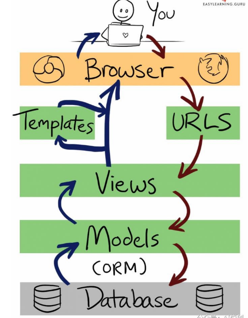
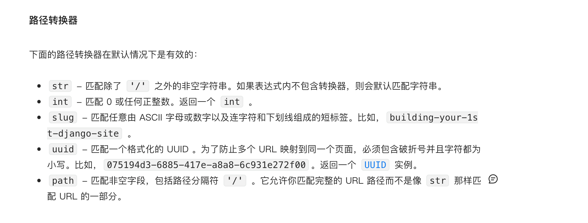
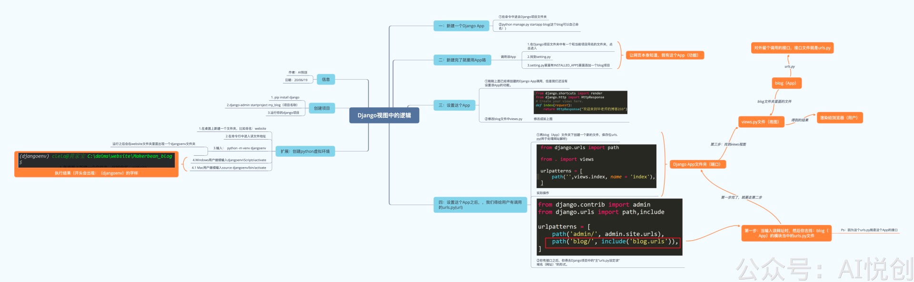

## Django

### 为什么要用虚拟环境？

在一台电脑上，想开发多个不同的项目， 需要用到同一个包的不同版本， 如果使用上面的命令， 在同一个目录下安装或者更新， 新版本会覆盖以前的版本， 其它的项目就无法运行了。

在使用django开发项目的时候，一个环境只能对应一个项目，因为这样可以方便管理第三方包，每个项目使用的第三方可能不一样，若不安装虚拟环境、都装在系统里面，每次项目加载都需要加载所有的安装包，影响效率。

### 1.Django环境搭建

创建文件夹‘MY_Web'

进入此文件夹路径下输入以下命令

python -m venv blog_venv(Django)

blog_venv/Scripts/activate

pip list

显示Django版本信息

## 2.创建项目

pip install django

django-admin startproject my_project_blog

pycharm打开创建的’My_Web'文件

python manage.py runserver

检查是否成功创建

teriminal中输入：python manage.py migrate (数据迁移)

python manage.py startapp blog_app(可以看到目录中出现blog_app文件夹)

views.py中定义函数，返回页面内容

导入HttpResponse类

在blog_app中创建urls.py

 urls.py中定义链接格式

