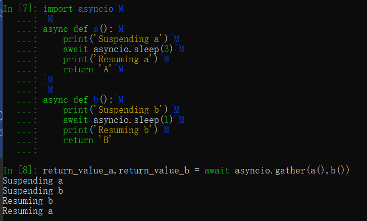
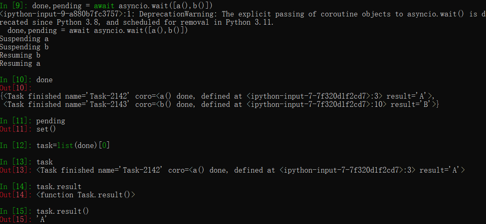
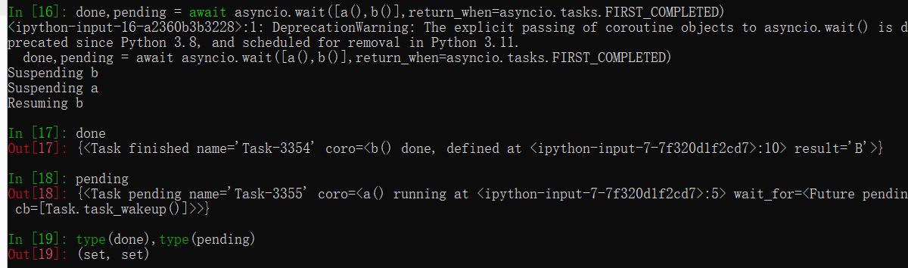

---

title: 异步协程
date: 2022-10-30 12:04:21
author: cava
isOriginal: true
category: 
    - notebook
tag:
    - python
    - 爬虫
icon: vue
sticky: false
star: false
password: false
article: true
timeline: true
image: false
navbar: true
sidebarIcon: true
headerDepth: 5
comment: true
lastUpdated: true
editLink: False
backToTop: true
toc: true
---

## 异步协程

如下所示，爬取若干个url,消耗的时间是每个url所需的时间之和。

```python
import time
def crawl_page(url):
    print("crawling{}".format(url))
    sleep_time=int(url.split("_")[-1])
    time.sleep(sleep_time)
    print("OK{}".format(url))

def main(urls):
    for url in urls:
        crawl_page(url)

%time main(["url_1","url_2","url_3","url_4"])
输出----------------------------------------------
OKurl_1
crawlingurl_2
OKurl_2
crawlingurl_3
OKurl_3
crawlingurl_4
OKurl_4
CPU times: total: 0 ns
Wall time: 10 s
```

协程,将时间最久的一个任务挂起，在这个时间段内执行其他任务。最终总时间只是其中一个任务所需的最长时间。

```python
import asyncio,time

async def crawl_page(url):
    print("crawling{}".format(url))
    sleep_time=int(url.split("_")[-1])
    await asyncio.sleep(sleep_time)
    print("OK {}".format(url))

async def main(urls):
    tasks=[asyncio.create_task(crawl_page(url)) for url in urls]
    for task in tasks:
        await task

start_time=time.time()
await main(["url_1","url_2","url_3","url_6"])
print(time.time()-start_time)
输出----------------------------------------------------------
crawlingurl_1
crawlingurl_2
crawlingurl_3
crawlingurl_6
OK url_1
OK url_2
OK url_3
OK url_6
6.00509238243103
```


### 执行task的另一种方法

```python
import asyncio,time

async def crawl_page(url):
    print("crawling{}".format(url))
    sleep_time=int(url.split("_")[-1])
    await asyncio.sleep(sleep_time)
    print("OK {}".format(url))

async def main(urls):
    tasks=[asyncio.create_task(crawl_page(url)) for url in urls]
    await asyncio.gather(*tasks) #(*task 解包列表)

start_time=time.time()
await main(["url_1","url_2","url_3","url_4"])
print(time.time()-start_time)
输出----------------------------------------------------------------
crawlingurl_1
crawlingurl_2
crawlingurl_3
crawlingurl_4
OK url_1
OK url_2
OK url_3
OK url_4
4.005146741867065
```

### 解包列表？

将列表中的元素都当作参数传到函数里








### 实战：豆瓣电影

版本1

```python
import requests
from bs4 import BeautifulSoup

def main():
    headers={"User-Agent":"Mozilla/5.0 (Windows NT 10.0; Win64; x64) AppleWebKit/537.36 (KHTML, like Gecko) Chrome/107.0.0.0 Safari/537.36"}

    url = "https://movie.douban.com/cinema/later/beijing/"
    init_page = requests.get(url,headers=headers).content
    init_soup = BeautifulSoup(init_page, 'lxml')

    all_movies = init_soup.find('div', id="showing-soon")
    for each_movie in all_movies.find_all('div', class_="item"):
        all_a_tag = each_movie.find_all('a')
        all_li_tag = each_movie.find_all('li')

        movie_name = all_a_tag[1].text
        url_to_fetch = all_a_tag[1]['href']
        movie_date = all_li_tag[0].text

        response_item = requests.get(url_to_fetch,headers=headers).content
        soup_item = BeautifulSoup(response_item, 'lxml')
        img_tag = soup_item.find('img')
        print('{} {} {}'.format(movie_name, movie_date, img_tag['src']))

%time main()
输出---------------------------------------------------------------------------
风再起时 02月05日 https://img9.doubanio.com/view/photo/s_ratio_poster/public/p2887039584.jpg
黑豹2 02月07日 https://img9.doubanio.com/view/photo/s_ratio_poster/public/p2886589774.jpg
不能流泪的悲伤 02月14日 https://img1.doubanio.com/view/photo/s_ratio_poster/public/p2886531289.jpg
蚁人与黄蜂女：量子狂潮 02月17日 https://img1.doubanio.com/view/photo/s_ratio_poster/public/p2886589789.jpg
中国乒乓之绝地反击 02月17日 https://img9.doubanio.com/view/photo/s_ratio_poster/public/p2887100255.jpg
印式英语 02月24日 https://img1.doubanio.com/view/photo/s_ratio_poster/public/p2886633470.jpg
毒舌律师 02月24日 https://img9.doubanio.com/view/photo/s_ratio_poster/public/p2886619074.jpg
会考试的猛犸象 02月24日 https://img9.doubanio.com/view/photo/s_ratio_poster/public/p2879572685.jpg
拨浪鼓咚咚响 02月25日 https://img2.doubanio.com/view/photo/s_ratio_poster/public/p2886538033.jpg
宇宙探索编辑部 04月01日 https://img1.doubanio.com/view/photo/s_ratio_poster/public/p2886529968.jpg
龙马精神 04月07日 https://img2.doubanio.com/view/photo/s_ratio_poster/public/p2887204283.jpg
长空之王 04月28日 https://img9.doubanio.com/view/photo/s_ratio_poster/public/p2886235064.jpg
人生路不熟 04月28日 https://img1.doubanio.com/view/photo/s_ratio_poster/public/p2887091779.jpg
检察风云 04月29日 https://img1.doubanio.com/view/photo/s_ratio_poster/public/p2886533208.jpg
请别相信她 05月20日 https://img1.doubanio.com/view/photo/s_ratio_poster/public/p2886540928.jpg
伟大的胜利 09月30日 https://img1.doubanio.com/view/photo/s_ratio_poster/public/p2886621940.jpg
CPU times: total: 672 ms
Wall time: 17.2 s
```

版本2 协程

```python
import asyncio
import aiohttp

from bs4 import BeautifulSoup

header = {
    "User-Agent": "Mozilla/5.0 (Windows NT 10.0; Win64; x64) AppleWebKit/537.36 (KHTML, like Gecko) Chrome/107.0.0.0 Safari/537.36"}


async def fetch_content(url):
    async with aiohttp.ClientSession(
        headers=header, connector=aiohttp.TCPConnector(ssl=False)
    ) as session:
        async with session.get(url) as response:
            return await response.text()

async def main():
    url = "https://movie.douban.com/cinema/later/beijing/"
    init_page = await fetch_content(url)
    init_soup = BeautifulSoup(init_page, 'lxml')

    movie_names, urls_to_fetch, movie_dates = [], [], []

    all_movies = init_soup.find('div', id="showing-soon")
    for each_movie in all_movies.find_all('div', class_="item"):
        all_a_tag = each_movie.find_all('a')
        all_li_tag = each_movie.find_all('li')

        movie_names.append(all_a_tag[1].text)
        urls_to_fetch.append(all_a_tag[1]['href'])
        movie_dates.append(all_li_tag[0].text)

    tasks = [fetch_content(url) for url in urls_to_fetch]
    pages = await asyncio.gather(*tasks)

    for movie_name, movie_date, page in zip(movie_names, movie_dates, pages):
        soup_item = BeautifulSoup(page, 'lxml')
        img_tag = soup_item.find('img')

        print('{} {} {}'.format(movie_name, movie_date, img_tag['src']))

asyncio.run(main())
输出----------------------------------------------------------------------------------
风再起时 02月05日 https://img9.doubanio.com/view/photo/s_ratio_poster/public/p2887039584.jpg
黑豹2 02月07日 https://img9.doubanio.com/view/photo/s_ratio_poster/public/p2886589774.jpg
不能流泪的悲伤 02月14日 https://img1.doubanio.com/view/photo/s_ratio_poster/public/p2886531289.jpg
蚁人与黄蜂女：量子狂潮 02月17日 https://img1.doubanio.com/view/photo/s_ratio_poster/public/p2886589789.jpg
中国乒乓之绝地反击 02月17日 https://img9.doubanio.com/view/photo/s_ratio_poster/public/p2887100255.jpg
印式英语 02月24日 https://img1.doubanio.com/view/photo/s_ratio_poster/public/p2886633470.jpg
毒舌律师 02月24日 https://img9.doubanio.com/view/photo/s_ratio_poster/public/p2886619074.jpg
会考试的猛犸象 02月24日 https://img9.doubanio.com/view/photo/s_ratio_poster/public/p2879572685.jpg
拨浪鼓咚咚响 02月25日 https://img2.doubanio.com/view/photo/s_ratio_poster/public/p2886538033.jpg
宇宙探索编辑部 04月01日 https://img1.doubanio.com/view/photo/s_ratio_poster/public/p2886529968.jpg
龙马精神 04月07日 https://img2.doubanio.com/view/photo/s_ratio_poster/public/p2887204283.jpg
长空之王 04月28日 https://img9.doubanio.com/view/photo/s_ratio_poster/public/p2886235064.jpg
人生路不熟 04月28日 https://img1.doubanio.com/view/photo/s_ratio_poster/public/p2887091779.jpg
检察风云 04月29日 https://img1.doubanio.com/view/photo/s_ratio_poster/public/p2886533208.jpg
请别相信她 05月20日 https://img1.doubanio.com/view/photo/s_ratio_poster/public/p2886540928.jpg
伟大的胜利 09月30日 https://img1.doubanio.com/view/photo/s_ratio_poster/public/p2886621940.jpg
```


