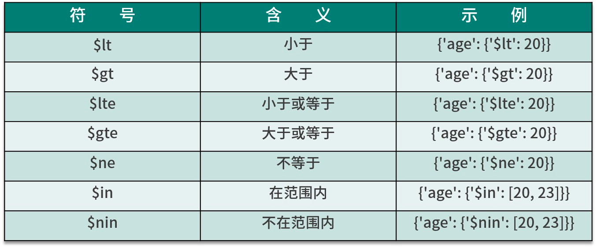

##  MongoDB-pymongo

导入库 import pymongo

### 1.连接数据库

```python
client=pymongo.MongoClient(host="localhost",port=27017)
client=pymongo.MongoClient('mongodb://localhost:27017/')
```

### 2.指定数据库

不存在该数据库会自动创建

```python
db=client.first
db=client['first']
```

### 3.指定集合（数据表）

```python
collections=db.info
collections=db['info']
```

### 4.插入数据

```python
info={
    'id':'123',
    'name':'xiaoyi',
    'birth':'1027',
     'sex':'girl'
}
result=collections.insert_one(info)
print(result)
```

#### 4.1批量插入数据(insert_one)

```python
 for num in range(1,501):
     info_second = {
         'name': faker.name(),
         'email': faker.email(),
         'post': faker.postcode(),
     }
     collections.insert_one(info_second)
```

#### 4.2批量插入数据(insert_many)

```python
result=collections.insert_many([info,info_student])

new_list=[]
for i in range(1,501):
     daylist = {
         'name': faker.name(),
         'email': faker.email(),
         'post': faker.postcode(),
     }
     new_list.append(daylist)
 collections.insert_many(new_list)
```

### 5.查询数据

```python
from bson.objectid import ObjectId

result=collections.find_one({"name":"wewe"})
#获取所有xiaoyi的信息
result2=collections.find({"name":"xiaoyi"})
#查询不存在的id会返回None
result3=collections.find_one({"_id":ObjectId("63b4dee4d36d58d5a24b4172")})
```

### 6.查询数据范围（int)



```python
result=collections.find_one({"birth":{"$gt":8888}})
result=collections.find_one({"birth":{"$in":[8888,20000]}})
result=collections.find_one({"birth":{"$lt":10000}})
result=collections.find_one({"birth":{"$lte":8888}})
```


