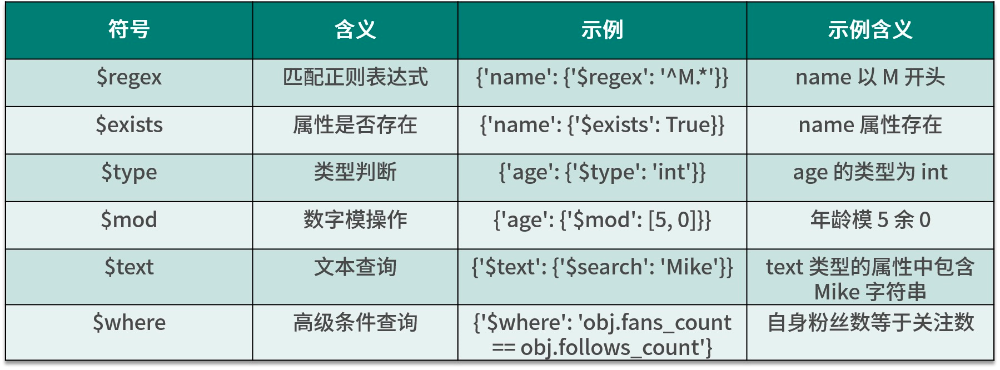

##  MongoDB-pymongo

导入库 import pymongo

### 1. 连接数据库

```python
client=pymongo.MongoClient(host="localhost",port=27017)
client=pymongo.MongoClient('mongodb://localhost:27017/')
```

### 2. 指定数据库

不存在该数据库会自动创建

```python
db=client.first
db=client['first']
```

### 3. 指定集合（数据表）

```python
collections=db.info
collections=db['info']
```

### 4. 插入数据

```python
info={
    'id':'123',
    'name':'xiaoyi',
    'birth':'1027',
     'sex':'girl'
}
result=collections.insert_one(info)
print(result)
```

#### 4.1 批量插入数据(insert_one)

```python
 for num in range(1,501):
     info_second = {
         'name': faker.name(),
         'email': faker.email(),
         'post': faker.postcode(),
     }
     collections.insert_one(info_second)
```

#### 4.2 批量插入数据(insert_many)

```python
result=collections.insert_many([info,info_student])

new_list=[]
for i in range(1,501):
     daylist = {
         'name': faker.name(),
         'email': faker.email(),
         'post': faker.postcode(),
     }
     new_list.append(daylist)
 collections.insert_many(new_list)
```

### 5. 查询数据

```python
from bson.objectid import ObjectId

result=collections.find_one({"name":"wewe"})
#获取所有xiaoyi的信息
result2=collections.find({"name":"xiaoyi"})
#查询不存在的id会返回None
result3=collections.find_one({"_id":ObjectId("63b4dee4d36d58d5a24b4172")})
```

### 6. 查询数据范围（int)


```python
result=collections.find_one({"birth":{"$gt":8888}})
result=collections.find_one({"birth":{"$in":[8888,20000]}})
result=collections.find_one({"birth":{"$lt":10000}})
result=collections.find_one({"birth":{"$lte":8888##}})
```

### 7. 查询数据范围(各类属性)



```python
result=collections.find_one({"name":{"$regex":"^h.*"}})
result=collections.find_one({"birth":{"$type":"int"}})
result=collections.find_one({"name":{"$exists":True}})
print(result)
```

### 8. 统计

```python
counts=collections.count_documents({"sex":{"$ne":"girl"}})
print(counts)
result=collections.find({"sex":{"$ne":"girl"}})
num=0
for i in result:
    print(i)
    num+=1
print(num)
```

### 9.排序

字符首字母大小/字符串大小

```python
result=collections.find().sort("birth",pymongo.ASCENDING)#升序
result=collections.find().sort("name",pymongo.DESCENDING)#降序
for i in result:
    print(i)
```

### 10. 偏移

```python
result=collections.find().sort("birth",pymongo.ASCENDING).skip(2)
跳过前两条数据，从第三条开始获取
result=collections.find().sort("birth",pymongo.ASCENDING).skip(2).limit(2)
跳过前两条,且只往后获取2条
for i in result:
    print(i)
```

### 11.数据更新update  $set

```python
condition={"name":"mike"}
student=collections.find_one(condition)
student["birth"]=24
result=collections.update_one(condition,{"$set":student})
print(result)
```

### 12. 指定某个数据增加

```python
condition={"birth":{"$gt":7}}
result=collections.update_one(condition,{"$inc":{"birth":4}})
result=collections.update_many(condition,{"$inc":{"birth":4}})
print(result)
```

### 13. 数据删减

```python
condition={"birth":{"$gt":30}}
result=collections.delete_one(condition)
result=collections.delete_many(condition)
```


