##  MongoDB 6.0教程

### 1.1下载MongoDB

https://www.mongodb.com/try/download/community

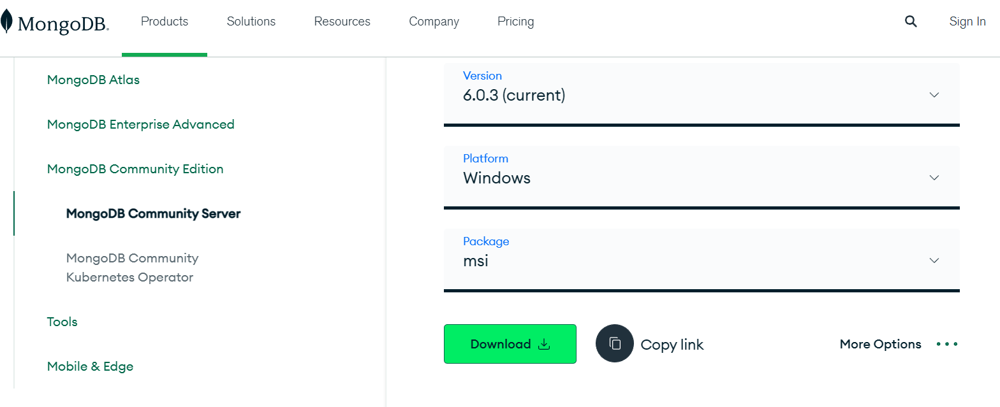

下载对应的版本

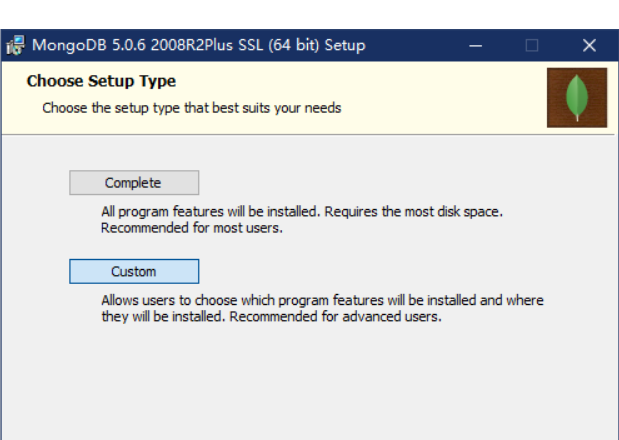

选custom可自定义安装路径，complete默认路径

后续点击next,，选择不勾选(*Install MongoDB Compass*),直至install，勾选后下载安装速度会较慢些。

### 1.2环境变量配置

安装完成后进行环境变量的配置

进入高级系统设置

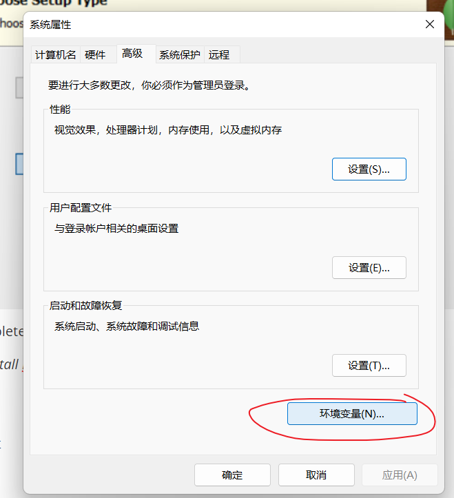

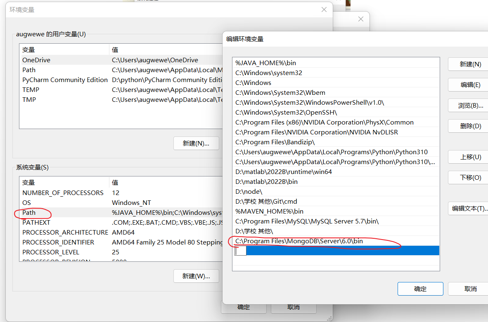

添加路径为MongoDB安装的路径" .............\bin"

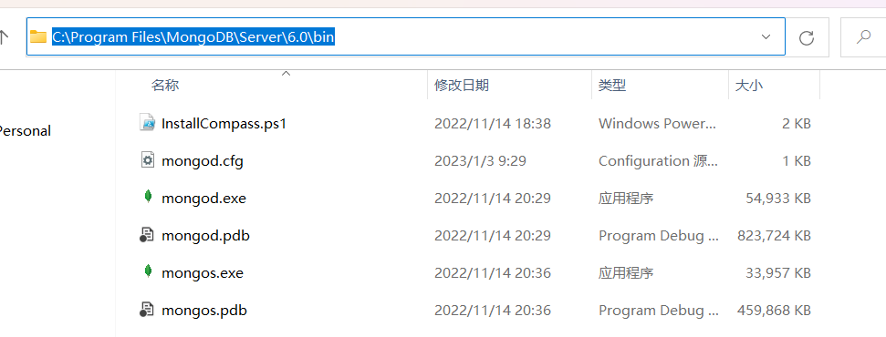

### 1.3 下载MongoDB.Shell

进入https://www.mongodb.com/try/download/shell

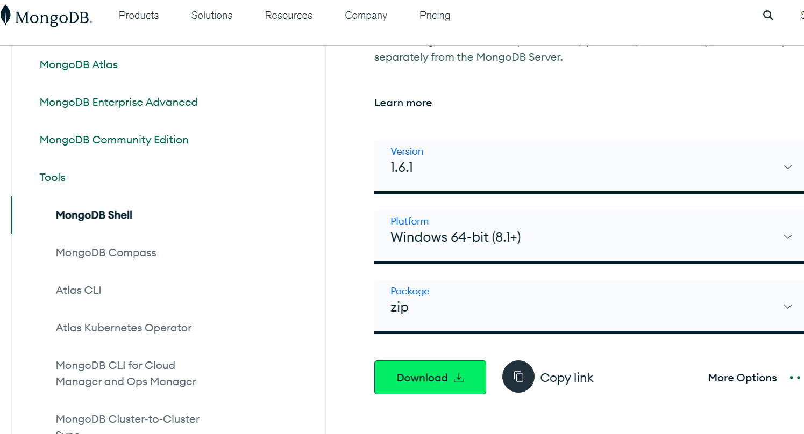

下载完成后，打开其bin文件夹

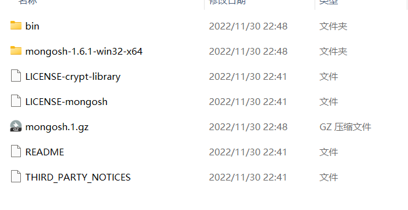

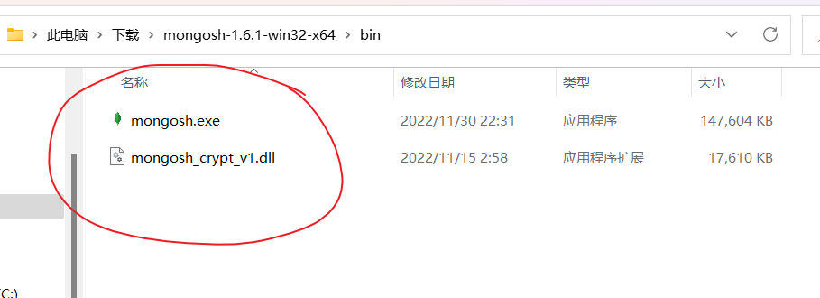

复制以上两个文件至MongoDB的bin文件中

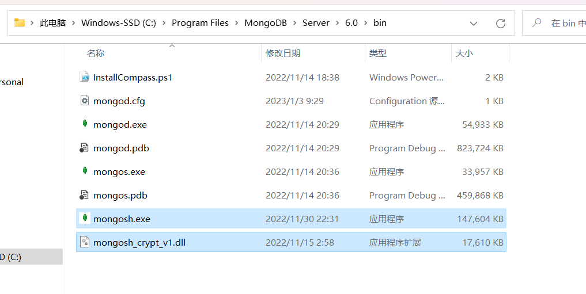

复制完成后，打开cmd,首先输入mongod

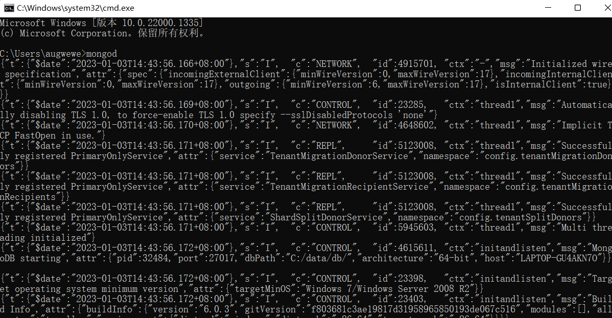

再输入mongosh

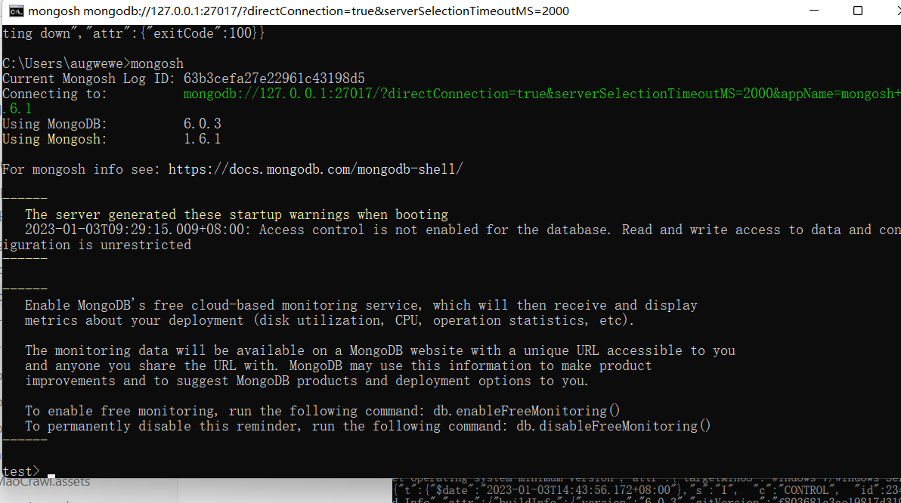

输入 show dbs(查询所有库)

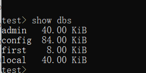

admin，config,local为自带的三个库，first为自定义的库

### 1.4 启动MongoDB 服务

以管理员权限进入cmd 

输入 net start MongoDB 

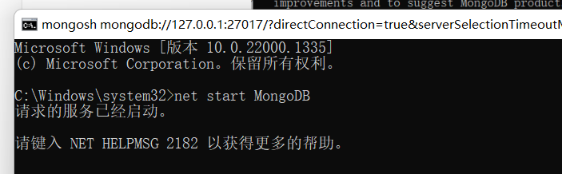

