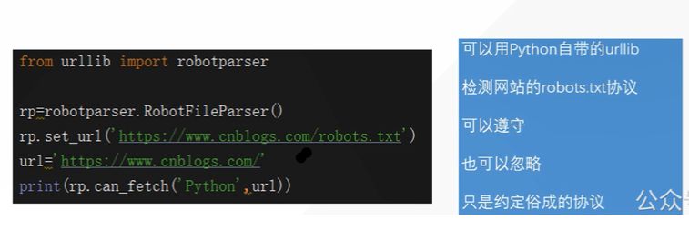

# 网络爬虫

定义：当今最大的网络是互联网，最大的爬虫是各类搜索引擎：谷歌，百度。网路爬虫按照一定的规则爬取所需要的信息的程序，通过URl的请求来实现。在包含广泛信息时，我们就需要一些聚焦于某一方面的信息的爬虫来提供服务，例如某一类型的书。

### 1. 网络爬虫类型





**查看User-Agent方式，右键-检查-NetWork**


全网爬虫：谷歌百度搜索引擎

主题爬虫：某一类型信息的，比如新闻类

增量式爬虫：对已下载的页面采取增量式更新的爬虫，只爬取新产生的或者发生的网页，在一定程度上保证 爬取的页面是最新的，减少了空间的浪费。

为什么要用采用增量式爬虫爬取实时热搜的新闻？优点体现在？

前提环境：第一次抓取微博热搜榜的全部新闻可能需要的工作量是24小时，如重复此工作量去操作达到需求，后果是效率低，且会有重复的数据。

解决策略：增量式爬虫，如何处理新数据？

​					将新旧数据进行比较 ，如python列表知识中的语法点：#value in xx , 类似来进行判断，来保证数据的唯一性（达到了数据不重复的目的）


1.URL 通过value in xx来比较查看

2.内容（哈希）

```python
#哈希解析
test="cava"
print(hash(test))
```

存储介质？

例如将爬取到的url作为MySQl中的主键，定义为Id,查看主键对应的内容，比如第一条值为xiaoyi想去迪士尼，第二条为xiaoyi想去环球影视城，数据已经有更新。

内容的判断？

``` python 
print(hash(text1)==hash(text2))
#返回True则表示存在重复内容
```

### Redis数据库

tips:内存爆满问题，注意要及时备份


**广度优先算法**

每一层都取完再取下一层


**深度优先算法**

从开始取到最后一个节点


 


 


 


