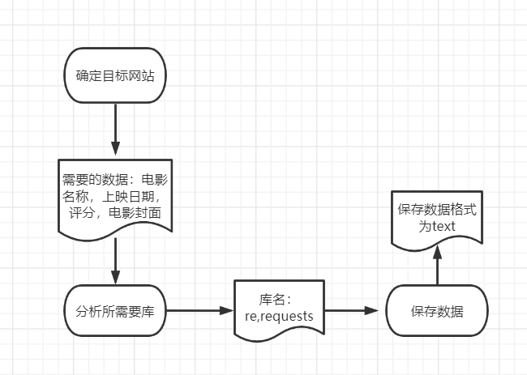

猫眼Top100榜第1页数据爬取

## 1.流程图



## 2.代码

### 2.1请求网站

```python
def __init__(self,url):
        self.url=url
        self.headers={
            "User-Agent":"Mozilla/5.0 (Windows NT 10.0; Win64; x64) AppleWebKit/537.36 (KHTML, like Gecko) Chrome/107.0.0.0 Safari/537.36"
        }    
```

### 2.2执行请求

状态码为200则是请求成功

response.text返回响应的内容以文本形式编码

```python
def req_fun(self,url):
        response=requests.get(url,headers=self.headers)
        if response.status_code==200:
           return response.text
        return None
```

### 2.3解析器

解析正在获取到的url（获取到"offset="后的参数），后续以此参数名作为文件名保存

```python
def url_parse(self,url:str):
        url_lst=url.split("=")
        if url_lst:
            return url_lst[-1]
        return "No Parse Parameter"
```

### 2.4 验证URL

请求的url是否已经存在于目录文件中，将文件下的所有目录文件整合成一个列表，判断请求的url是否已存在于此列表中

```python
def have_asked(self,asking):
#验证链接是否是已经请求过的的；即判断1
        asked_lst_filename=[filename[2] for filename in os.walk("demo")][0]
        if asking in asked_lst_filename:
            return False
        return True
```

### 2.5 保存文件

若在”html"文件，将url保存（写入）至文件”html"中,若不存在,则创建该文件。

```python
def save_html(self,content,filename,mkdir_r="html"):
        if not os.path.exists(mkdir_r):
            os.mkdir("html")#创建文件名
        with open(f"{mkdir_r}/{filename}.html","w",encoding="utf-8") as f:
            f.write(content)
            f.close()

```

### 2.6"引擎"

处理url

```python
 def engine(self):
        asking_filename = self.url_parse(self.url)
        if self.have_asked(asking_filename):
            #执行请求
            html=self.req_fun(self.url)
            self.save_html(html, asking_filename)
        print(f"Requests url {self.url}已经请求过了")
```

### 2.7 完整代码

```python
import re,requests,os

class Maoyan(object):
    def __init__(self,url):
        self.url=url
        self.headers={
            "User-Agent":"Mozilla/5.0 (Windows NT 10.0; Win64; x64) AppleWebKit/537.36 (KHTML, like Gecko) Chrome/107.0.0.0 Safari/537.36"
        }
    def req_fun(self,url):
        response=requests.get(url,headers=self.headers)
        if response.status_code==200:
           return response.text
        return None
    def url_parse(self,url:str):
        url_lst=url.split("=")
        if url_lst:
            return url_lst[-1]
        return "No Parse Parameter"
    def have_asked(self,asking):
        asked_lst_filename=[filename[2] for filename in os.walk("demo")][0]
        if asking in asked_lst_filename:
            return False
        return True
    def save_html(self,content,filename,mkdir_r="html"):
        if not os.path.exists(mkdir_r):
            os.mkdir("html")#创建文件名
        with open(f"{mkdir_r}/{filename}.html","w",encoding="utf-8") as f:
            f.write(content)
            f.close()
    def engine(self):
        asking_filename = self.url_parse(self.url)
        if self.have_asked(asking_filename):
            #执行请求
            html=self.req_fun(self.url)
            self.save_html(html, asking_filename)
        print(f"Requests url {self.url}已经请求过了")
if __name__ == '__main__':
    url="https://www.maoyan.com/board/4?offset=00"
    maoyan=Maoyan(url)
    maoyan.engine()
```

## 3.补充知识点

### 3.1 补充 os

案例：在demo文件下创建10个‘txt'文件

```python
import  os
 for i in range(10):
      f=open(f'demo/{i}.txt','w')
      f.close()
```

### 3.2获取文件下的目录文件名

写法1

```python
#eg1:
for iter in os.walk("demo"):
    print(iter[2])
#输出：['0.txt', '1.txt', '2.txt', '3.txt', '4.txt', '5.txt', '6.txt', '7.txt', '8.txt', '9.txt']
#eg2:
new_list=[]
for filename in os.walk("demo"):
    new_list.append(filename[2])
print(new_list)
#输出：[['0.txt', '1.txt', '2.txt', '3.txt', '4.txt', '5.txt', '6.txt', '7.txt', '8.txt', '9.txt']]
```

写法2（列表推导式;列表生成式）

 ```python
 #eg3,等同于eg2:
 list1=[filename[2] for filename in os.walk("demo")]
 #输出：[['0.txt', '1.txt', '2.txt', '3.txt', '4.txt', '5.txt', '6.txt', '7.txt', '8.txt', '9.txt']]
 #eg4，等同于eg1:
 list1=[filename[2] for filename in os.walk("demo")][0]
 #输出：['0.txt', '1.txt', '2.txt', '3.txt', '4.txt', '5.txt', '6.txt', '7.txt', '8.txt', '9.txt']
 ```

