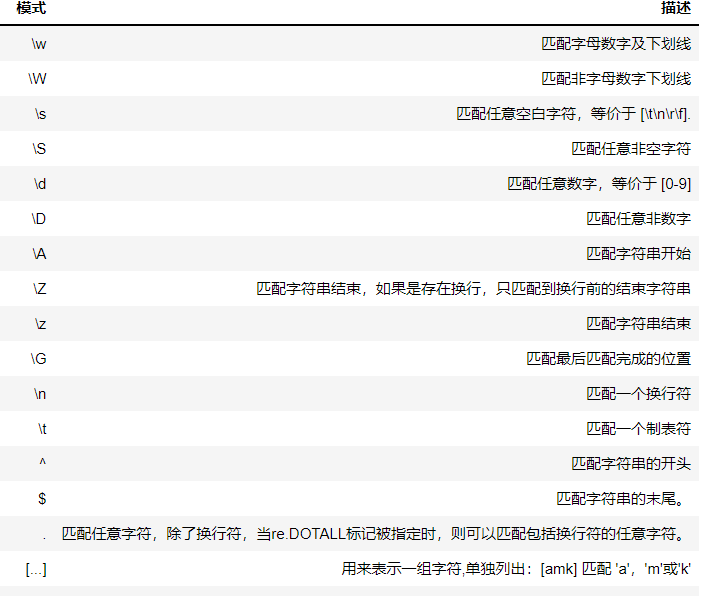
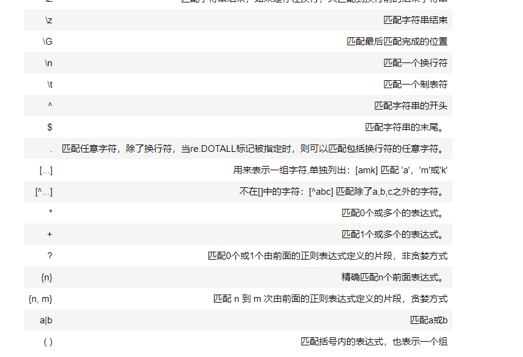
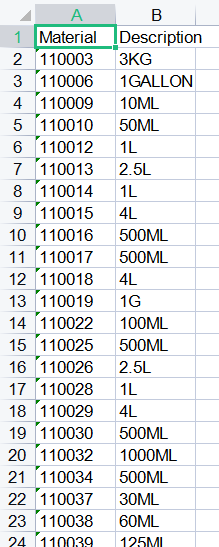

## 正则表达式

### 模式





### 常规匹配

### atttention:

re.match(pattern,string,flag=0)

从字符的起始位置匹配一个模式，如果不是起始位置匹配成功,match()返回none

\w只能匹配到一个数字/字母

```python
import re
content="Hello 123 4567 Word_This is a Regex Demo"
pattern="^Hello\s\d\d\d\s\d{4}\s\w+\s.*Demo$"
result=re.match(pattern,content)
print(result)
print(result.group())#获取到匹配的对象
#输出
<re.Match object; span=(0, 40), match='Hello 123 4567 Word_This is a Regex Demo'>
Hello 123 4567 Word_This is a Regex Demo
-------------------------------------------------------
content = "Ethanol, Ethyl Alcohol Absolute 200 1L"
pattern="^Ethanol\S\s\w+\s.*1L$"
result=re.match(pattern,content)
print(result)
print(result.group())
```

### 泛匹配

```py
content="Hello 123 4567 Word_This is a Regex Demo"
pattern="^H.*o$"#"^H.+o$"
result=re.match(pattern,content)
print(result)
print(result.group())

```

### 匹配特定目标

```py
content="Hello 123 4567 Word_This is a Regex Demo"
pattern="^H.*\s(\d{3})\s.*Demo$"#
result=re.match(pattern,content)
print(result)
print(result.group())
print(result.group(1))#1,2获取两个内容
---------------------------------------
a = "Beakers, Plastic, Polypropylene, 2000mL"
pattern="^Beakers\S\s(\w+)\S\s\w+\S\s(\w+)$"
result=re.match(pattern,a)
print(result)
print(result.group())
print(result.group(1,2))
-------------------------------------------
content="Filter, Vacuum System, PES Membrane, 0.2"
pattern="^Filter\S\s(\w{5})\w+\s\w+\S\s(\w+)\s\w+\S\s(\d\S\d)$"
result=re.match(pattern,content)
print(result)
print(result.group())
print(result.group(1,2,3))


```

### 贪婪匹配

```python
content="Hello 123 4567 Word_This is a Regex Demo"
pattern="^H.*(\d{3})\s.*Demo$"  #输出567
#\d+会输出7,至少保留一个；\d* 没有输出
#*控制输出数字，

result=re.match(pattern,content)
print(result)
print(result.group())
print(result.group(1))
```

### 换行输出

```python
content='''Hello 1234567 Word_This
is a Regex Demo
'''
pattern="^h.*\s(\d+)\s.*Demo$"#
result=re.match(pattern,content,re.S|re.I)#re.S可以匹配到换行,若开始字母是小写，且没有加re.I,就不会有输出，re.S是忽略大小写（不论开始字母是大写或小写都可以输出）
print(result)
print(result.group())
print(result.group(1))
```

### groups()返回所有

```python
#groups()返回元组
content="Hello 123 4567 Word_This is a Regex Demo"
pattern="^H.*\s(\d+)\s.*Demo$"#
result=re.match(pattern,content)
print(result)
print(result.groups())
```

### 转义 - 原样输出特殊符号

``` python
#转义
import  re
content="hello$6.66"
result=re.match("hello\$6.66",content)#$默认结束，加上\转义后原样输出,.原样输出也需要转义
print(result)
```

### search方法

```python
#search方法,不会因原字符开头和结尾不符合匹配而影响到结果
content='''Hello 1234567 Word_This
is a Regex Demo
'''
pattern="^h.*\s(\d+)\s.*Demo$"#
result=re.search(pattern,content,re.S|re.I)#re.S可以匹配到换行,若开始字母是小写，且没有加re.I,就不会有输出，re.S是忽略大小写（不论开始字母是大写或小写都可以输出）
print(result)
#最好不要加^ $开始和结束符号
```

```python
content="Extra strings Hello 1234567 Word_This is a 666 Regex Demo Extra strings"
pattern="\d+"
result=re.search(pattern,content)
# result=re.search(pattern,content)输出1234567
# result=re.match(pattern,content)#None
print(result)
```

### sub方法

```python
#sub，替换所有符合条件的 。2.将匹配的条件用括号引用，r'1\加上添加的内容',
content="Hello 1234567 Word_This is a Regex Demo"
content=re.sub("(\d+)",r"\1 666",content)
print(content)

```

###  excel数据清洗小案例

规范正则表达式

```python
import re

# Detergent, Triton X-100, Emprove, 1 L
# Ethanol, Ethyl Alcohol Absolute 200 1L
# 4L Ethyl Alcohol Pure 200 Proof USP
# CIP 100, 1 gallon
# Bag, 50mL Labtainer BioProcess w/ Luer L


n1="Detergent, Triton X-100, Emprove, 1 L"
regex1=n1.replace(" ","&").upper()
pattern1=".*?(\d+(?:&)?(GALLON|L|KG|ML|UL))"#gallon放在最前面，否则匹配到g就不会检测到gallon
result1=re.search(pattern1,regex1)
print(result1.group(1))

n2="Ethanol, Ethyl Alcohol Absolute 200 1L"
regex2=n2.replace(" ","&").upper()
pattern2=".*?(\d+(GALLON|L|KG|ML|UL))"
result2=re.search(pattern2,regex2)
print(result2.group(1))

n3="4L Ethyl Alcohol Pure 200 Proof USP"
regex3=n3.replace(" ","&").upper()
pattern3=".*?(\d+(GALLON|L|KG|ML|UL))"
result3=re.search(pattern3,regex3)
print(result3.group(1))

n4="CIP 100, 1 gallon"
regex4=n4.replace(" ","&").upper()
pattern4=".*?(\d+(?:&)?(GALLON|L|KG|ML|UL))"
result4=re.search(pattern4,regex4)
print(result4.group(1))

n5="Bag, 50mL Labtainer BioProcess w/ Luer L"
regex5=n5.replace(" ","&").upper()
pattern5=".*?(\d+(GALLON|L|KG|ML|UL))"
result5=re.search(pattern5,regex5)
print(result5.group(1))

regex_list=[".*?(\d+(?:&)?(GALLON|L|KG|ML|UL))",
            ".*?(\d+(GALLON|L|KG|ML|UL))",
            ".*?(\d+(GALLON|L|KG|ML|UL))",
            ".*?(\d+(?:&)?(GALLON|L|KG|ML|UL))",
            ".*?(\d+(GALLON|L|KG|ML|UL))"
            ]
new_regex=set(regex_list)
print(new_regex)
```

```python
import xlrd,xlwt,re

wb=xlrd.open_workbook("MARA.xls")
sheet =wb.sheet_by_name("marm")
regex_list = [
    '.*?(?:,)?(\d+?(\.\d+)?(%)?(GALLON|L|KG|ML|G))',
    '.*?(\d+?(\.\d+)?(%)?(GALLON|L|KG|ML|G))',
    '(\d+?(\.\d+)?(%)?(GALLON|L|KG|ML|G)).*?',
    '.*?(\d+?(\.\d+)?(%)?(GALLON|L|KG|ML|G))',
    '.*?(\d+?(\.\d+)?(GALLON|L|KG|ML|G))',
]

M_data=sheet.col_values(0)[1:]#序号
D_data=sheet.col_values(2)[1:]#混乱的description
data_dict={} #将序号和description变成一一对应的字典
for i in range(len(M_data)):
    data_dict[M_data[i]]=D_data[i]
# print(data_dict)
the_metrial=[]
the_descripition=[]
for key,value in data_dict.items():
    for i in regex_list:
        test=value.upper().replace(" ","%")
        result=re.search(i,test)
        if result:
            the_metrial.append(key)
            the_descripition.append(result.group(1))
            break
#打印测试查看保存的是否是符合正则表达式的key值
# print(the_descripition)
# print(the_metrial)
clean_description=str(the_descripition).replace("%","")
# print(type(clean_description))
#整理完毕，新建表格存入数据
wb2=xlwt.Workbook()
sheet2=wb2.add_sheet("marm")
head_data=["Material","Description"]
the_pos=0
for i in head_data:
    sheet2.write(0,the_pos,i)
    the_pos+=1
the_index=1
for r in the_metrial:
    sheet2.write(the_index,0,r)
    the_index+=1
the_count=1
for k in  eval(clean_description):
    sheet2.write(the_count,1,k)
    the_count+=1
wb2.save("Result_Mara.xls")
```

输出：


